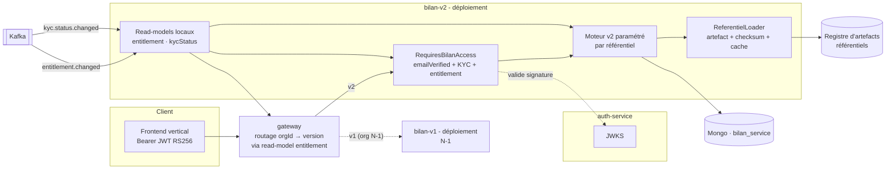

# Architecture Système : Micro-service BilanService

**Date :** 2026-07-07
**Architecte :** vivian
**Version :** 1.0
**Type de projet :** API (micro-service NestJS)
**Statut :** Draft
**Écosystème :** PROSPERA

> **Portée de ce document.** Il cadre l'**architecture d'intégration et de versioning** de `bilan-service` en tant que **capacité partagée** (décisions **P7 / D10**) : extraction, relying party, moteur paramétré par référentiel, gate d'accès rejoué, déploiement multi-version. Le **domaine fonctionnel comptable** (quelles états financiers, quelles règles de calcul, FR détaillés) est **volontairement hors périmètre** — il fera l'objet d'un **PRD/tech-spec Bilan dédié** (cf. `prd-expert-comptable` § Hors périmètre). On peut construire le **squelette** (extraction, read-models, gate, chargement de référentiel, routage) **avant** que ce PRD existe.

---

## Vue d'ensemble du document

Ce document définit l'architecture du micro-service **BilanService** — la **capacité partagée** qui produit les **états financiers** d'une organisation, consommée par plusieurs verticaux (`expert-comptable`, `distributeur`, `microfinance`). Il naît de la décision **D10/P7** : le Bilan cesse d'être un *module interne* d'`expert-comptable` et devient un **service autonome**, versionné selon **deux axes orthogonaux** — la **version de code** (moteur) et le **référentiel comptable** (paquet de données : SYSCOHADA révisé, SFD-BCEAO…).

BilanService est *relying party* de l'IdP (`auth-service`, RS256/JWKS) et **consommateur** de deux contrats d'événements dont il n'est **pas** la source de vérité :
- **`entitlement.changed`** (`catalog-service`) → quelle **version** et quel **référentiel** servir à chaque org, et si l'accès est **actif** ;
- **`kyc.status.changed`** (`kyc-service`) → le statut KYC, nécessaire au **gate d'accès** (ex-`TenantStateGuard`/FR-007, désormais **rejoué ici**).

**Documents liés :**
- **Architecture programme (parent) : `docs/architecture-prospera-ecosystem-2026-07-04.md`** — topologie, ownership map (P7/P8), modèle de jetons, contrats d'événements. Ce document s'y subordonne.
- Source de vérité des entitlements : `docs/architecture-catalog-service-2026-07-07.md` (contrat `entitlement.changed`)
- Source de vérité du KYC : `docs/architecture-kyc-service-2026-07-03.md` (contrat `kyc.status.changed`)
- IdP émetteur des jetons : `docs/architecture-auth-service-2026-07-04.md`
- Origine du gate / du module Bilan : `docs/architecture-expert-comptable-2026-07-02.md` (FR-007, décision **D10**)
- **PRD/tech-spec Bilan (fonctionnel) : à rédiger** — définira les FR comptables, les schémas d'états financiers et les règles de calcul.

---

## Résumé exécutif

BilanService est un micro-service **NestJS + MongoDB (base dédiée `bilan_service`)** qui calcule les **états financiers** d'une organisation à partir de ses données comptables, **selon le référentiel** attribué à cette org. Il **ne possède pas** l'identité (`auth-service`), le KYC (`kyc-service`), l'**entitlement** (`catalog-service`) ni l'**abonnement** (chaque vertical). Il ne connaît les organisations que par un `orgId` opaque issu du **JWT RS256** validé via **JWKS**.

Deux propriétés structurent le service :

1. **Moteur paramétré par référentiel.** Le **code** (moteur de calcul, en semver) et le **référentiel** (plan de comptes, mapping des états, règles de présentation) sont **orthogonaux**. Une même version de code sert **plusieurs référentiels** (chargés **par tenant** depuis le read-model d'entitlement) : une IMF sur `sfd-bceao@1.3` et un cabinet sur `syscohada-revise@2.1` peuvent tourner sur la **même** instance `bilan v2.0`.
2. **Gate d'accès rejoué en relying party.** L'ancien `TenantStateGuard` d'`expert-comptable` est **reconstruit ici** à partir de **read-models locaux** — `emailVerified` (claim JWT), statut **KYC** (`kyc.status.changed`) et **entitlement** `bilan` actif (`entitlement.changed`) — **sans aucun appel réseau** à un autre service sur le chemin chaud.

Le déploiement **multi-version** suit deux stratégies : un **écart de référentiel seul** tourne sur **une** instance (chargement par tenant) ; un **écart de code majeur** (API incompatible) donne **deux déploiements** (`bilan-v1`, `bilan-v2`) routés à l'edge via le read-model d'entitlement.

---

## Périmètre

### Dans le périmètre de BilanService

- **Moteur de calcul des états financiers**, **paramétré** par le référentiel chargé pour l'org.
- **Chargement du référentiel** : récupération de l'artefact (pointeur fourni par `catalog-service`), **vérification de checksum**, cache local.
- **Gate d'accès** (`@RequiresBilanAccess`) rejouant FR-007 via read-models (emailVerified + KYC + entitlement).
- **Read-models locaux** alimentés par `entitlement.changed` et `kyc.status.changed`.
- **Données du domaine** (états financiers produits), keyées par `orgId`, base `bilan_service`.

### Hors périmètre

- **FR comptables détaillés / schémas d'états financiers / règles de calcul** → **PRD/tech-spec Bilan dédié** (non encore rédigé). Ce document ne fixe que l'**architecture d'intégration/versioning** (**B8**).
- **Identité** (Users/Organizations/Memberships, jetons) → `auth-service`.
- **Entitlement** (quelle version/référentiel, droit d'usage) → **`catalog-service`** (source de vérité) ; BilanService en tient un **read-model**.
- **KYC** (documents, revue, statut) → `kyc-service` ; BilanService en tient un **read-model** (pour le gate).
- **Abonnement / paiement** (FedaPay, `Subscription`) → chaque vertical. BilanService n'en dépend pas : il lit l'**entitlement `ACTIVE`** (que le vertical maintient en phase avec le paiement — **B4**).
- **Édition du catalogue / des référentiels** (registre des versions) → `catalog-service` ; le **paquet** de données du référentiel vit dans un **registre d'artefacts**, BilanService le **télécharge**, il ne l'édite pas.

---

## Drivers architecturaux

1. **Réutilisabilité inter-verticaux (P7/D10)** → contrat stable (API HTTP + read-models) consommable par N verticaux, sans couplage à leurs bases.
2. **Variabilité OHADA sans fork (P7)** → le référentiel est une **dimension de configuration** (chargée par tenant), pas une branche de code ; SYSCOHADA révisé vs SFD-BCEAO cohabitent sur la même version de code.
3. **Autonomie de fonctionnement (P4)** → gate et calcul s'appuient sur des read-models locaux ; aucun appel réseau à auth/kyc/catalog par requête.
4. **Autonomie de déploiement (database-per-service)** → base `bilan_service` dédiée ; base/collections **séparées par version majeure** (pas de schéma partagé entre `bilan-v1` et `bilan-v2`).
5. **Sécurité (NFR-001)** → relying party RS256/JWKS ; gate d'accès strict ; intégrité des artefacts de référentiel par checksum.
6. **Discipline de versions** → au plus **2 versions majeures simultanées** (N, N-1), dépréciation datée (risque programme #7).

---

## Vue d'ensemble du système

### Topologie de l'écosystème



### Flux principal (accès → référentiel → calcul)

1. Une org paie sur un vertical → le billing du vertical octroie l'entitlement `bilan` sur `catalog-service` → `entitlement.changed` (`versionCode: "2.0"`, `referentiel: syscohada-revise@2.1`, `status: ACTIVE`).
2. BilanService **consomme** l'événement → met à jour son **read-model** `(org → bilan v2.0, syscohada-revise@2.1, ACTIVE)`. Le **gateway** route désormais cette org vers `bilan-v2`.
3. L'utilisateur appelle une opération Bilan (JWT RS256). Le **gate** vérifie : `emailVerified` (claim) **+** KYC `APPROVED` (read-model) **+** entitlement `bilan` `ACTIVE` (read-model). Échec → **403** (code explicite). Tout est **local**.
4. Le **moteur v2** charge (via `ReferentielLoader`) le paquet `syscohada-revise@2.1` depuis le registre d'artefacts (pointeur/checksum issus du read-model d'entitlement), le **vérifie** et le **met en cache**.
5. Le moteur produit les états financiers **selon ce référentiel** ; le résultat est persisté keyé `orgId` dans `bilan_service`.
6. Une **IMF** de la même version de code mais sous `sfd-bceao@1.3` est servie par la **même** instance `bilan-v2`, avec un **autre** paquet référentiel chargé — aucun fork.

---

## Stack technologique

Socle PROSPERA (NestJS 11 / Node 20 LTS / TypeScript strict / MongoDB 7 / `kafkajs` / `passport-jwt`) + `common/` dupliqué. **Spécifique** : un `ReferentielLoader` (téléchargement + vérification checksum + cache) branché sur le **registre d'artefacts** (MinIO/OCI). Pas de `nodemailer`/`bcrypt`. `@nestjs/jwt` seulement pour les tokens de test e2e.

---

## Composants du système

### BilanModule (moteur)

- **BilanController** — endpoints métier (`@Roles(TENANT_ADMIN, TENANT_USER)` selon les opérations), **protégés par `@RequiresBilanAccess`**. *Le détail des endpoints/DTO relève du tech-spec Bilan (B8).*
- **BilanEngineService** — calcul des états financiers, **paramétré** par le référentiel résolu pour l'org (injection du référentiel chargé). Une **interface de référentiel** (plan de comptes, mapping états, règles de présentation) découple le moteur du référentiel concret.
- **BilanRepository** (`extends TenantScopedRepository`) — persistance keyée `orgId`.

### ReferentielLoader

- Résout `(code, version)` depuis le read-model d'entitlement → **télécharge** l'artefact (`artifactUri`), **vérifie le checksum** (sha256), **met en cache** (mémoire/disque) ; refuse un paquet dont le hash ne correspond pas (**B5**). Rechargement si l'entitlement change de référentiel.

### AccessGate — `@RequiresBilanAccess`

- Guard rejouant FR-007 **en relying party** : `emailVerified` (claim JWT) **+** `OrgKycStatus == APPROVED` (read-model) **+** entitlement `bilan` `status == ACTIVE` (read-model). Codes d'erreur explicites (`EMAIL_NOT_VERIFIED` / `KYC_NOT_APPROVED` / `BILAN_NOT_ENTITLED`). **Zéro appel réseau** (**B3**).

### Consommateurs d'événements

- **EntitlementConsumer** (consumer group dédié sur `entitlement.changed`, filtré `moduleCode == "bilan"`) → read-model `OrgBilanEntitlement`.
- **KycStatusConsumer** (consumer group dédié sur `kyc.status.changed`) → read-model `OrgKycStatus`.
- Idempotence par marqueur `ProcessedEvent { eventId }`.

### Socle transverse (dupliqué)

- `CommonModule` : `TenantContext` (nestjs-cls), `TenantScopedRepository`, guards (`JwtAuthGuard`, `EmailVerifiedGuard`, `RolesGuard`) + `@RequiresBilanAccess`, décorateurs, `Role` enum, `AccessTokenPayload`.
- `auth/jwt.strategy.ts` — **validate-only** (RS256/JWKS).

---

## Architecture des données

### Ownership (database-per-service)

| Donnée | Propriétaire | Base | Rôle ici |
|---|---|---|---|
| États financiers / bilans produits | **bilan-service** | `bilan_service` | source de vérité (keyé `orgId`) |
| Entitlement `(org × bilan)` | catalog-service | `catalog_service` | **read-model** `OrgBilanEntitlement` (version, référentiel, statut) |
| Statut KYC de l'org | kyc-service | `kyc_service` | **read-model** `OrgKycStatus` (pour le gate) |
| `Organization`, `User` | auth-service | `auth_service` | connus par `orgId`/`userId` opaques (JWT) |
| Paquet de données du référentiel | registre d'artefacts | — | **téléchargé + vérifié**, jamais édité |

### Read-model `OrgBilanEntitlement` (alimenté par `entitlement.changed`)

```typescript
@Schema({ timestamps: true })
export class OrgBilanEntitlement {
  @Prop({ type: Types.ObjectId, required: true, unique: true }) organizationId!: Types.ObjectId;
  @Prop({ required: true }) versionCode!: string;                 // "2.0"
  @Prop({ type: Object }) referentiel?: { code: string; version: string };
  @Prop({ type: Object, default: {} }) config!: Record<string, unknown>;
  @Prop({ type: String, enum: EntitlementStatus }) status!: EntitlementStatus; // ACTIVE | SUSPENDED | REVOKED
}
// index : { organizationId: 1 } unique
```

### Read-model `OrgKycStatus` (alimenté par `kyc.status.changed`)

```typescript
@Schema({ timestamps: true })
export class OrgKycStatus {
  @Prop({ type: Types.ObjectId, required: true, unique: true }) organizationId!: Types.ObjectId;
  @Prop({ type: String, enum: KycStatus }) status!: KycStatus; // PENDING_DOCUMENTS | UNDER_REVIEW | APPROVED | REJECTED
}
// index : { organizationId: 1 } unique
```

> Les **schémas du domaine comptable** (écritures, états financiers) sont définis par le **tech-spec Bilan** (B8). Ce document fixe seulement qu'ils vivent dans `bilan_service`, keyés `orgId`, et sont produits par le moteur paramétré par référentiel.

---

## Versioning & déploiement multi-version

Les **deux axes** (P7) se traduisent par deux stratégies distinctes — à ne jamais confondre :

| Nature de l'écart | Stratégie | Base de données |
|---|---|---|
| **Référentiel seul** (même code) | **Une** instance ; référentiel chargé **par tenant** depuis le read-model d'entitlement | partagée (même version de code) |
| **Code majeur** (API incompatible) | **Deux déploiements** `bilan-v1` / `bilan-v2` derrière le même service logique ; routage `orgId → version` à l'**edge** (gateway) via le read-model d'entitlement | **séparée par version majeure** (pas de schéma partagé) |

- **Discipline N/N-1** : au plus 2 versions majeures actives par module ; migration d'une org = **mise à jour d'entitlement** côté catalog → `entitlement.changed` → bascule du routage (**B6**).
- **Migration de données inter-majeures** (historique des bilans d'une org de v1 → v2) : préoccupation de prod, **différée et documentée** ; bases séparées → pas de migration implicite.
- Le **détail edge/GitOps** (gateway, Helm/ArgoCD, images semver) relève du **doc ops** ; ce document fixe les invariants.

---

## Gate d'accès — FR-007 rejoué en relying party

L'ancien `TenantStateGuard` d'`expert-comptable` mêlait e-mail + KYC + **abonnement**. Dans le modèle partagé, BilanService **ne connaît pas l'abonnement** : le vertical maintient l'**entitlement `ACTIVE`** en phase avec le paiement (**B4, C5**). Le gate devient donc :

```
@RequiresBilanAccess :
  emailVerified (claim JWT)            → sinon 403 EMAIL_NOT_VERIFIED
  OrgKycStatus == APPROVED (read-model) → sinon 403 KYC_NOT_APPROVED
  entitlement bilan == ACTIVE (read-model) → sinon 403 BILAN_NOT_ENTITLED
```

Tout est **local** (claims + read-models) → aucune latence d'autorisation, résilience si auth/kyc/catalog sont momentanément indisponibles (les JWT valides et les read-models suffisent). Cohérence éventuelle : une approbation KYC / un octroi d'entitlement ouvre l'accès en quelques secondes ; une **révocation** le ferme tout aussi vite (statut absolu dans l'événement).

---

## Authentification inter-services

> Aligné sur `architecture-prospera-ecosystem-2026-07-04.md` § Modèle de jetons. `auth-service` (IdP) émet ; bilan-service est *relying party*.

- **Frontière de confiance = access token JWT RS256**, validé via **JWKS** caché — aucun secret de signature ne circule. Payload : `{ iss, aud, sub, org, roles, emailVerified }`. `bilan-service` doit figurer dans `AUTH_AUDIENCE` de l'IdP.
- BilanService **ne signe jamais** de token et n'expose aucun endpoint d'authentification.
- Chaîne de guards **dupliquée** : `Throttler → JwtAuth (RS256) → EmailVerified → Roles`, + `@RequiresBilanAccess` sur les opérations métier.
- **Conséquence de sécurité** : l'`orgId` signé fait foi ; la robustesse de la clé privée de l'IdP et de sa rotation (`kid`) est critique.

---

## Orchestration & déploiement

- **`docker-compose.yml` racine** : ajout de `bilan-service` (port dédié), branché sur `mongo` (base `bilan_service`, rs0), `kafka`, `redis` (cache JWKS + marqueurs), et un **registre d'artefacts** (MinIO) pour les référentiels. En dev, une **seule** instance ; le multi-déploiement majeur est un sujet de prod.
- **Kafka** : consomme `entitlement.changed` et `kyc.status.changed` (deux consumer groups) ; ne **produit** que ses éventuels événements métier (définis par le tech-spec Bilan).
- **Base dédiée** : `mongodb://mongo:27017/bilan_service?replicaSet=rs0`.
- **CI** : matrice `service: [..., bilan-service]`.

---

## Couverture des exigences

Aucun **FR PRD** hérité (le fonctionnel Bilan viendra d'un PRD dédié). Les exigences réalisées ici sont les **décisions programme** + le **pattern FR-007** :

| Élément | Réalisé par |
|---|---|
| **P7/D10** — capacité partagée, 2 axes, versioning par org | moteur paramétré + read-model entitlement + routage multi-version |
| **FR-007** (pattern rejoué) | `@RequiresBilanAccess` (emailVerified + KYC + entitlement, read-models) |
| **P4** — événements + read-models | consumers `entitlement.changed` + `kyc.status.changed` |
| **P8/C5** — séparation abonnement/entitlement | gate sur entitlement `ACTIVE`, pas sur l'abonnement |

| NFR | Solution |
|-----|----------|
| NFR-001 Sécurité | RS256/JWKS ; gate strict ; checksum des référentiels ; throttler |
| NFR-002 Isolation | `TenantScopedRepository` + `TenantContext` (JWT) ; anti-énumération (404) |
| NFR-005 Observabilité | Logs pino (`requestId`) ; consommation d'événements traçable (`eventId`) |
| NFR-006 Docs + tests | Swagger `/api/docs` ; seuils Jest 65/90/90/90 ; e2e par service + cross-service docker |

---

## Journal de décisions

**B1 — Bilan = capacité partagée extraite (vs module d'`expert-comptable`)** — *concrétise D10/P7*
✓ Réutilisable par tous les verticaux ; frontières nettes ; keyé `orgId` (cross-sell préservé). ✗ Inversion : `expert-comptable` devient consommateur ; gate à rejouer. *Le Bilan n'est plus construit sur les fondations d'un vertical.*

**B2 — Moteur paramétré par référentiel (version de code ⊥ référentiel)** — *concrétise P7/C2*
✓ Une version de code sert N référentiels par tenant ; SYSCOHADA/SFD-BCEAO sans fork. ✗ Interface de référentiel à stabiliser. *Le référentiel est une donnée injectée, pas une branche.*

**B3 — Gate d'accès rejoué via read-models (vs appel réseau à kyc/catalog)** — *P4*
✓ Latence nulle d'autorisation ; résilience ; remplace le `TenantStateGuard` hérité. ✗ Cohérence éventuelle (quelques secondes) ; deux read-models à maintenir. *emailVerified (claim) + KYC + entitlement, tous locaux.*

**B4 — Entitlement `ACTIVE` comme proxy du droit d'usage (vs connaître l'abonnement)** — *séparation C5/P8*
✓ BilanService ignore FedaPay ; le vertical maintient l'entitlement en phase avec le paiement. ✗ Dépend de la discipline du vertical à révoquer à l'échéance. *Découplage paiement/usage.*

**B5 — Référentiel téléchargé + vérifié (pointeur catalog, artefact registre)** — *C3*
✓ Le paquet n'est pas dupliqué dans catalog ; intégrité garantie (checksum). ✗ Dépendance au registre d'artefacts à la (re)charge. *Cache local + refus si hash invalide.*

**B6 — Multi-version : code majeur = déploiements séparés ; référentiel = chargement par tenant**
✓ Isolation stricte entre majeures (bases séparées) ; souplesse des référentiels. ✗ Routage edge + N/N-1 à opérer. *Ne jamais multi-déployer pour un simple écart de référentiel.*

**B7 — Database-per-service (`bilan_service`), keyé `orgId`**
✓ Découplage total ; base séparée par version majeure. ✗ Migration inter-majeures à traiter en prod. *Standard micro-services.*

**B8 — Fonctionnel comptable différé à un PRD/tech-spec Bilan**
✓ On extrait/versionne/sécurise le service sans attendre le détail métier ; frontière nette entre architecture d'intégration et spec fonctionnelle. ✗ Le squelette est livrable, pas le calcul complet. *Ce document ne fixe pas les FR comptables.*

---

## Risques & points ouverts

1. **Fonctionnel non spécifié (B8)** — le service ne sera pleinement implémentable qu'avec le PRD/tech-spec Bilan ; le **squelette** (extraction, read-models, gate, loader, routage) est cependant réalisable dès maintenant.
2. **Interface de référentiel** — le contrat entre moteur et référentiel (plan de comptes, mapping, règles) doit être stabilisé tôt : c'est le cœur du découplage P7. À co-concevoir avec le tech-spec Bilan.
3. **Disponibilité/intégrité de l'artefact** — le registre doit être joignable à la (re)charge ; checksum obligatoire ; cache pour tolérer une indisponibilité transitoire.
4. **Fraîcheur des read-models pour le gate** — une révocation d'entitlement doit fermer l'accès rapidement (secondes) ; acceptable, mais à surveiller (métrique de lag de consommation).
5. **Migration de données inter-majeures** — bases séparées ⇒ l'historique d'une org ne migre pas implicitement de v1 → v2 ; stratégie à définir (rejeu, export/import) au moment de la 1ʳᵉ montée majeure.
6. **Discipline N/N-1** — sans elle, prolifération de déploiements Bilan ingérable.

---

## Historique des révisions

| Version | Date | Auteur | Changements |
|---------|------|--------|-------------|
| 1.0 | 2026-07-07 | vivian | Architecture initiale de BilanService (capacité partagée) : moteur paramétré par référentiel (2 axes P7), gate FR-007 rejoué en relying party (read-models KYC + entitlement), consommation `entitlement.changed`/`kyc.status.changed`, déploiement multi-version. Fonctionnel comptable différé à un PRD/tech-spec dédié. Concrétise P7/D10. |

---

**Document créé avec BMAD Method v6 — Phase 3 (Solutioning)**
*Prochaines étapes : rédiger le **PRD/tech-spec Bilan** (fonctionnel comptable) ; `/bmad:sprint-planning` pour séquencer catalog-service → bilan-service après le rebasage kyc.*
