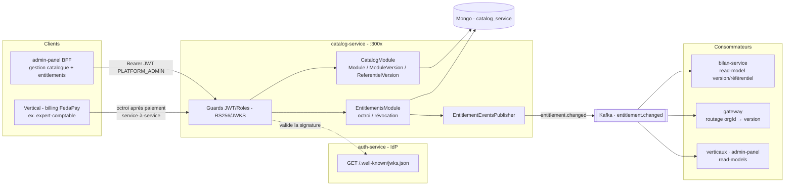

# Architecture Système : Micro-service CatalogService

**Date :** 2026-07-07
**Architecte :** vivian
**Version :** 1.0
**Type de projet :** API (micro-service NestJS)
**Statut :** Draft
**Écosystème :** PROSPERA

---

## Vue d'ensemble du document

Ce document définit l'architecture du micro-service **CatalogService** — la **capacité plateforme** qui possède le **catalogue des modules produit** (leurs versions de code et les référentiels comptables) et les **entitlements** : quel module, à quelle version, avec quel référentiel et quelle configuration, chaque **organisation** a le droit de consommer. Il naît des décisions **P7/P8** de l'architecture programme (le Bilan devient une capacité partagée `bilan-service`, versionnée par organisation) : dès qu'un module est **partagé entre plusieurs verticaux**, plus personne côté vertical ne peut être la source de vérité de « quelle version servir à l'org X » — ni `auth-service` (décision **A3** : il n'émet aucun état métier). Cette responsabilité est donc élevée au rang de service plateforme dédié.

Ce document est la **source de vérité du contrat d'événements `entitlement.changed`** (§ Contrat d'événements) : toute évolution du contrat se décide ici avant d'être répliquée dans les services consommateurs. Le **transport** (Apache Kafka) et les conventions communes sont définis dans l'architecture programme.

**Documents liés :**
- **Architecture programme (parent) : `docs/architecture-prospera-ecosystem-2026-07-04.md`** — source de vérité de la topologie, de l'ownership map (§ amendée par P7/P8), du modèle de jetons RS256/JWKS et des contrats d'événements. Ce document s'y subordonne.
- Architecture de l'IdP émetteur des jetons : `docs/architecture-auth-service-2026-07-04.md`
- Architecture de la capacité consommatrice principale : `docs/architecture-bilan-service-2026-07-07.md`
- Vertical déclencheur des entitlements (après paiement) : `docs/architecture-expert-comptable-2026-07-02.md` (EPIC-004 facturation ; décision **D10**)
- Décisions d'origine : architecture programme **P7** (capacité partagée + versioning par organisation) et **P8** (catalog-service = source de vérité des entitlements + `admin-panel` BFF)

---

## Résumé exécutif

CatalogService est un micro-service **NestJS + MongoDB (base dédiée `catalog_service`)** qui possède deux domaines :

1. **Le catalogue** — le registre des **`Module`** (ex. `bilan`, `stock`), de leurs **`ModuleVersion`** (versions de **code**, en semver) et des **`ReferentielVersion`** (paquets de données comptables versionnés indépendamment : `syscohada-revise@2.1`, `sfd-bceao@1.3`). Ces **deux axes** (version de code ⊥ référentiel) sont **orthogonaux** et ne se mélangent jamais.
2. **Les entitlements** — pour chaque couple **`(organisation × module)`**, le droit d'usage : `version_code` retenue, `référentiel` retenu, `config`, et `statut` (actif/suspendu/révoqué).

Il **ne possède pas** l'identité (propriété d'`auth-service`), le KYC (`kyc-service`), l'**abonnement/paiement** (chaque vertical, via FedaPay) ni le **moteur de calcul** ou les **données** du Bilan (`bilan-service`). La frontière de confiance est l'**access token JWT RS256** émis par l'IdP, validé via **JWKS** — CatalogService ne connaît les organisations que par un `orgId` opaque.

Le service **publie** chaque changement d'entitlement sur le **topic Kafka `entitlement.changed`** (clé de partition = `orgId`, **état absolu**). Les consommateurs — **`bilan-service`** (quelle version/référentiel servir), les **verticaux**, l'**`admin-panel`** et le **gateway** (routage multi-version `orgId → version`) — maintiennent chacun un **read-model local** ; aucun appel réseau à CatalogService sur le chemin chaud. **Le JWT ne porte jamais l'entitlement** (règle d'or du programme) : il reste lu dans les read-models locaux.

---

## Périmètre

### Dans le périmètre de CatalogService

- **Catalogue** : CRUD `Module` / `ModuleVersion` / `ReferentielVersion`, cycle de vie des versions (actif → déprécié → retiré) avec **date de dépréciation**.
- **Entitlements** : octroi / mise à jour / révocation d'un entitlement `(org × module)` ; source de vérité de « quelle version + quel référentiel pour quelle org ».
- **Publication** des événements `entitlement.changed` (état absolu, keyé `orgId`).
- **Endpoint de réconciliation** : snapshot des entitlements d'une org (hydratation initiale / re-synchro d'un read-model), **hors chemin chaud**.

### Hors périmètre

- **Identité** (Users, Organizations, Memberships, émission de jetons) → **`auth-service`**. CatalogService est *relying party* ; il ne connaît que `orgId`/`userId` opaques (issus du JWT).
- **Abonnement / paiement** (plans, checkout, webhooks FedaPay, `Subscription`) → **chaque vertical** (EPIC-004). Le paiement **déclenche** un octroi d'entitlement, mais l'abonnement lui-même n'est pas ici (**séparation abonnement ≠ entitlement**, décision **C5**).
- **Moteur de calcul du Bilan + données des états financiers + chargement effectif du paquet référentiel** → **`bilan-service`**. CatalogService ne stocke **pas** les données du référentiel, seulement son **entrée de registre** (métadonnées + pointeur d'artefact + checksum — décision **C3**).
- **KYC** → `kyc-service`. **Dashboard admin agrégé** (FR-012) → `admin-panel` (BFF), qui *consomme* le catalogue.
- **Gate d'accès métier** (`TenantStateGuard` / FR-007) → **`bilan-service`** le rejoue en relying party (read-models KYC + entitlement).

---

## Drivers architecturaux

1. **Un module partagé = un seul propriétaire d'entitlement** (P8) → CatalogService centralise la vérité « qui a droit à quoi, à quelle version », que ni le vertical ni l'IdP ne peuvent porter.
2. **Deux axes de variabilité orthogonaux** (P7) → version de **code** (`ModuleVersion`, semver) et **référentiel** comptable (`ReferentielVersion`, paquet de données) modélisés **séparément** ; jamais l'un encodé dans l'autre.
3. **Communication par événements + read-models** (P4) → `entitlement.changed` alimente les read-models locaux ; REST réservé à l'admin et à la réconciliation, **jamais** le chemin chaud.
4. **Autonomie de déploiement (database-per-service)** → base Mongo dédiée `catalog_service` ; aucune jointure inter-services.
5. **Sécurité (NFR-001)** → relying party RS256/JWKS ; admin catalogue réservé `PLATFORM_ADMIN` ; octroi d'entitlement authentifié (service-à-service, décision **C8**) ; throttler.
6. **Discipline de versions** → au plus **2 versions majeures simultanées** (N, N-1) par module, avec dépréciation datée (risque programme #7).

---

## Vue d'ensemble du système

### Topologie de l'écosystème

**Pattern :** capacité plateforme NestJS indépendante, relying party de l'IdP, productrice d'événements, orchestrée par le **`docker-compose` racine** du dépôt PROSPERA.



### Flux principal (catalogue → droit → routage)

1. Le **`PLATFORM_ADMIN`** (via `admin-panel`) alimente le catalogue : module `bilan`, versions `1.2` et `2.0`, référentiels `syscohada-revise@2.1` et `sfd-bceao@1.3`.
2. Une organisation paie son abonnement sur un **vertical** (ex. `expert-comptable`). À l'activation, le **billing du vertical déclenche** un octroi d'entitlement sur CatalogService (service-à-service) : `PUT /entitlements/{orgId}/bilan { versionCode: "2.0", referentiel: { code: "syscohada-revise", version: "2.1" }, config }`.
3. CatalogService **persiste** l'`Entitlement` puis **publie** `entitlement.changed` (clé `orgId`, état absolu).
4. Les consommateurs mettent à jour leur **read-model local** : `bilan-service` (sait désormais servir la v2.0 + `syscohada-revise@2.1` à cette org), le **gateway** (route `orgId → bilan-v2`), l'`admin-panel` (affichage).
5. À une requête Bilan de cette org, `bilan-service` charge le **paquet référentiel** `syscohada-revise@2.1` (via le pointeur d'artefact du registre) et calcule — **zéro appel réseau à CatalogService sur le chemin chaud**.
6. **Migration de version** : le `PLATFORM_ADMIN` déprécie `bilan 1.x` (date) ; migrer une org de `1.2` → `2.0` = une **mise à jour d'entitlement** → nouvel événement → bascule du routage.

---

## Stack technologique

Identique au socle PROSPERA (NestJS 11 / Node 20 LTS / TypeScript strict / MongoDB 7 via Mongoose / `kafkajs` / `passport-jwt`), pour mutualiser conventions et socle `common/` dupliqué. **Différences** : pas de `nodemailer`/`bcrypt` (aucun e-mail, aucun mot de passe) ; aucun stockage de fichiers lourds — les **artefacts de référentiel** sont hébergés dans un **registre d'artefacts** (MinIO/OCI, décision **C3**), CatalogService n'en stocke que le **pointeur + checksum**. `@nestjs/jwt` conservé pour signer des tokens de test e2e ; validation de production par JWKS.

---

## Composants du système

### CatalogModule (registre)

- **CatalogAdminController** (`@Roles(PLATFORM_ADMIN)`) — CRUD `Module`, `ModuleVersion`, `ReferentielVersion` ; transitions de cycle de vie (`ACTIVE → DEPRECATED → RETIRED`) avec date.
- **ModulesService / ModuleVersionsService / ReferentielVersionsService** — validations (unicité `code`+`version`, garde-fou **N/N-1** : refuser une 3ᵉ version majeure `ACTIVE` sans dépréciation d'une ancienne).
- **CatalogReadController** (`@Roles(PLATFORM_ADMIN, TENANT_ADMIN)`) — lecture du catalogue publié (modules/versions/référentiels **actifs**).

### EntitlementsModule (droits)

- **EntitlementsController** — `PUT /entitlements/:orgId/:moduleCode` (octroi/màj), `DELETE /entitlements/:orgId/:moduleCode` (révocation), `GET /entitlements/:orgId` (snapshot de **réconciliation**, hors chemin chaud). Écriture réservée `PLATFORM_ADMIN` **ou** identité de service (billing d'un vertical — **C8**) ; lecture `:orgId` restreinte à l'org du JWT ou `PLATFORM_ADMIN`.
- **EntitlementsService** — valide la cohérence (module/version/référentiel **existants et actifs** dans le catalogue), upsert idempotent `(orgId, moduleCode)`, **publication après persistance** via `EntitlementEventsPublisher`.

### EntitlementEventsPublisher

- Produit `entitlement.changed` sur Kafka (clé `orgId`), **après** commit Mongo. Cible de fiabilité : **transactional outbox** (aligné programme). État **absolu** par `(org, module)`.

### Socle transverse (dupliqué)

- `CommonModule` : `TenantContext` (nestjs-cls), `TenantScopedRepository`, guards (`JwtAuthGuard`, `RolesGuard` ; `EmailVerifiedGuard` optionnel), décorateurs (`@Public`, `@Roles`, `@CurrentUser`), `Role` enum, `AccessTokenPayload`.
- `auth/jwt.strategy.ts` — **validate-only** (RS256/JWKS), peuple `TenantContext`/`request.user`. Aucun endpoint d'authentification.

---

## Architecture des données

### Ownership (database-per-service)

| Donnée | Propriétaire | Base | Rôle chez les consommateurs |
|---|---|---|---|
| `Module`, `ModuleVersion`, `ReferentielVersion` (catalogue) | **catalog-service** | `catalog_service` | read-model du catalogue (admin-panel) |
| `Entitlement` `(org × module)` | **catalog-service** | `catalog_service` | **read-model** version/référentiel (bilan-service, gateway, verticaux) |
| `Organization`, `User` | auth-service | `auth_service` | connus par `orgId`/`userId` opaques (JWT) |
| `Subscription`, `Transaction` (abonnement/paiement) | chaque vertical | `<vertical>` | déclencheur d'octroi (jamais stocké ici) |
| Données du référentiel (paquet comptable) + moteur | bilan-service / registre d'artefacts | — | catalog ne détient que le **pointeur** |

### Schéma `Module`

```typescript
// modules/catalog/schemas/module.schema.ts
@Schema({ timestamps: true })
export class Module {
  @Prop({ required: true, unique: true }) code!: string;        // "bilan", "stock"
  @Prop({ required: true }) name!: string;
  @Prop() description?: string;
  @Prop({ type: String, enum: ModuleStatus, default: ModuleStatus.ACTIVE }) status!: ModuleStatus; // ACTIVE | DEPRECATED
}
// index : { code: 1 } unique
```

### Schéma `ModuleVersion` (axe « code »)

```typescript
// modules/catalog/schemas/module-version.schema.ts
@Schema({ timestamps: true })
export class ModuleVersion {
  @Prop({ required: true }) moduleCode!: string;                // ref Module.code
  @Prop({ required: true }) version!: string;                   // semver routable, ex. "2.0"
  @Prop({ type: String, enum: VersionStatus, default: VersionStatus.ACTIVE }) status!: VersionStatus; // ACTIVE | DEPRECATED | RETIRED
  @Prop() deprecationDate?: Date;                               // fin de support planifiée
  @Prop() releasedAt?: Date;
}
// index : { moduleCode: 1, version: 1 } unique ; { moduleCode: 1, status: 1 }
```

### Schéma `ReferentielVersion` (axe « données », orthogonal)

```typescript
// modules/catalog/schemas/referentiel-version.schema.ts
@Schema({ timestamps: true })
export class ReferentielVersion {
  @Prop({ required: true }) code!: string;                      // "syscohada-revise", "sfd-bceao"
  @Prop({ required: true }) version!: string;                   // "2.1"
  @Prop({ type: String, enum: VersionStatus, default: VersionStatus.ACTIVE }) status!: VersionStatus;
  @Prop({ required: true }) artifactUri!: string;               // pointeur vers le paquet (registre d'artefacts)
  @Prop({ required: true }) checksum!: string;                  // intégrité du paquet (sha256)
}
// index : { code: 1, version: 1 } unique
```

### Schéma `Entitlement`

```typescript
// modules/entitlements/schemas/entitlement.schema.ts
@Schema({ timestamps: true })
export class Entitlement {
  @Prop({ type: Types.ObjectId, required: true }) organizationId!: Types.ObjectId; // opaque (JWT)
  @Prop({ required: true }) moduleCode!: string;
  @Prop({ required: true }) versionCode!: string;               // ModuleVersion.version retenue
  @Prop({ type: Object }) referentiel?: { code: string; version: string }; // null si module sans référentiel (ex. stock)
  @Prop({ type: Object, default: {} }) config!: Record<string, unknown>;
  @Prop({ type: String, enum: EntitlementStatus, default: EntitlementStatus.ACTIVE }) status!: EntitlementStatus; // ACTIVE | SUSPENDED | REVOKED
  @Prop({ type: Types.ObjectId }) grantedBy?: Types.ObjectId;   // userId opaque
  @Prop() source?: string;                                      // "billing:expert-comptable" | "admin"
}
// index : { organizationId: 1, moduleCode: 1 } unique ; { organizationId: 1 }
```

**Upsert idempotent** : `PUT /entitlements/:orgId/:moduleCode` fait un `findOneAndUpdate` (`$set` absolu) sur la clé unique `(organizationId, moduleCode)` — race-safe, rejouable. La cohérence référentielle (module/version/référentiel existants **et actifs**) est validée **avant** l'upsert.

---

## Contrat d'événements `entitlement.changed` (v1) — source de vérité

> Transport aligné sur `architecture-prospera-ecosystem-2026-07-04.md` § Contrats d'événements : **Apache Kafka**.

**Transport :** **topic Kafka `entitlement.changed`**, partitionné par **clé = `orgId`** (ordre garanti par organisation).
**Producteur :** catalog-service (unique). **Consommateurs :** un **consumer group** par service intéressé (`bilan-service`, gateway, verticaux, admin-panel).
Publié **après** persistance réussie de l'upsert local (cible de fiabilité : transactional outbox).

```typescript
/** Émis à CHAQUE changement d'entitlement d'une organisation POUR UN module. État ABSOLU. */
export interface EntitlementChangedEventV1 {
  schemaVersion: 1;
  eventId: string;             // UUID v4 — clé d'idempotence côté consommateur
  orgId: string;               // ObjectId hex de l'organisation (= clé de partition Kafka)
  moduleCode: string;          // "bilan", "stock", …
  versionCode: string;         // version de code retenue, ex. "2.0"
  referentiel?: {              // absent si le module n'a pas de référentiel
    code: string;              // "syscohada-revise" | "sfd-bceao"
    version: string;           // "2.1"
  };
  config: Record<string, unknown>;
  status: 'ACTIVE' | 'SUSPENDED' | 'REVOKED';
  occurredAt: string;          // ISO-8601 UTC
}
```

**Sémantique Kafka :** clé de message = `orgId` (co-localise et ordonne les événements d'une même organisation) ; livraison **at-least-once** → le consommateur **doit** être idempotent (marqueur `ProcessedEntitlementEvent`, `eventId` = clé de déduplication).

**Traitement côté consommateur** (ordre) :
1. **Read-model** — `$set` absolu de `(org × module) → { versionCode, referentiel, config, status }`. Idempotent (état absolu → rejouable). `status === REVOKED` → le consommateur **retire/refuse** le module pour cette org.
2. **Effets** — le **gateway** recalcule sa table de routage `orgId → version` ; `bilan-service` (re)charge le paquet référentiel si `referentiel` a changé ; l'`admin-panel` rafraîchit l'affichage.
3. **Marqueur** — `ProcessedEntitlementEvent { eventId unique, processedAt }` (TTL 30 j), avant *commit* de l'offset Kafka.

**Pourquoi un état absolu par `(org, module)` ?** La mise à jour du read-model et de la table de routage devient idempotente ; aucune dépendance à l'ordre d'arrivée pour l'état final. Un module partagé par plusieurs verticaux reste keyé par `orgId` (jamais par vertical) → **cross-sell préservé (P2)**.

### Fan-out multi-consommateurs — natif avec Kafka

Un nouveau consommateur (nouveau vertical, nouvelle capacité) crée son consumer group sur `entitlement.changed` — **sans modification du producteur**.

---

## Authentification inter-services

> Aligné sur `architecture-prospera-ecosystem-2026-07-04.md` § Modèle de jetons. `auth-service` (IdP) est l'émetteur ; catalog-service est *relying party*.

- **Frontière de confiance = l'access token JWT RS256** émis par `auth-service`, validé via la **clé publique JWKS** (`GET {auth-service}/.well-known/jwks.json`) mise en cache — **aucun secret de signature ne circule**. Payload : `{ iss, aud, sub, org, roles, emailVerified }`. `catalog-service` doit figurer dans la liste `AUTH_AUDIENCE` de l'IdP.
- **Admin catalogue** : `@Roles(PLATFORM_ADMIN)` (opérateur plateforme, `org = null`). **Lecture d'un entitlement d'org** : restreinte à l'`org` du JWT (anti-énumération) ou `PLATFORM_ADMIN`.
- **Octroi d'entitlement par un vertical (service-à-service)** : le billing d'un vertical (après paiement) écrit l'entitlement. L'authentification de cet appel machine-à-machine est un **point ouvert (C8)** : jeton de service dédié (client-credentials émis par l'IdP) *recommandé*, mTLS interne ou rôle technique en alternative.
- **Conséquence de sécurité** : `catalog-service` ne vérifie pas l'existence réelle de l'org — l'`orgId` fait foi. Optionnellement, il **consomme `identity.org.suspended`** pour suspendre en cascade les entitlements d'une org suspendue (décision **C9**, activable sans refonte).

---

## Orchestration & déploiement

- **`docker-compose.yml` racine** (`PROSPERA/`) : ajout du service `catalog-service` (port dédié), branché sur `mongo` (base `catalog_service`, rs0), `kafka`, `redis` (cache JWKS + marqueurs). `docker-compose.override.yml` pour le hot-reload.
- **Kafka** : produit `entitlement.changed` ; consomme optionnellement `identity.org.suspended` (C9). `redis` = cache/marqueurs internes, **jamais** canal inter-services.
- **Base dédiée** : `mongodb://mongo:27017/catalog_service?replicaSet=rs0`.
- **Registre d'artefacts de référentiels** (MinIO/OCI) : héberge les paquets `syscohada-revise@2.1`, etc. ; `catalog-service` en stocke le **pointeur + checksum**, `bilan-service` les **télécharge et vérifie** (C3).
- **CI** : matrice `service: [..., catalog-service]` (lint → tests → build par service).
- **Prod (multi-version)** : le routage `orgId → version` à l'edge (gateway) et le GitOps des déploiements par version majeure relèvent du **doc ops/déploiement** (hors périmètre ; le programme en fixe les invariants).

---

## Couverture des exigences

CatalogService n'hérite d'**aucun FR du PRD `expert-comptable`** : c'est une **capacité plateforme nouvelle**. Ses « exigences » sont les **décisions programme** :

| Décision | Réalisée par |
|---|---|
| **P7** — capacité partagée + versioning par organisation (2 axes) | `Module`/`ModuleVersion`/`ReferentielVersion` + `Entitlement` |
| **P8** — source de vérité des entitlements ; séparation abonnement/entitlement | `EntitlementsModule` + `entitlement.changed` ; octroi déclenché par le vertical |
| **D10** — Bilan → `bilan-service`, entitlement au catalog | consommateur `bilan-service` du read-model |
| **FR-012** (partiel) — dashboard admin agrégé | `admin-panel` consomme le catalogue + les entitlements |

| NFR | Solution |
|-----|----------|
| NFR-001 Sécurité | Relying party RS256/JWKS ; `PLATFORM_ADMIN` pour l'admin ; octroi service-à-service (C8) ; throttler ; checksum des artefacts |
| NFR-002 Isolation | Lecture d'entitlement restreinte à l'`org` du JWT (404 anti-énumération) |
| NFR-005 Observabilité | Logs pino (`requestId`) ; événements `entitlement.changed` traçables (`eventId`) |
| NFR-006 Docs + tests | Swagger `/api/docs` ; seuils Jest 65/90/90/90 ; e2e par service + e2e cross-service docker |

---

## Journal de décisions

**C1 — Entitlement `(org × module)` possédé par catalog-service (vs chaque vertical)** — *concrétise P8*
✓ Un module partagé a **un seul** propriétaire d'entitlement ; le gateway et `bilan-service` ont une source unique. ✗ Nouvelle brique plateforme. *L'ancienne règle « entitlement → chaque vertical » ne tenait que pour un module mono-vertical.*

**C2 — Deux axes orthogonaux : `ModuleVersion` (code) ⊥ `ReferentielVersion` (données)** — *concrétise P7*
✓ Une IMF et un cabinet partagent la même version de code avec des référentiels différents, sans fork ; deux schémas séparés. ✗ Deux dimensions à gérer. *Ne jamais encoder le référentiel dans la version de code.*

**C3 — Référentiel = entrée de registre (pointeur + checksum), pas les données**
✓ CatalogService reste léger ; le paquet comptable (potentiellement volumineux) vit dans un registre d'artefacts, chargé et vérifié par `bilan-service`. ✗ Un registre d'artefacts à opérer. *Séparation nette registre (catalog) / artefact (store) / chargement (consommateur).*

**C4 — Événements + read-models (vs REST synchrone sur le chemin chaud)** — *P4*
✓ Le gateway et `bilan-service` décident localement (routage, référentiel) sans appel à catalog par requête. ✗ Cohérence éventuelle (quelques secondes). *REST réservé à l'admin et à la réconciliation.*

**C5 — Séparation abonnement (vertical) / entitlement (catalog)**
✓ Pas de double source de vérité : le paiement vit au vertical, le droit/version au catalog ; **un seul déclencheur** d'octroi (le billing du vertical, ou l'admin). ✗ Un aller-retour service-à-service après paiement. *Le catalog ne connaît pas FedaPay ; le vertical ne connaît pas les versions.*

**C6 — Relying party d'auth-service (RS256/JWKS)** — *aligné écosystème*
✓ Aucun secret de signature ; `PLATFORM_ADMIN` pour l'admin catalogue. ✗ `catalog-service` à ajouter à `AUTH_AUDIENCE`. *Même patron que kyc-service.*

**C7 — État absolu par `(org, module)`, keyé `orgId` (vs delta)**
✓ Read-model et routage idempotents, robustes au rejeu/désordre. ✗ Payload un peu plus verbeux. *La valeur finale ne dépend jamais de l'ordre d'arrivée.*

**C8 — Auth de l'octroi service-à-service (billing vertical → catalog)** — *point ouvert*
Recommandé : **jeton de service** (client-credentials émis par l'IdP, `aud: catalog-service`). Alternatives : mTLS interne, rôle technique. *À trancher à l'implémentation ; n'impacte pas le contrat d'événement.*

**C9 — Suspension en cascade via `identity.org.suspended` (optionnel)**
Recommandé : consommer l'événement d'identité pour passer les entitlements d'une org suspendue en `SUSPENDED`. *Activable sans refonte ; désactivé en phase 1 si l'IdP ne le publie pas encore.*

---

## Risques & points ouverts

1. **Prolifération de versions** — sans discipline **N/N-1** + dépréciation datée, coût d'exploitation ingérable. Garde-fou applicatif : refuser une 3ᵉ version majeure `ACTIVE` d'un module.
2. **Perte d'un événement** `entitlement.changed` → l'endpoint de **réconciliation** (`GET /entitlements/:orgId`) permet à un read-model de re-synchroniser ; état absolu → rejeu sûr.
3. **Auth service-à-service (C8)** non tranchée → bloquant pour l'octroi automatique après paiement ; à décider avant l'intégration billing.
4. **Intégrité de l'artefact référentiel** → checksum obligatoire ; `bilan-service` refuse un paquet dont le hash ne correspond pas.
5. **Latence de propagation du routage** — une org fraîchement passée en v2 est routée en v2 en quelques secondes (cohérence éventuelle) ; acceptable, aligné sur le KYC.
6. **Cohérence catalogue ↔ entitlement** — interdire l'octroi vers une `ModuleVersion`/`ReferentielVersion` inexistante ou `RETIRED` (validation au `PUT`).

---

## Historique des révisions

| Version | Date | Auteur | Changements |
|---------|------|--------|-------------|
| 1.0 | 2026-07-07 | vivian | Architecture initiale de CatalogService : catalogue (`Module`/`ModuleVersion`/`ReferentielVersion`), entitlements `(org × module)`, contrat d'événements `entitlement.changed` v1, relying party RS256/JWKS ; concrétise P7/P8/D10 |

---

**Document créé avec BMAD Method v6 — Phase 3 (Solutioning)**
*Prochaine étape : réconcilier la roadmap (`/bmad:sprint-planning` — nouvel EPIC catalog-service avant bilan-service), puis `/bmad:create-story` pour le scaffold. Le doc `bilan-service` (capacité consommatrice) reste à rédiger.*
