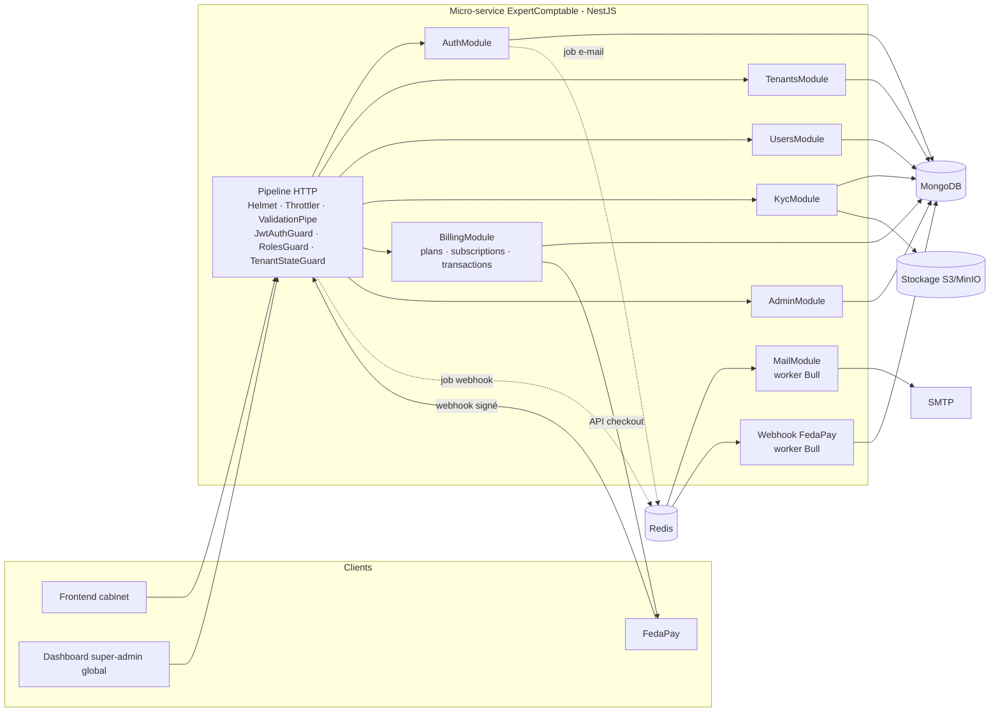

# Architecture Système : Micro-service ExpertComptable

**Date :** 2026-07-02
**Architecte :** vivian
**Version :** 1.3
**Type de projet :** API (micro-service NestJS)
**Niveau de projet :** 3 (12–40 stories)
**Statut :** Draft

> **Révision 1.1 (2026-07-03) — extraction du KYC.** L'EPIC-003 (KYC) est extrait dans un micro-service dédié **`kyc-service`** (documents + machine à états + revue admin, FR-005/FR-006), consommé par plusieurs services PROSPERA. `expert-comptable` devient **consommateur** : il maintient `tenant.kycStatus` comme **read-model** alimenté par les événements KYC, et conserve le `TenantStateGuard` (FR-007). Voir `docs/architecture-kyc-service-2026-07-03.md`. Les sections ci-dessous sont annotées « ⟶ kyc-service » là où la responsabilité a migré.
>
> **Révision 1.2 (2026-07-04) — écosystème : IdP + Kafka.** Le re-cadrage programme (**source de vérité : `docs/architecture-prospera-ecosystem-2026-07-04.md`**) fait de PROSPERA un écosystème multi-vertical. Conséquences pour ce service :
> - **`expert-comptable` devient *relying party* d'un IdP dédié `auth-service`.** Aujourd'hui il est l'**émetteur temporaire** des JWT (HS256) ; à terme, `auth-service` possède l'identité (Users, Organisations, Memberships, credentials, vérif e-mail, invitations) et émet les JWT en **RS256** ; expert-comptable valide via **JWKS** et garde un **read-model d'identité** alimenté par les événements `identity.*`.
> - **`Tenant` = organisation partagée** entre verticaux (identité possédée par `auth-service`). La clé d'isolation reste `tenantId` (= `orgId`) ; seule l'ownership de l'identité se déplace.
> - **Bus inter-services = Apache Kafka** (topics `identity.*`, `kyc.status.changed`). Redis/BullMQ reste réservé aux **jobs internes** (e-mails). Voir décision **D9**.
>
> **Révision 1.3 (2026-07-07) — le Bilan devient `bilan-service` (capacité partagée).** Le module métier **Bilan n'est plus construit *dans* `expert-comptable`** : il est extrait en **`bilan-service`**, consommé par plusieurs verticaux, avec un **référentiel comptable versionné par organisation** (SYSCOHADA révisé, SFD-BCEAO…). L'**entitlement** (quel module/version pour quelle org) est possédé par **`catalog-service`** (et non plus « chaque vertical ») ; l'**abonnement/paiement** FedaPay reste ici (EPIC-004). Voir **P7/P8** de l'architecture programme et **D10** ci-dessous. Les mentions « futur module Bilan » du corps du document sont désormais **historiques** : lire « `bilan-service` (relying party) ».

---

## Vue d'ensemble du document

Ce document définit l'architecture du micro-service **ExpertComptable**. Il couvre la **phase 1** du service : gestion des comptes multi-tenant, vérification e-mail, validation KYC (RCCM + carte CFE) et abonnement via FedaPay. *(Le module métier **Bilan**, initialement prévu « sur ces fondations », est depuis la **révision 1.3** un service partagé **`bilan-service`** — relying party, cf. **D10**.)*

**Documents liés :**
- Exigences d'entrée : brief utilisateur + `Environnement-Module-Expert-Comptable.docx` (environnement, outils, dépendances)
- PRD : `docs/prd-expert-comptable-2026-07-02.md` (mêmes identifiants FR/NFR ; critères d'acceptation détaillés)

---

## Résumé exécutif

ExpertComptable est un micro-service **NestJS + MongoDB (Mongoose)** multi-tenant destiné aux cabinets comptables de la zone UEMOA. Un tenant (cabinet) est créé par un utilisateur qui en devient le **super-admin de compte** ; il gère ensuite ses propres utilisateurs. L'activation complète du tenant exige : (1) vérification e-mail des utilisateurs, (2) validation KYC des documents **RCCM** et **carte CFE** par le **super-admin global de la plateforme**, (3) un abonnement actif payé via **FedaPay** (Mobile Money + carte bancaire).

L'architecture retenue est un **monolithe modulaire NestJS** (un seul déployable, modules fortement découplés), avec **Redis + Bull** pour les traitements asynchrones fiables (e-mails, webhooks de paiement), un **stockage objet S3-compatible** (MinIO en local) pour les fichiers KYC, et une **isolation multi-tenant par discriminateur `tenantId`** appliquée par guards/décorateurs.

---

## Drivers architecturaux

Exigences qui pèsent le plus sur les décisions de conception :

1. **NFR-002 — Isolation multi-tenant stricte** → toutes les requêtes MongoDB filtrées par `tenantId`, imposé par l'infrastructure (guard + repository de base), jamais laissé à la discipline du développeur.
2. **NFR-003 — Fiabilité des paiements** → webhooks FedaPay traités via file Bull avec retry, vérification de signature, **idempotence** (index unique sur l'ID de transaction FedaPay) : un paiement ne peut jamais activer deux fois un abonnement.
3. **FR-007 — Accès restreint tant que le tenant n'est pas validé** → machine à états du tenant (e-mail → KYC → abonnement) appliquée par un guard global déclaratif, pour que le futur module Bilan soit protégé sans code supplémentaire.
4. **NFR-001 — Sécurité** → données financières et documents d'identité d'entreprises : JWT court + refresh token rotatif, bcrypt, rate limiting, fichiers KYC servis uniquement via URLs signées.
5. **Extensibilité vers le module Bilan** → les fondations (tenancy, RBAC, abonnement) doivent être consommables par simple décorateur/guard depuis les futurs modules métier.

---

## Vue d'ensemble du système

### Architecture de haut niveau

**Pattern :** Monolithe modulaire NestJS (un micro-service dans un écosystème PROSPERA plus large)

**Justification :** une équipe réduite, un seul domaine (expertise comptable), un couplage fort entre tenancy/KYC/abonnement. Découper en plusieurs services (auth-service, billing-service…) ajouterait de la complexité de déploiement et des transactions distribuées sans bénéfice à ce stade. Les frontières de modules NestJS sont nettes : si le besoin d'extraction apparaît (ex. billing partagé entre plusieurs micro-services PROSPERA), chaque module peut devenir un service indépendant.

**Composants principaux :**
1. **API HTTP (NestJS)** — REST versionné `/api/v1`, Swagger, validation DTO
2. **Modules cœur** — `auth`, `tenants`, `users`, `kyc`, `billing` (plans/subscriptions/transactions), `admin` (dashboard super-admin global)
3. **Workers Bull (Redis)** — envoi d'e-mails, traitement des webhooks FedaPay
4. **MongoDB** — collections partagées avec discriminateur `tenantId`
5. **Stockage objet S3-compatible** — documents KYC (MinIO en dev, S3/Spaces en prod)
6. **Intégrations externes** — FedaPay (SDK Node), SMTP (nodemailer)

### Diagramme d'architecture



### Flux principaux

1. **Inscription** : `POST /auth/register` → création `Tenant` + `User` (rôle `TENANT_ADMIN`) → job Bull « e-mail de vérification » → l'utilisateur clique le lien → `emailVerifiedAt` renseigné.
2. **KYC** : le super-admin du tenant téléverse RCCM + CFE → fichiers en stockage objet, métadonnées en base → `kycStatus: UNDER_REVIEW` → le super-admin global approuve/rejette depuis son dashboard → notification e-mail au tenant.
3. **Abonnement** : choix d'un plan → création d'une transaction FedaPay (SDK, mode sandbox) → l'utilisateur paie (Mobile Money/carte) → FedaPay appelle le webhook → vérification de signature → job Bull → activation idempotente de l'abonnement.

---

## Stack technologique

### Backend

**Choix :** NestJS 11 sur Node.js 20 LTS, TypeScript strict
**Justification :** imposé par le projet ; DI, modules et guards de NestJS correspondent exactement au besoin (RBAC, tenancy déclarative). Écosystème mature pour tous les besoins de la phase 1.
**Compromis :** framework opinioné (courbe d'apprentissage), mais structure homogène pour une équipe.

### Base de données

**Choix :** MongoDB 7 via `@nestjs/mongoose` + Mongoose
**Justification :** imposé par le projet ; adapté au multi-tenant par discriminateur et aux documents à structure évolutive (futur Bilan). Atlas M0 possible pour démarrer, Docker en local.
**Compromis :** pas de transactions multi-documents sans replica set → les invariants critiques (idempotence paiement) reposent sur des **index uniques**, pas sur des transactions. Le `docker-compose` de dev lancera MongoDB en replica set single-node pour disposer des transactions si nécessaire.

### Jobs asynchrones

**Choix :** Redis + `@nestjs/bull` (Bull)
**Justification :** fiabilité exigée pour webhooks de paiement et e-mails (retry exponentiel, persistance des jobs) ; prépare l'OCR futur mentionné dans le document d'environnement.

### Stockage des fichiers KYC

**Choix :** stockage objet S3-compatible via un `StorageService` abstrait — **MinIO** dans `docker-compose` en dev, S3/DigitalOcean Spaces/OVH en prod. Alternative écartée : GridFS (couple les fichiers à MongoDB, complique la sauvegarde et le serving).
**Sécurité :** bucket privé, accès uniquement par **URLs présignées** à durée courte générées par l'API.

### Paiement

**Choix :** **FedaPay** (SDK Node officiel `fedapay`), sandbox complet, Mobile Money + cartes, Togo/Bénin.
**Justification :** recommandé par le document d'environnement ; SDK Node natif. Le `BillingModule` isole FedaPay derrière une interface `PaymentProvider` pour permettre PayGate/CinetPay plus tard.

### Services tiers & outillage

- **E-mail :** nodemailer + SMTP (Mailhog en dev via docker-compose) ; templates Handlebars
- **Docs API :** `@nestjs/swagger` sur `/api/docs`
- **Dev :** ESLint, Prettier, ngrok (webhooks en local), MongoDB Compass, Postman/Insomnia
- **CI/CD :** GitHub Actions (lint → tests → build → image Docker)
- **Config :** `@nestjs/config` + validation du `.env` par schéma (Joi ou class-validator) au démarrage

---

## Composants du système

### AuthModule

**Rôle :** inscription du tenant, login, refresh, vérification e-mail.
**Responsabilités :** hash bcrypt (cost 12) ; émission JWT access (15 min) + refresh (7 j, rotatif, hash stocké) ; génération/validation des tokens de vérification e-mail (aléatoires, hashés en base, TTL 24 h) ; renvoi de lien de vérification (rate-limité).
**Interfaces :** `POST /auth/register`, `/auth/login`, `/auth/refresh`, `/auth/logout`, `/auth/verify-email`, `/auth/resend-verification`.
**Dépendances :** UsersModule, TenantsModule, MailModule.
**FR couverts :** FR-001, FR-002, FR-003.

### TenantsModule

**Rôle :** cycle de vie du tenant et sa machine à états.
**Responsabilités :** création (transactionnelle avec le premier user), lecture/mise à jour du profil cabinet, calcul de l'**état effectif d'accès** (`emailVerified && kycApproved && subscriptionActive`), exposition du `TenantStateGuard`.
**FR couverts :** FR-001, FR-007.

### UsersModule

**Rôle :** gestion des utilisateurs d'un tenant par son super-admin.
**Responsabilités :** invitation par e-mail (l'invité définit son mot de passe via lien), CRUD, activation/suspension, attribution de rôle (`TENANT_ADMIN` | `TENANT_USER`), garde-fou « au moins un TENANT_ADMIN actif par tenant ».
**Interfaces :** `GET/POST /users`, `GET/PATCH/DELETE /users/:id`, `POST /users/:id/resend-invitation`.
**FR couverts :** FR-004.

### KycModule ⟶ extrait dans **kyc-service** (révision 1.1)

> À partir de la révision 1.1, la soumission, le stockage, la machine à états et la revue KYC (FR-005, FR-006) vivent dans le micro-service **`kyc-service`** (`docs/architecture-kyc-service-2026-07-03.md`). Les endpoints `POST /kyc/documents`, `GET /kyc/status` et `GET/POST /admin/kyc/...` sont désormais servis par `kyc-service` (`:3001`), pas par `expert-comptable`. Ce qui suit décrit ce qui **reste** côté `expert-comptable`.

**Ce qui reste dans `expert-comptable` :**
- **KycEventsConsumer** — consommateur (consumer group Kafka) du topic `kyc.status.changed` : applique le **read-model** `tenant.kycStatus` (+ `kycReviewedAt`/`kycReviewedBy`/`kycRejectionReason`) et enfile les e-mails KYC (soumission / approbation / rejet) sur la file **interne** `MAIL_QUEUE` (BullMQ) via `MailModule` (il possède `User` + `MailerService`). Idempotence par `eventId` (marqueur `ProcessedKycEvent`, TTL 30 j).
- **TenantStateGuard** (FR-007) — lit le read-model local `tenant.kycStatus` (aucun appel réseau à kyc-service).
- Les champs `kyc*` du schéma `Tenant` deviennent une **copie locale** (read-model), plus la source de vérité — celle-ci est le `TenantKycProfile` de kyc-service.

**FR couverts (côté expert-comptable) :** FR-007 (guard) ; participation à FR-005/FR-006 comme consommateur (read-model + e-mails).

### BillingModule

**Rôle :** plans, abonnements, transactions, intégration FedaPay.
**Responsabilités :** catalogue de plans (seedé) ; création de checkout FedaPay ; endpoint webhook **public** avec vérification de signature HMAC (comparaison à temps constant) puis mise en file Bull ; worker idempotent d'activation/renouvellement ; historique des transactions ; expiration des abonnements (job planifié quotidien) ; réconciliation par re-lecture de la transaction via l'API FedaPay avant activation (le webhook est un signal, la **source de vérité est l'API FedaPay**).
**Interfaces :** `GET /billing/plans`, `POST /billing/checkout`, `GET /billing/subscription`, `GET /billing/transactions`, `POST /webhooks/fedapay` (hors auth JWT, hors préfixe tenant).
**FR couverts :** FR-008 → FR-011.

### AdminModule (super-admin global)

**Rôle :** dashboard plateforme.
**Responsabilités :** liste/recherche des tenants avec statuts (e-mail, KYC, abonnement), détail d'un tenant, suspension manuelle, statistiques simples. Regroupe les endpoints de revue KYC. Accessible uniquement au rôle `PLATFORM_ADMIN` (utilisateur sans `tenantId`, créé par script de seed).
**FR couverts :** FR-006, FR-012.

### MailModule & infrastructure transverse

- **MailModule :** producteur/consommateur Bull `mail`, templates (vérification, invitation, KYC, paiement), retry ×5 backoff exponentiel.
- **CommonModule :** `TenantContext` (extrait du JWT, injecté request-scoped), décorateurs `@Roles()`, `@AllowUnverifiedTenant()`, filtre d'exceptions global (format d'erreur uniforme), intercepteur de logging structuré (pino) avec `requestId`/`tenantId`.
- **HealthModule :** `GET /health` (Terminus : Mongo, Redis).

---

## Architecture des données

### Modèle de données

```
Tenant 1 ──── n User            (User.tenantId ; null pour PLATFORM_ADMIN)
Tenant 1 ──── n KycDocument     (2 types actifs : RCCM, CFE ; versionnés)
Tenant 1 ──── 0..1 Subscription (active à la fois ; historisée)
Subscription n ──── 1 Plan
Subscription 1 ──── n Transaction
WebhookEvent (indépendant — journal brut idempotent des webhooks reçus)
```

### Schémas Mongoose

```typescript
// tenants/schemas/tenant.schema.ts
@Schema({ timestamps: true })
export class Tenant {
  @Prop({ required: true, trim: true }) name: string;            // raison sociale du cabinet
  @Prop({ required: true, unique: true, lowercase: true }) slug: string;
  @Prop() phone?: string;
  @Prop({ required: true, default: 'TG' }) country: string;       // ISO 3166-1
  @Prop() address?: string;

  @Prop({ type: String, enum: TenantStatus, default: TenantStatus.ACTIVE })
  status: TenantStatus;                                           // ACTIVE | SUSPENDED (suspension manuelle admin)

  // READ-MODEL (révision 1.1) : copie locale alimentée par les événements `kyc-events`
  // de kyc-service. Source de vérité = `TenantKycProfile` de kyc-service. Écrit
  // uniquement par le KycEventsProcessor ; lu par le TenantStateGuard (FR-007).
  @Prop({ type: String, enum: KycStatus, default: KycStatus.PENDING_DOCUMENTS })
  kycStatus: KycStatus;   // PENDING_DOCUMENTS → UNDER_REVIEW → APPROVED | REJECTED (→ re-soumission → UNDER_REVIEW)
  @Prop() kycReviewedAt?: Date;
  @Prop({ type: Types.ObjectId }) kycReviewedBy?: Types.ObjectId;   // userId opaque (issu de l'événement)
  @Prop() kycRejectionReason?: string;

  @Prop({ type: Types.ObjectId, ref: 'User' }) createdBy: Types.ObjectId;
}
// index : { slug: 1 } unique ; { kycStatus: 1 } (file d'attente de revue admin)
```

```typescript
// users/schemas/user.schema.ts
@Schema({ timestamps: true })
export class User {
  @Prop({ type: Types.ObjectId, ref: 'Tenant', index: true }) tenantId?: Types.ObjectId; // null = PLATFORM_ADMIN
  @Prop({ required: true, unique: true, lowercase: true, trim: true }) email: string;    // unique globalement
  @Prop() passwordHash?: string;                                  // absent tant que l'invitation n'est pas acceptée
  @Prop({ required: true }) firstName: string;
  @Prop({ required: true }) lastName: string;

  @Prop({ type: String, enum: Role, required: true }) role: Role; // PLATFORM_ADMIN | TENANT_ADMIN | TENANT_USER
  @Prop({ type: String, enum: UserStatus, default: UserStatus.INVITED })
  status: UserStatus;                                             // INVITED | ACTIVE | SUSPENDED

  @Prop() emailVerifiedAt?: Date;
  @Prop() emailVerificationTokenHash?: string;                    // sha256 du token envoyé par lien
  @Prop() emailVerificationExpiresAt?: Date;

  @Prop() refreshTokenHash?: string;                              // rotation à chaque refresh
  @Prop() lastLoginAt?: Date;
}
// index : { email: 1 } unique ; { tenantId: 1, role: 1 }
```

```typescript
// kyc/schemas/kyc-document.schema.ts
@Schema({ timestamps: true })
export class KycDocument {
  @Prop({ type: Types.ObjectId, ref: 'Tenant', required: true, index: true }) tenantId: Types.ObjectId;
  @Prop({ type: String, enum: KycDocumentType, required: true }) type: KycDocumentType; // RCCM | CFE
  @Prop({ required: true }) storageKey: string;                   // clé S3 (bucket privé)
  @Prop({ required: true }) originalFilename: string;
  @Prop({ required: true }) mimeType: string;                     // application/pdf | image/jpeg | image/png
  @Prop({ required: true }) sizeBytes: number;
  @Prop({ default: 1 }) version: number;                          // incrémenté à chaque re-soumission

  @Prop({ type: String, enum: KycDocumentStatus, default: KycDocumentStatus.PENDING })
  status: KycDocumentStatus;                                      // PENDING | APPROVED | REJECTED | SUPERSEDED
  @Prop({ type: Types.ObjectId, ref: 'User' }) uploadedBy: Types.ObjectId;
  @Prop({ type: Types.ObjectId, ref: 'User' }) reviewedBy?: Types.ObjectId;
  @Prop() reviewedAt?: Date;
  @Prop() rejectionReason?: string;
}
// index : { tenantId: 1, type: 1, version: -1 }
```

```typescript
// billing/schemas/plan.schema.ts
@Schema({ timestamps: true })
export class Plan {
  @Prop({ required: true, unique: true }) code: string;           // ex. STARTER, PRO
  @Prop({ required: true }) name: string;
  @Prop({ required: true }) amount: number;                       // en centimes XOF
  @Prop({ default: 'XOF' }) currency: string;
  @Prop({ type: String, enum: ['monthly', 'yearly'], required: true }) interval: string;
  @Prop({ type: Object, default: {} }) limits: Record<string, number>; // ex. { maxUsers: 5, maxBilans: 20 }
  @Prop({ default: true }) isActive: boolean;
}
```

```typescript
// billing/schemas/subscription.schema.ts
@Schema({ timestamps: true })
export class Subscription {
  @Prop({ type: Types.ObjectId, ref: 'Tenant', required: true, index: true }) tenantId: Types.ObjectId;
  @Prop({ type: Types.ObjectId, ref: 'Plan', required: true }) planId: Types.ObjectId;
  @Prop({ type: String, enum: SubscriptionStatus, default: SubscriptionStatus.PENDING_PAYMENT })
  status: SubscriptionStatus;   // PENDING_PAYMENT → ACTIVE → PAST_DUE → EXPIRED | CANCELED
  @Prop() currentPeriodStart?: Date;
  @Prop() currentPeriodEnd?: Date;
  @Prop() canceledAt?: Date;
  @Prop() fedapayCustomerId?: string;
}
// index : { tenantId: 1, status: 1 } ; index partiel unique { tenantId } où status = ACTIVE
// (garantit une seule souscription active par tenant)
```

```typescript
// billing/schemas/transaction.schema.ts
@Schema({ timestamps: true })
export class Transaction {
  @Prop({ type: Types.ObjectId, ref: 'Tenant', required: true, index: true }) tenantId: Types.ObjectId;
  @Prop({ type: Types.ObjectId, ref: 'Subscription', required: true }) subscriptionId: Types.ObjectId;
  @Prop({ required: true, unique: true }) fedapayTransactionId: string; // ← clé d'idempotence
  @Prop({ required: true }) amount: number;
  @Prop({ default: 'XOF' }) currency: string;
  @Prop({ type: String, enum: ['mobile_money', 'card', 'unknown'], default: 'unknown' }) method: string;
  @Prop({ type: String, enum: TransactionStatus, default: TransactionStatus.PENDING })
  status: TransactionStatus;   // PENDING | APPROVED | DECLINED | CANCELED (statuts FedaPay normalisés)
  @Prop() processedAt?: Date;
  @Prop({ type: Object }) providerSnapshot?: Record<string, unknown>; // réponse API FedaPay au moment du traitement
}
```

```typescript
// billing/schemas/webhook-event.schema.ts — journal brut, idempotence au niveau réception
@Schema({ timestamps: true })
export class WebhookEvent {
  @Prop({ default: 'fedapay' }) provider: string;
  @Prop({ required: true, unique: true }) eventKey: string;       // id d'événement ou hash(payload)
  @Prop({ required: true }) eventType: string;                    // ex. transaction.approved
  @Prop({ type: Object, required: true }) payload: Record<string, unknown>;
  @Prop({ type: String, enum: ['RECEIVED', 'PROCESSED', 'FAILED', 'IGNORED'], default: 'RECEIVED' })
  status: string;
  @Prop() error?: string;
}
```

### Conception base & flux de données

- **Multi-tenancy :** collections partagées, discriminateur `tenantId` indexé partout. Un `TenantScopedRepository` de base injecte automatiquement `{ tenantId }` dans chaque requête à partir du `TenantContext` — un développeur ne peut pas oublier le filtre.
- **Écritures sensibles :** l'activation d'abonnement s'appuie sur l'index unique `fedapayTransactionId` + un `findOneAndUpdate` conditionnel (`status: PENDING → APPROVED`) pour être idempotente même en cas de webhooks concurrents.
- **Chemins de lecture chauds :** `GET /kyc/status` et l'état effectif du tenant sont calculés à la volée (volumétrie faible en phase 1) ; un cache Redis pourra être ajouté sans changement d'API.

---

## Conception de l'API

### Architecture API

- **REST JSON**, préfixe global `/api/v1` (versionnement URI de NestJS)
- **Swagger** sur `/api/docs` (tags par module, DTO annotés)
- **Validation** : `ValidationPipe` global (`whitelist: true`, `forbidNonWhitelisted: true`, `transform: true`)
- **Erreurs** : format uniforme `{ statusCode, error, message, requestId }`

### Endpoints principaux

```
### Auth (public)
POST   /api/v1/auth/register              Créer tenant + super-admin du compte
POST   /api/v1/auth/login                 Login → { accessToken, refreshToken }
POST   /api/v1/auth/refresh               Rotation du refresh token
POST   /api/v1/auth/logout                Invalide le refresh token
GET    /api/v1/auth/verify-email?token=   Valide l'adresse e-mail
POST   /api/v1/auth/resend-verification   Renvoie le lien (rate-limité 3/h)
POST   /api/v1/auth/accept-invitation     L'invité définit son mot de passe

### Tenant (auth ; e-mail vérifié)
GET    /api/v1/tenant                     Profil + état effectif (email/kyc/abonnement)
PATCH  /api/v1/tenant                     Mise à jour profil            [TENANT_ADMIN]

### Utilisateurs (auth ; TENANT_ADMIN)
GET    /api/v1/users                      Liste paginée des utilisateurs du tenant
POST   /api/v1/users                      Inviter un utilisateur
PATCH  /api/v1/users/:id                  Modifier rôle / suspendre / réactiver
DELETE /api/v1/users/:id                  Supprimer (soft delete)

### KYC (auth ; TENANT_ADMIN ; e-mail vérifié)
POST   /api/v1/kyc/documents              Upload multipart { type: RCCM|CFE, file }
GET    /api/v1/kyc/status                 Statut KYC + documents et motifs éventuels

### Billing (auth ; TENANT_ADMIN ; KYC approuvé)
GET    /api/v1/billing/plans              Plans actifs (accessible dès e-mail vérifié)
POST   /api/v1/billing/checkout           Crée la transaction FedaPay → { paymentUrl }
GET    /api/v1/billing/subscription       Abonnement courant
GET    /api/v1/billing/transactions       Historique paginé

### Webhooks (public, signature HMAC vérifiée)
POST   /api/v1/webhooks/fedapay           Réception événements FedaPay → 200 immédiat + job Bull

### Admin plateforme (auth ; PLATFORM_ADMIN)
GET    /api/v1/admin/tenants              Liste/recherche tenants + statuts
GET    /api/v1/admin/tenants/:id          Détail tenant (users, KYC, abonnement)
POST   /api/v1/admin/tenants/:id/suspend  Suspension manuelle
GET    /api/v1/admin/kyc/pending          File des KYC à examiner
GET    /api/v1/admin/kyc/tenants/:id/documents/:docId/url   URL présignée de consultation
POST   /api/v1/admin/kyc/tenants/:id/approve
POST   /api/v1/admin/kyc/tenants/:id/reject                 { reason } obligatoire
GET    /api/v1/health                     Health check (public)
```

### Authentification & autorisation

**Chaîne de guards globale** (l'ordre compte) :

1. `JwtAuthGuard` — vérifie l'access token ; routes publiques marquées `@Public()`
2. `EmailVerifiedGuard` — bloque si `emailVerifiedAt` absent ; contourné par `@AllowUnverified()` (ex. resend-verification)
3. `RolesGuard` — RBAC via `@Roles(Role.TENANT_ADMIN)`
4. `TenantStateGuard` — applique la matrice d'accès ci-dessous ; les contrôleurs déclarent le niveau requis via `@RequiresTenantState(...)`

**Matrice d'accès du tenant (FR-007) :**

| Fonctionnalité | E-mail vérifié | KYC approuvé | Abonnement actif |
|---|---|---|---|
| Gestion du profil, re-soumission KYC | requis | — | — |
| Gestion des utilisateurs | requis | — | — |
| Consultation des plans / checkout | requis | requis | — |
| **Modules métier (Bilan, …)** | requis | requis | requis |

Le payload JWT contient `{ sub, tenantId, role, emailVerified }` ; l'état KYC/abonnement est relu en base (jamais dans le token, car il change par des actions tierces : revue admin, webhook).

---

## Couverture des exigences non fonctionnelles

### NFR-001 : Sécurité

**Exigence :** protection des données de cabinets comptables et des documents d'identité d'entreprise ; OWASP API Top 10.
**Solution :** bcrypt cost 12 ; JWT access 15 min / refresh 7 j rotatif (hash en base, révocable) ; Helmet ; `@nestjs/throttler` (global 100 req/min/IP, strict sur login 5/min et resend 3/h) ; validation stricte des DTO ; fichiers KYC en bucket privé + URLs présignées 5 min ; vérification HMAC des webhooks en temps constant ; secrets uniquement en variables d'environnement validées au boot.
**Validation :** tests e2e d'accès croisé tenant ; revue `/security-review` avant mise en prod.

### NFR-002 : Isolation multi-tenant

**Exigence :** aucune donnée d'un tenant ne doit être lisible/modifiable par un autre.
**Solution :** `TenantScopedRepository` injectant `tenantId` depuis le contexte de requête ; interdiction de passer `tenantId` dans les DTO clients ; tests e2e systématiques « user du tenant A → ressource du tenant B → 404 ».
**Validation :** suite de tests d'isolation exécutée en CI.

### NFR-003 : Fiabilité & idempotence des paiements

**Exigence :** un paiement ne doit jamais être perdu ni appliqué deux fois.
**Solution :** webhook → journalisation `WebhookEvent` (index unique `eventKey`, doublon = `IGNORED`) → ACK 200 immédiat → job Bull (retry ×5, backoff exponentiel, dead-letter loggée) → le worker **re-lit la transaction via l'API FedaPay** (source de vérité) → activation via index unique `fedapayTransactionId` + transition conditionnelle de statut.
**Validation :** tests d'intégration rejouant le même webhook 2× et des webhooks concurrents.

### NFR-004 : Performance

**Exigence :** p95 < 300 ms sur les endpoints CRUD (hors upload).
**Solution :** index Mongo sur tous les chemins de requête listés dans les schémas ; pagination par défaut (limit 20, max 100) ; travail lourd (e-mail, paiement) hors requête via Bull.
**Validation :** monitoring p95 ; test de charge simple (k6) sur login + liste users.

### NFR-005 : Observabilité

**Exigence :** diagnostiquer tout incident de paiement ou de KYC a posteriori.
**Solution :** logs structurés pino avec `requestId` + `tenantId` ; journal `WebhookEvent` conservé ; `providerSnapshot` sur chaque transaction ; `/health` (Terminus : Mongo, Redis) pour l'orchestrateur.

### NFR-006 : Documentation & testabilité

**Exigence :** API documentée, couverture ≥ 80 % sur les modules critiques (auth, billing, kyc).
**Solution :** Swagger généré des DTO ; Jest unitaire + `mongodb-memory-server` ; e2e supertest sur les parcours complets ; seuil de couverture appliqué en CI.

---

## Architecture de sécurité (synthèse)

- **Authentification :** JWT Bearer (passport-jwt), refresh rotatif avec détection de réutilisation (réutilisation d'un refresh révoqué ⇒ invalidation de la session).
- **Autorisation :** RBAC 3 rôles (`PLATFORM_ADMIN`, `TENANT_ADMIN`, `TENANT_USER`) + matrice d'état du tenant. Le `PLATFORM_ADMIN` est créé par script de seed (jamais par l'API publique).
- **Chiffrement :** TLS terminé au reverse-proxy ; chiffrement au repos assuré par Atlas / volume chiffré ; bucket KYC avec chiffrement côté serveur (SSE).
- **Uploads :** taille max 10 Mo, MIME vérifié par magic bytes (pas seulement l'extension), noms de fichiers régénérés (UUID) — jamais le nom client dans la clé de stockage.

---

## Organisation du code

```
src/
├── main.ts                      # bootstrap : pipes, helmet, swagger, versioning
├── app.module.ts
├── common/                      # guards, décorateurs, filtres, interceptors, TenantContext
│   ├── guards/                  # jwt-auth, roles, email-verified, tenant-state
│   ├── decorators/              # @Public, @Roles, @CurrentUser, @RequiresTenantState
│   └── database/                # tenant-scoped.repository.ts
├── config/                      # configuration typée + validation du .env
├── modules/
│   ├── auth/                    # controller, service, strategies, dto/
│   ├── tenants/
│   ├── users/
│   ├── kyc/
│   ├── billing/                 # plans/, subscriptions/, transactions/, fedapay/ (PaymentProvider)
│   ├── admin/
│   └── mail/                    # mail.processor.ts (Bull), templates/
├── health/
└── seeds/                       # plans par défaut, platform-admin
test/
├── e2e/                         # parcours : inscription, kyc, paiement, isolation tenant
Dockerfile                       # image de l'app (multi-stage : build → runtime Node 20 slim)
.dockerignore
```

> **Révision 1.1 :** le `docker-compose.yml` (+ override) migre au **niveau racine du dépôt PROSPERA** pour orchestrer les deux micro-services (`expert-comptable` `:3000`, `kyc-service` `:3001`) sur une infra partagée (mongo/redis/minio/mailhog). Deux bases Mongo distinctes : `expert_comptable` et `kyc_service`. Voir `docs/architecture-kyc-service-2026-07-03.md § Orchestration`.

**Démarrage :** le projet démarre **exclusivement via Docker** — `docker compose up` depuis la **racine PROSPERA** construit les images des deux apps et lance l'ensemble (les 2 apps + Mongo + Redis + MinIO + Mailhog). Chaque application NestJS est elle-même un service du compose (pas de `npm run` hors conteneur en usage normal). En dev, un `docker-compose.override.yml` racine monte le code source des deux services pour le hot-reload ; en prod, seules les images buildées sont utilisées.

**Environnements :** `development` (docker compose + ngrok pour webhooks + FedaPay sandbox), `staging` (FedaPay sandbox), `production` (FedaPay live). Parité assurée par Docker (même image partout) ; config 100 % par variables d'environnement.

**CI/CD (GitHub Actions) :** lint → tests unitaires → tests e2e (services Mongo/Redis en containers) → build image Docker → déploiement (stratégie rolling ; blue-green inutile à ce stade).

---

## Traçabilité des exigences

| FR | Exigence | Composants |
|----|----------|-----------|
| FR-001 | Création compte tenant, créateur = super-admin du compte | AuthModule, TenantsModule, UsersModule |
| FR-002 | Vérification e-mail obligatoire (lien) | AuthModule, MailModule (Bull) |
| FR-003 | Authentification JWT (login/refresh/logout) | AuthModule |
| FR-004 | Gestion des utilisateurs du tenant par son super-admin | UsersModule, MailModule |
| FR-005 | Soumission documents KYC : RCCM + carte CFE | **kyc-service** (KycModule, StorageService) ; expert-comptable : read-model + e-mail |
| FR-006 | Revue KYC (approbation/rejet motivé) par le super-admin global | **kyc-service** (AdminKycController) ; expert-comptable : read-model + e-mails |
| FR-007 | Accès restreint tant que le tenant n'est pas validé | TenantStateGuard (Common, lit le read-model), TenantsModule |
| FR-008 | Plans d'abonnement | BillingModule (Plan) |
| FR-009 | Paiement FedaPay Mobile Money + carte | BillingModule (PaymentProvider/FedaPay) |
| FR-010 | Webhooks : signature vérifiée + idempotence | BillingModule, Bull, WebhookEvent |
| FR-011 | Historique des transactions | BillingModule (Transaction) |
| FR-012 | Dashboard super-admin global (tenants, statuts, KYC) | AdminModule |

| NFR | Exigence | Solution | Validation |
|-----|----------|----------|------------|
| NFR-001 | Sécurité OWASP | JWT rotatif, bcrypt, throttler, URLs signées | e2e + security-review |
| NFR-002 | Isolation tenant | TenantScopedRepository + guards | tests d'isolation en CI |
| NFR-003 | Fiabilité paiement | Bull + index uniques + re-lecture API FedaPay | tests idempotence |
| NFR-004 | p95 < 300 ms | index, pagination, async | k6 + monitoring |
| NFR-005 | Observabilité | pino structuré, WebhookEvent, /health | revue logs |
| NFR-006 | Docs + tests ≥ 80 % | Swagger, Jest, supertest | seuil CI |

---

## Compromis & journal de décisions

**D1 — Monolithe modulaire plutôt que plusieurs services**
✓ Un déployable, pas de transactions distribuées, vélocité. ✗ Scaling non indépendant par module. *Réversible : frontières de modules nettes.*

**D2 — Multi-tenancy par discriminateur (vs base par tenant)**
✓ Simple, économique, requêtes cross-tenant pour l'admin global. ✗ Isolation logique et non physique. *Mitigé par NFR-002 ; une migration vers DB-par-tenant reste possible pour de gros clients.*

**D3 — E-mail unique globalement (un e-mail = un utilisateur = un tenant)**
✓ Login simple sans sélecteur de tenant. ✗ Un même e-mail ne peut pas appartenir à deux cabinets. *Acceptable en phase 1 ; évolution possible vers un modèle membership (User ↔ n Tenants).*

**D4 — Idempotence par index uniques plutôt que transactions Mongo**
✓ Fonctionne même hors replica set, robuste à la concurrence. ✗ Nettoyage manuel des états partiels. *Le compose de dev active quand même le replica set single-node.*

**D5 — Webhook = signal, API FedaPay = source de vérité**
✓ Immunisé contre les webhooks forgés/mal formés. ✗ Un appel API supplémentaire par paiement. *Coût négligeable.*

**D6 — Stockage S3/MinIO pour le KYC (vs GridFS)**
✓ Sauvegardes découplées, URLs présignées, prêt pour l'OCR futur. ✗ Un service d'infra de plus en dev. *docker-compose fourni.*

**D7 — Mono-instance assumée en phase 1 (pas de HA ni de load balancing)**
✓ Simplicité d'exploitation adaptée à la volumétrie (~50 tenants). ✗ Indisponibilité lors des redéploiements/pannes. *Réversible sans refonte : l'API est stateless (JWT), les jobs sont dans Redis/Bull — le passage à N instances derrière un load balancer ne demande aucun changement de code. Conditions de bascule : SLA formalisé ou charge soutenue. Cf. gate check E4/R4.*

**D8 — Extraction du KYC en micro-service `kyc-service` (révision 1.1, concrétise D1)**
✓ Capacité KYC réutilisable par plusieurs services PROSPERA (Bilan…) ; autonomie de déploiement (database-per-service) ; frontières nettes. ✗ Second déployable ; cohérence éventuelle du read-model `tenant.kycStatus` ; contrat d'événements à versionner. *Communication par événements + read-model local, pas d'appel réseau synchrone par requête. Le `TenantStateGuard` (FR-007) reste ici. Détail : `docs/architecture-kyc-service-2026-07-03.md`.*

**D9 — Écosystème PROSPERA : IdP `auth-service` + bus Kafka (révision 1.2, généralise D1/D8)**
✓ Identité mutualisée entre tous les verticaux (expert-comptable, distributeur, microfinance…) via un IdP dédié ; jetons RS256/JWKS (aucun secret de signature partagé) ; événements de domaine sur Kafka (pub/sub durable, consumer groups = fan-out natif). ✗ Inversion de dépendance (expert-comptable devient consommateur d'identité) ; infra Kafka à opérer ; refonte la plus profonde du programme. *`expert-comptable` : émetteur JWT temporaire aujourd'hui → relying party demain (read-model d'identité via `identity.*`). Redis/BullMQ conservé pour les jobs internes. Source de vérité : `docs/architecture-prospera-ecosystem-2026-07-04.md`.*

**D10 — Le Bilan devient `bilan-service` (capacité partagée, révision 1.3, concrétise P7 / prolonge D1/D8)**
✓ Réutilisable par `expert-comptable`, `distributeur`, `microfinance` ; **référentiel comptable versionné par organisation** (SYSCOHADA révisé vs SFD-BCEAO = dimension de config, **pas un fork**) ; entitlement `(org × module)` possédé par `catalog-service` (P8). ✗ `expert-comptable` **perd le module Bilan** ; son `TenantStateGuard` (FR-007) est **rejoué en relying party** côté `bilan-service` (read-models `kyc.status.changed` + `entitlement.changed`). *Le périmètre résiduel d'`expert-comptable` se recentre sur la **facturation FedaPay** (EPIC-004) + socle relying-party. Source de vérité : `docs/architecture-prospera-ecosystem-2026-07-04.md` (P7/P8).*

---

## Risques & points ouverts

1. **Format exact de la signature des webhooks FedaPay** (nom du header, algorithme HMAC) à vérifier dans la doc officielle au moment de la story S4.3 — l'abstraction `PaymentProvider` isole ce détail.
2. **Politique tarifaire non définie** (montants, essai gratuit ?) — les plans sont seedés et modifiables sans redéploiement.
3. **Rétention légale des documents KYC** (durée de conservation, droit à l'effacement) à confirmer avec le métier.
4. **Renouvellement d'abonnement** : phase 1 = paiement manuel à échéance (e-mail de relance J-7/J-1) ; le prélèvement récurrent automatique FedaPay est un point d'étude ultérieur.

---

## Plan d'implémentation BMAD (Phase 4 — epics & stories)

> À détailler via `/bmad:sprint-planning` puis `/bmad:create-story` ; découpage proposé :

### Epic 0 — Fondations (Sprint 1)
- **S0.1** Scaffolding NestJS : config typée + validation .env, Swagger, ValidationPipe, versioning, health check
- **S0.2** docker-compose (Mongo RS, Redis, MinIO, Mailhog) + connexion Mongoose + Bull
- **S0.3** Socle transverse : logging pino, filtre d'exceptions, TenantContext, CI GitHub Actions

### Epic 1 — Comptes & authentification (Sprints 1–2)
- **S1.1** Inscription : création Tenant + User TENANT_ADMIN (FR-001)
- **S1.2** Login / refresh rotatif / logout, guards JWT + rôles (FR-003)
- **S1.3** Vérification e-mail : token, envoi via Bull, endpoint verify, resend rate-limité, EmailVerifiedGuard (FR-002)
- **S1.4** Seed du PLATFORM_ADMIN + squelette AdminModule

### Epic 2 — Utilisateurs du tenant (Sprint 2)
- **S2.1** Invitation d'utilisateur + acceptation (définition du mot de passe) (FR-004)
- **S2.2** CRUD utilisateurs : rôles, suspension, garde-fou dernier admin (FR-004)
- **S2.3** Tests d'isolation multi-tenant (NFR-002)

### Epic 3 — KYC (Sprint 3)
- **S3.1** StorageService S3/MinIO + upload RCCM/CFE validé (magic bytes, taille) (FR-005)
- **S3.2** Statut KYC tenant + machine à états + notifications e-mail
- **S3.3** Revue admin global : file d'attente, URLs présignées, approve/reject motivé (FR-006)
- **S3.4** TenantStateGuard + matrice d'accès + re-soumission après rejet (FR-007)

### Epic 4 — Abonnement FedaPay (Sprint 4)
- **S4.1** Plans : schéma, seed, endpoint public (FR-008)
- **S4.2** Checkout FedaPay sandbox : création transaction, paymentUrl (FR-009)
- **S4.3** Webhook : vérification signature, WebhookEvent, worker Bull idempotent, activation (FR-010)
- **S4.4** Historique transactions + expiration d'abonnement (job quotidien) + e-mails de relance (FR-011)
- **S4.5** Dashboard admin : tenants + statuts + stats (FR-012) ; tests e2e du parcours complet inscription → KYC → paiement → accès

**Ensuite :** ~~module **Bilan** (héritant de `@RequiresTenantState(FULL_ACCESS)`)~~ → **`bilan-service`** (service partagé, nouvel epic **hors** `expert-comptable` — cf. **D10** / P7). Il **rejoue** le gate d'accès en relying party (read-models KYC + entitlement) au lieu d'hériter du guard local.

---

## Annexe D — Registre des exigences (en attendant le PRD)

Les FR-001 → FR-012 et NFR-001 → NFR-006 listés dans les tables de traçabilité ci-dessus font office de registre d'exigences. La formalisation complète (personas, parcours, critères d'acceptation détaillés) sera produite par `/bmad:prd`.

---

## Historique des révisions

| Version | Date | Auteur | Changements |
|---------|------|--------|-------------|
| 1.0 | 2026-07-02 | vivian | Architecture initiale (phase 1 : tenancy, KYC, abonnement) |
| 1.1 | 2026-07-03 | vivian | Extraction du KYC en micro-service `kyc-service` (décision D8) ; `expert-comptable` devient consommateur (read-model `tenant.kycStatus` + e-mails) ; ajout du contrat d'événements KYC (cf. doc kyc-service) |
| 1.2 | 2026-07-04 | vivian | Re-cadrage écosystème (décision D9) : `expert-comptable` devient relying party de l'IdP `auth-service` (jetons RS256/JWKS, read-model d'identité via `identity.*`), organisation partagée entre verticaux, bus inter-services Apache Kafka. Source de vérité : `docs/architecture-prospera-ecosystem-2026-07-04.md` |
| 1.3 | 2026-07-07 | vivian | Le module **Bilan** devient un service partagé **`bilan-service`** (décision **D10**, concrétise P7) ; **entitlement** → `catalog-service` (P8, remplace « chaque vertical ») ; FR-012 dashboard → `admin-panel` (BFF). Périmètre résiduel d'`expert-comptable` recentré sur la **facturation FedaPay** + relying party. Source de vérité : `docs/architecture-prospera-ecosystem-2026-07-04.md` |

---

**Document créé avec BMAD Method v6 — Phase 3 (Solutioning)**
*Prochaine étape : `/bmad:sprint-planning` pour détailler les stories de l'Epic 0 et démarrer l'implémentation.*
