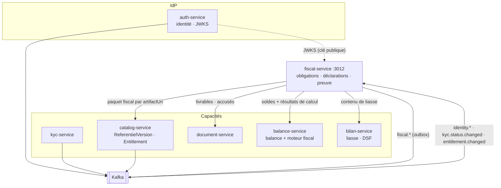
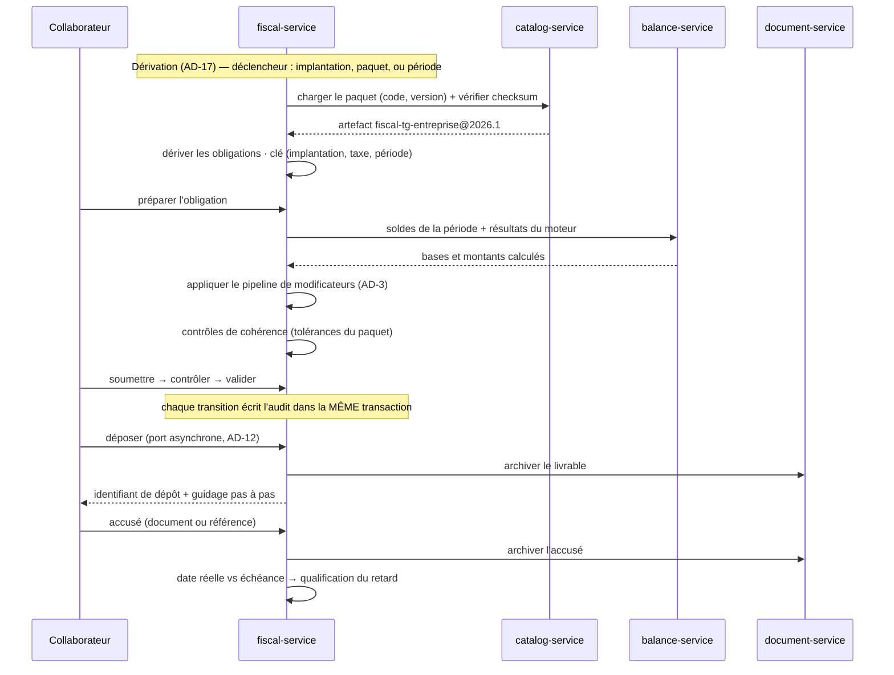

# Architecture Système : Micro-service FiscalService

**Date :** 2026-08-03
**Version :** 1.0
**Type de projet :** API (micro-service NestJS)
**Statut :** Draft
**Écosystème :** PROSPERA

> **Portée de ce document.** Il détaille l'architecture de `fiscal-service` (Module 3), le service qui
> porte le **cycle déclaratif** : dossier fiscal, catalogue d'obligations dérivé, calendrier, workflow,
> dépôt assisté, preuve et règlement. Il **ne définit aucune règle d'imposition** — le calcul appartient
> au moteur fiscal de `balance-service` (EPIC-023/024).
>
> Les **invariants** de ce service vivent dans sa colonne vertébrale,
> `architecture/architecture-fiscal-service-2026-08-03/ARCHITECTURE-SPINE.md` (AD-1 → AD-19). Le présent
> document en est la mise en œuvre détaillée ; en cas d'écart, **la colonne vertébrale fait foi**.

---

## Vue d'ensemble du document

`fiscal-service` est le troisième étage du domaine comptable de PROSPERA. Le premier fabrique la balance
(`balance-service`), le deuxième en tire les états financiers (`bilan-service`), le troisième transforme
tout cela en **obligations déclarées, déposées et prouvées**.

Le service naît d'un re-scopage : le Module 3 devait porter « la fiscalité », mais le **calcul** a été
anticipé dans `balance-service` le 2026-07-12. Ce qui lui reste est plus vaste que ce qui lui a été
retiré — savoir *quoi* déclarer, *quand*, *par qui*, et *comment le prouver*.

Il est *relying party* de l'IdP et consommateur de trois contrats d'événements dont il n'est la source
de vérité d'aucun : `identity.*`, `kyc.status.changed`, `entitlement.changed`.

**Documents liés :**

- **Colonne vertébrale (fait foi) :** `architecture/architecture-fiscal-service-2026-08-03/ARCHITECTURE-SPINE.md`
- **PRD fonctionnel :** `prds/prd-fiscalite-2026-07-31/prd.md` (v0.3, FR-F01→F78, NFR-F01→F16)
- **Architecture programme (parent) :** `architecture-prospera-ecosystem-2026-07-04.md`
- Source de vérité des référentiels et entitlements : `architecture-catalog-service-2026-07-07.md`
- Producteur de la liasse et de la DSF : `architecture-bilan-service-2026-07-07.md`
- Producteur de la balance et du calcul fiscal : `prd-atelier-balance-2026-07-12.md`, EPIC-023/024
- Données réglementaires : `referentiels/paquet-fiscal-togo-2026.json`, `procedures-fiscales-togo.json`

---

## Résumé exécutif

`fiscal-service` est un micro-service **NestJS + MongoDB (base dédiée `fiscal`)** organisé en
**hexagone** : un noyau métier pur — obligations, déclarations, familles de calcul, règles d'échéance —
entouré d'adaptateurs vers la balance, le paquet fiscal, la liasse, les documents, les canaux
administratifs et le bus.

Quatre propriétés le structurent.

1. **Il ne calcule aucun impôt** (AD-1). Le moteur de `balance-service` reste le seul lieu où une règle
   d'imposition est écrite. `fiscal-service` possède l'obligation, son cycle et sa preuve.

2. **Le catalogue d'obligations est dérivé, pas énuméré** (AD-2 à AD-6, AD-17). Les obligations
   applicables découlent du profil — type d'entité × pays × régime × activité — lu dans un **paquet
   fiscal** publié comme `ReferentielVersion` de `catalog-service`. Ajouter une taxe d'une famille
   supportée est un acte de donnée ; une famille inconnue produit un **refus nommé**, jamais un montant
   approximatif.

3. **Deux natures de persistance cohabitent sans se contaminer** (AD-8, AD-9). L'obligation est
   matérialisée et re-dérivable ; la déclaration est append-only, chaque version étant un document neuf.
   L'obligation porte l'avancement, la déclaration porte les montants.

4. **La preuve est protégée par le serveur, pas par le code** (AD-10, AD-19). Le compte applicatif ne
   détient ni `update` ni `remove` sur la collection d'audit ; un chaînage d'empreintes par obligation
   démontre qu'aucune entrée n'a disparu ; la restauration de sauvegarde est un acte administratif tracé.

---

## Périmètre

### Dans le périmètre

- Dossier fiscal et **implantations** (l'implantation *est* l'entité comptable, AD-7).
- Dérivation du catalogue d'obligations et registre des familles de calcul.
- Calendrier fiscal, échéances, alertes, affectation et charge par collaborateur.
- Cycle de vie de l'obligation et versionnement des déclarations, y compris les rectificatives.
- Dépôt **assisté** : production du livrable, guidage, capture de l'accusé, qualification du retard.
- Preuve : journal d'audit inviolable, dossier de contrôle, rattachement des pièces.
- Préparation du règlement et rapprochement — **jamais** son exécution.
- Base de rémunération (import et saisie) pour les obligations sociales.

### Hors périmètre

- Toute règle d'imposition — `balance-service`.
- La production du contenu de la liasse et de la DSF — `bilan-service` (AD-11).
- L'identité, le KYC, l'entitlement, le catalogue de modules.
- Le stockage et l'OCR des documents — `document-service`.
- L'exécution financière d'un règlement, et tout connecteur de dépôt automatisé (AD-13).
- Le paiement des abonnements PROSPERA — `paiement-service` (:3005), sans rapport avec le règlement de
  l'impôt malgré la proximité du vocabulaire.

---

## Drivers architecturaux

| Driver | Conséquence |
| --- | --- |
| Un montant faux est opposable et coûte des majorations de 30 à 80 % | Refus explicite plutôt que valeur par défaut, partout (AD-4, AD-15) |
| La valeur du produit *est* la preuve, pas le calcul | Le journal prime sur la performance : inviolabilité côté serveur, chaînage, sauvegarde séparée |
| Le référentiel réglementaire change chaque année et par pays | Zéro taux, seuil ou échéance dans le code ; tout vient du paquet versionné |
| Le module doit servir cabinets, IMF, assurances et distributeurs | Le service ne connaît que le contrat de balance, jamais sa source (AD-14) |
| Aucun portail administratif n'expose d'API | Le canal est un port asynchrone ; l'assisté et l'automatisé en sont deux implémentations (AD-12) |
| Le programme a déjà été mordu par l'append-only déclaratif | Les garanties d'immuabilité sont techniques, jamais documentaires |

---

## Vue d'ensemble du système

### Topologie



### Flux principal — de la balance à la preuve



---

## Stack technologique

Ratifiée depuis `balance-service` et l'écosystème — aucune version n'est introduite sans usage constaté
dans le dépôt.

| Composant | Version | Origine de la vérification |
| --- | --- | --- |
| Node.js (types) / TypeScript | 22 / 5.7 | `balance-service/package.json` |
| NestJS | 11 | idem |
| Mongoose / `@nestjs/mongoose` | 8.24 / 11 | idem |
| MongoDB | 7, réplica set `rs0` | `docker-compose.yml` |
| kafkajs | 2.2.4 | `balance-service/package.json` |
| `@nestjs/bullmq` / `bullmq` / `ioredis` | 11.0.4 / 5.81 / 5.11 | `document-service`, `auth-service` |
| Redis | 7-alpine | `docker-compose.yml` |
| `nestjs-cls` / `nestjs-pino` / `helmet` | 6.2 / 4.6 / 8 | `balance-service/package.json` |
| `@nestjs/throttler` / `swagger` / `terminus` | 6.5 / 11 / 11 | idem |
| `class-validator` / `class-transformer` | 0.14 / 0.5 | idem |
| Jest | 29 | idem |

---

## Composants du système

### `DossierModule`

Dossier fiscal et implantations. Historisation append-only de toute modification, avec reconstitution de
l'état à une date passée. Porte l'attestation de mandat (FR-F57) comme une entrée de journal, non comme
un formulaire.

### `PaquetModule` — chargement et résolution

Résout `(type d'entité, pays, année)` vers un `ReferentielVersion`, charge l'artefact par `artifactUri`,
vérifie le `checksum` sha256, met en cache. **Refuse** un paquet dont la liste de consommateurs déclarés
ne nomme pas `fiscal-service` (AD-6), un type sans paquet publié (AD-15), et une combinaison
type ↔ référentiel comptable incohérente.

### `CatalogueObligationModule` — dérivation

Unique propriétaire de la dérivation (AD-17). Trois déclencheurs, une clé d'idempotence
`(implantation, taxe, période)`. Une re-dérivation actualise échéance et montant attendu sans écraser
statut, responsable ni déclarations.

### `CalculModule` — registre de familles

Le cœur de la promesse « ajouter une taxe = ajouter une donnée ». Un registre de stratégies typées,
enregistrées au démarrage :

```typescript
// domain/calcul/famille.port.ts
export interface FamilleCalcul<P extends ParametresFamille> {
  readonly code: CodeFamille;                  // PROPORTIONNELLE | BAREME_TRANCHES | FORFAIT_TRANCHE
  valider(parametres: unknown): P;             // validation de schéma au chargement du paquet
  calculer(assiette: bigint, parametres: P): ResultatCalcul; // unités mineures entières
}
```

Les **modificateurs** forment un pipeline d'ordre fixe (AD-3) :

```
assiette → PLANCHER/PLAFOND_ASSIETTE → AIGUILLAGE → famille → MAXIMUM_DE → MINIMUM_PERCEPTION
```

C'est cette composition qui absorbe les cas réels du CGI togolais sans langage d'expression :

| Cas réel | Expression |
| --- | --- |
| TVA 18 % | `PROPORTIONNELLE(0,18)` |
| IS = max(MFP, IS) | `PROPORTIONNELLE(0,27)` + `MAXIMUM_DE(PROPORTIONNELLE(0,01) sur CA HT)` |
| IRPP 8 tranches, haute 35 % | `BAREME_TRANCHES` |
| TPU forfaitaire ≤ 30 M | `FORFAIT_TRANCHE` |
| TPU déclaratif 30–60 M, 2 % ou 8 % | `AIGUILLAGE(activité)` → `PROPORTIONNELLE` + `MINIMUM_PERCEPTION(20 000)` |
| RSH 3 / 5 / 20 % | `AIGUILLAGE(régularité fiscale du prestataire)` → `PROPORTIONNELLE` |
| Cotisations sociales | `PLANCHER_ASSIETTE(SMIG)` → `PROPORTIONNELLE` |

Les familles **non supportées en v1** — `SPECIFIQUE_UNITE` (accises pétrolières), `PAR_ACTE`
(enregistrement), `VALEUR_LOCATIVE` (patente, foncière) — sont déclarables dans le paquet mais n'ont
aucune stratégie enregistrée : l'obligation apparaît au calendrier à **montant saisi**, avec un refus
nommé de calcul (AD-4).

### `DeclarationModule` — cycle de vie

Machine à états unique (AD-9). Chaque transition écrit l'état **et** son entrée d'audit dans la même
transaction Mongo. Les rectificatives créent une version neuve sans altérer la précédente.

### `CanalModule` — dépôt assisté

Adaptateurs derrière un port **asynchrone** (AD-12) : produire le livrable, guider, enregistrer l'accusé
comme un fait séparé. Aucun nom de portail dans le domaine ; aucun secret d'accès stocké (AD-13).

### `AuditModule` — journal inviolable

Collection `audit` en insertion seule au niveau du serveur, chaînage d'empreintes par obligation, index
unique `(perimetre, seq)`. Produit le dossier de contrôle (FR-F52).

### `TravauxModule` — travail récurrent

Files BullMQ à clés idempotentes pour les alertes d'échéance, les dérivations périodiques et les
rapprochements différés (AD-18). Aucun ordonnancement en mémoire de processus.

### Socle transverse (dupliqué, comme dans les autres relying parties)

`JwtAuth (RS256/JWKS)` → `EmailVerified` → `Roles` → `@RequiresFiscalAccess`, plus `Throttler`,
`helmet`, `nestjs-cls`, `nestjs-pino`, `terminus`.

---

## Architecture des données

### Ownership

`fiscal-service` possède **uniquement** : dossiers et implantations, obligations, déclarations, accusés,
règlements, anomalies, base de rémunération, journal d'audit. Tout le reste est lu ailleurs ou répliqué
en read-model.

| Read-model local | Alimenté par | Sert à |
| --- | --- | --- |
| `OrgKycStatus` | `kyc.status.changed` | gate d'accès |
| `OrgFiscalEntitlement` | `entitlement.changed` | gate d'accès + résolution du paquet |
| `OrgMembers` | `identity.*` | affectation et visibilité des dossiers |

### Schémas principaux

```typescript
@Schema({ timestamps: true })
export class Implantation {
  @Prop({ required: true, index: true }) orgId!: Types.ObjectId;   // opaque, du JWT
  @Prop({ required: true }) dossierId!: Types.ObjectId;            // regroupement, local au service
  @Prop({ required: true }) pays!: string;                         // ISO 3166-1 alpha-2
  @Prop({ required: true }) typeEntite!: TypeEntite;               // ENTREPRISE | SFD | ASSURANCE | DISTRIBUTEUR | DEROGATOIRE
  @Prop({ required: true }) identifiantFiscal!: string;
  @Prop({ type: Object }) regimes!: { comptable: 'SN' | 'SMT'; fiscal: 'REEL' | 'SYNTHETIQUE' };
  @Prop({ default: true }) actif!: boolean;
}
// index : { orgId: 1, dossierId: 1 } · { orgId: 1, pays: 1, identifiantFiscal: 1 } unique
```

```typescript
@Schema({ timestamps: true })
export class Obligation {
  @Prop({ required: true, index: true }) orgId!: Types.ObjectId;
  @Prop({ required: true }) implantationId!: Types.ObjectId;
  @Prop({ required: true }) taxe!: string;                          // code du catalogue
  @Prop({ type: Object, required: true }) periode!: { debut: Date; fin: Date };
  @Prop({ required: true }) echeanceLegale!: Date;
  @Prop({ type: Date }) echeanceReportee?: Date;                    // report administratif, ne remplace pas
  @Prop({ type: String, enum: StatutObligation }) statut!: StatutObligation;
  @Prop({ type: Types.ObjectId }) responsableId?: Types.ObjectId;
  @Prop({ required: true }) paquetVersion!: string;                 // déterminisme de re-dérivation (AD-8)
  @Prop({ type: Types.ObjectId }) declarationCouranteId?: Types.ObjectId;
  @Prop({ default: false }) montantASaisir!: boolean;               // famille non supportée (AD-4)
}
// index : { orgId, implantationId, taxe, periode.debut, periode.fin } UNIQUE  ← idempotence AD-17
//         { orgId, echeanceLegale, statut }                                   ← calendrier
//         { orgId, responsableId, statut }                                    ← charge par collaborateur
```

```typescript
@Schema({ timestamps: true })
export class Declaration {                                          // APPEND-ONLY (AD-9)
  @Prop({ required: true, index: true }) orgId!: Types.ObjectId;
  @Prop({ required: true }) obligationId!: Types.ObjectId;
  @Prop({ required: true }) version!: number;                       // 1, 2, 3… rectificatives
  @Prop({ type: BigInt }) montantCalcule?: bigint;                  // unités mineures
  @Prop({ type: BigInt }) montantDeclare?: bigint;
  @Prop({ type: BigInt }) montantPaye?: bigint;
  @Prop({ type: Object }) detailCalcul?: DetailCalcul;              // entrées, étapes, arrondis (FR-F15)
  @Prop() motifCorrection?: string;
  @Prop({ required: true }) auteurId!: Types.ObjectId;
}
// index : { obligationId: 1, version: 1 } unique
```

```typescript
@Schema({ timestamps: true })
export class EntreeAudit {                                          // collection en INSERTION SEULE
  @Prop({ required: true, index: true }) orgId!: Types.ObjectId;
  @Prop({ required: true }) perimetre!: string;                     // `obligation:<id>` — chaîne par périmètre
  @Prop({ required: true }) seq!: number;
  @Prop({ required: true }) empreintePrecedente!: string;           // sha256, chaînage (AD-10)
  @Prop({ required: true }) empreinte!: string;
  @Prop({ required: true }) action!: string;
  @Prop({ type: Object }) depuis?: unknown;
  @Prop({ type: Object }) vers?: unknown;
  @Prop() motif?: string;
  @Prop({ required: true }) auteurId!: Types.ObjectId;
}
// index : { perimetre: 1, seq: 1 } UNIQUE  ← sérialise la chaîne sans verrou global
```

**Rôle MongoDB associé** (AD-10) — c'est la base, et non le code, qui interdit la mutation :

```javascript
db.createRole({
  role: "fiscalApp",
  privileges: [
    { resource: { db: "fiscal", collection: "audit" }, actions: ["find", "insert"] }
  ],
  roles: [{ role: "readWrite", db: "fiscal" }]   // plein droit ailleurs
});
```

> Le rôle `readWrite` accorde `remove` sur toute la base ; le privilège explicite sur `audit` ne le
> retire pas. **La collection `audit` vit donc dans une base séparée `fiscal_audit`**, sur laquelle le
> compte applicatif ne détient que `find` + `insert` — c'est le seul montage où l'interdiction tient
> réellement. La purge de rétention utilise un second compte, absent de la configuration du service.

---

## Gate d'accès

Rejoué en relying party, sur le patron de `bilan-service` :

```
@RequiresFiscalAccess :
  emailVerified (claim JWT)                 → sinon 403 EMAIL_NOT_VERIFIED
  OrgKycStatus == APPROVED (read-model)     → sinon 403 KYC_NOT_APPROVED
  entitlement fiscal == ACTIVE (read-model) → sinon 403 FISCAL_NOT_ENTITLED
```

Tout est local : aucune latence d'autorisation, et le service reste opérant si `auth`, `kyc` ou
`catalog` sont momentanément indisponibles.

---

## Contrats d'événements produits

Publiés par **outbox transactionnelle**, sur le patron de `balance.created` (STORY-099).

| Événement | Émis quand | Consommateurs pressentis |
| --- | --- | --- |
| `fiscal.obligation.derivee` | une obligation apparaît au catalogue | notifications, tableau de bord |
| `fiscal.declaration.deposee` | une déclaration atteint « Déposée » | notifications, pilotage cabinet |
| `fiscal.reglement.rapproche` | un règlement est imputé | comptabilité, tableau de bord |

---

## Authentification inter-services

Frontière de confiance = **access token JWT RS256**, validé via **JWKS** caché. `fiscal-service` doit
figurer dans l'`AUTH_AUDIENCE` de l'IdP. Le service ne signe jamais de jeton et n'expose aucun point
d'authentification. L'`orgId` signé fait foi ; il n'est **jamais** lu depuis le corps d'une requête.

---

## Orchestration et déploiement

- Conteneur `fiscal-service` dans le `docker-compose` racine, port **`:3012`**
  (`:3005` réservé à `paiement-service`, `:3011` à `assistant-service`).
- **Deux bases Mongo** sur le réplica set `rs0` : `fiscal` (métier) et `fiscal_audit` (journal).
- **Deux comptes**, provisionnés par environnement : l'applicatif (aucun droit de mutation sur
  `fiscal_audit`) et un compte de maintenance réservé à la purge et à la restauration.
- Files BullMQ sur le Redis partagé.
- Point de santé Terminus couvrant Mongo (dont l'état du réplica set), Kafka, Redis et la **résolution du
  paquet fiscal actif** — un paquet irrésoluble rend le service dégradé, pas sain.
- Migrations : les collections append-only ne se migrent jamais par réécriture ; évolution par champ
  optionnel et lecture tolérante.

---

## Risques et points d'attention

| Risque | Traitement |
| --- | --- |
| **AD-7 exige un travail sur `balance-service` qui n'est ni fait ni planifié** — vérifié dans le code le 2026-08-03 : la clé de balance vaut `(orgId, exercice.debut, exercice.fin, source, version)` et ne porte **aucune** dimension d'entité ; `societeId`, `entiteId` et `implantation` y sont introuvables, et la story censée l'apporter n'existe ni en fichier ni au tracker | La dimension est **à créer**, pas à réinterpréter. Elle doit précéder STORY-187 et STORY-205, donc être planifiée en tête du module |
| Formats de dépôt inconnus | Jalon bloquant « format confirmé » avant l'incrément I4 (PRD §9) ; le port de canal est conçu pour absorber la découverte |
| Le paquet fiscal a trois consommateurs | AD-6 : artefact unique, consommateurs déclarés, chargement refusé si le service n'y figure pas |
| Deux bases pour un service | Coût d'exploitation assumé : c'est le seul montage où l'interdiction d'effacement tient réellement |
| Familles hors v1 | Obligations à montant saisi, visibles au calendrier ; une contre-métrique du PRD suit cette part |

---

## Journal de décisions

Les dix-neuf décisions d'architecture (AD-1 → AD-19) et leurs alternatives écartées vivent dans la
colonne vertébrale et son memlog :
`architecture/architecture-fiscal-service-2026-08-03/`. Les revues qui ont durci AD-6, AD-10 et AD-12 et
fait naître AD-17, AD-18 et AD-19 sont dans le sous-dossier `reviews/`.
