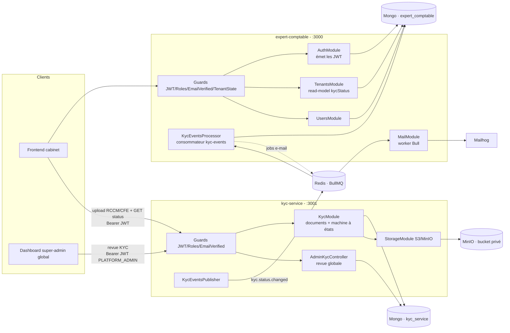

# Architecture Système : Micro-service KycService

**Date :** 2026-07-03
**Architecte :** vivian
**Version :** 1.1
**Type de projet :** API (micro-service NestJS)
**Statut :** Draft
**Écosystème :** PROSPERA

> **Révision 1.1 (2026-07-04) — rebasage sur `auth-service` + bus Kafka.** Le re-cadrage de l'écosystème (voir `docs/architecture-prospera-ecosystem-2026-07-04.md`) introduit (a) un fournisseur d'identité dédié **`auth-service`** (IdP) et (b) **Apache Kafka** comme bus d'événements inter-services. Conséquences : KycService devient *relying party* de **`auth-service`** (valide les JWT via **RS256/JWKS**, non plus un secret HS256 partagé) ; les événements KYC transitent par le **topic Kafka `kyc.status.changed`** (non plus une file BullMQ) ; la file BullMQ interne `MAIL_QUEUE` reste réservée aux jobs internes. La clé `tenantId` désigne désormais l'**organisation** (`orgId`). Sections amendées : Résumé exécutif, Contrat d'événements, Authentification inter-services, Orchestration.

---

## Vue d'ensemble du document

Ce document définit l'architecture du micro-service **KycService**, extrait de l'EPIC-003 initialement conçu comme un module interne d'`expert-comptable`. La décision produit de l'externaliser répond à un besoin de **réutilisation par plusieurs micro-services PROSPERA** (le module métier Bilan à venir, puis d'autres) : la vérification d'identité d'un cabinet devient une capacité transverse, pas une fonction propre à `expert-comptable`.

Ce document est la **source de vérité du contrat d'événements `kyc.status.changed`** (§ Contrat d'événements) : toute évolution du contrat se décide ici avant d'être répliquée dans le code des services producteur/consommateur. Le **transport** (Apache Kafka) et les conventions communes sont eux définis dans l'architecture programme.

**Documents liés :**
- **Architecture programme (parent) : `docs/architecture-prospera-ecosystem-2026-07-04.md`** — source de vérité de la topologie, de l'ownership map, du modèle de jetons RS256/JWKS et des contrats d'événements. Ce document s'y subordonne.
- Architecture du service consommateur : `docs/architecture-expert-comptable-2026-07-02.md` (§ KycModule → renvoi vers ce document ; § read-model)
- Architecture de l'IdP émetteur des jetons : `docs/architecture-auth-service-2026-07-04.md`
- PRD : `docs/prd-expert-comptable-2026-07-02.md` (FR-005, FR-006 — mêmes identifiants ; addendum 2026-07-03)
- Décision d'origine : `architecture-expert-comptable` décision **D1** (« chaque module peut devenir un service indépendant »)

---

## Résumé exécutif

KycService est un micro-service **NestJS + MongoDB (base dédiée `kyc_service`)** qui possède le domaine KYC de bout en bout : réception des documents justificatifs (**RCCM**, **carte CFE**), stockage objet privé (S3/MinIO), machine à états du dossier par organisation, et revue par le super-admin global de la plateforme. Il **ne possède pas** l'organisation ni les utilisateurs : ceux-ci sont la propriété d'**`auth-service`** (l'IdP). La frontière de confiance entre services est l'**access token JWT** émis par `auth-service` et signé en **RS256** : KycService valide le token via la **clé publique JWKS** de l'IdP et en extrait `org` (=`tenantId`), `roles`, `emailVerified` — sans jamais interroger la base d'un autre service.

Le service **publie** chaque changement de statut KYC sur un **topic Kafka** (`kyc.status.changed`). `expert-comptable` (et, demain, tout autre vertical intéressé, via son propre *consumer group*) **consomme** ces événements pour maintenir une **copie locale** (read-model) du statut KYC de ses organisations et déclencher ses propres effets de bord (e-mails, restriction d'accès via `TenantStateGuard`). KycService n'envoie aucun e-mail lui-même — il ne connaît que des identifiants opaques.

---

## Périmètre

### Dans le périmètre de KycService

- **FR-005** — Soumission des documents KYC (RCCM/CFE), validation magic-bytes + taille, versionnage/supersede, stockage privé.
- **FR-006** — Revue par le super-admin global : file d'attente, URLs présignées (≤ 5 min), approbation / rejet motivé.
- Machine à états du dossier KYC par cabinet (`PENDING_DOCUMENTS → UNDER_REVIEW → APPROVED | REJECTED`, re-soumission `REJECTED → UNDER_REVIEW`).
- Publication des événements `kyc-events`.

### Hors périmètre (reste dans `expert-comptable`)

- **FR-007** — `TenantStateGuard` et matrice d'accès (e-mail / KYC / abonnement). Le guard lit le **read-model local** `tenant.kycStatus` ; il ne fait aucun appel réseau à KycService (cohérence par événements). Justification : FR-007 mêle KYC **et** abonnement (EPIC-004), et protège les endpoints d'`expert-comptable` — c'est une préoccupation du service consommateur, pas du fournisseur KYC.
- Propriété de `Tenant`, `User`, envoi d'e-mails, authentification (émission de tokens).

---

## Drivers architecturaux

1. **Réutilisabilité inter-services** → KycService expose un contrat stable (API HTTP + événements) consommable par N services, sans couplage à la base d'`expert-comptable`.
2. **Autonomie de déploiement (database-per-service)** → base Mongo dédiée ; aucune jointure ni transaction distribuée avec `expert-comptable`.
3. **Isolation multi-tenant (NFR-002)** → même socle que l'hôte : `TenantScopedRepository` + `TenantContext` alimenté par le JWT ; anti-énumération (404, jamais 403 cross-tenant).
4. **Sécurité (NFR-001)** → documents en bucket privé, servis uniquement par URLs présignées courtes ; validation MIME par magic bytes ; secret JWT partagé validé au boot.
5. **Cohérence éventuelle assumée** → le read-model des consommateurs suit les événements avec une latence de quelques secondes ; acceptable pour la matrice d'accès (un cabinet fraîchement approuvé voit son accès s'ouvrir en quasi temps réel).

---

## Vue d'ensemble du système

### Topologie de l'écosystème

**Pattern :** deux micro-services NestJS indépendants (`expert-comptable`, `kyc-service`) partageant une infrastructure commune (MongoDB, Redis, MinIO, Mailhog) orchestrée par un **`docker-compose` racine** unique au niveau du dépôt PROSPERA.



### Flux principal (soumission → revue → accès)

1. Le cabinet s'inscrit et se connecte sur `expert-comptable` (`:3000`) → obtient un access token JWT.
2. Avec ce **même** token, il téléverse RCCM puis CFE sur KycService (`:3001` `POST /kyc/documents`). KycService valide le token (secret partagé), crée/complète le `TenantKycProfile` (lazy), stocke les fichiers.
3. Quand RCCM **et** CFE sont présents, KycService transitionne le profil en `UNDER_REVIEW` et **publie** `kyc.status.changed`.
4. `expert-comptable` consomme l'événement : met à jour `tenant.kycStatus` (read-model) et enfile l'e-mail de soumission (il possède `User` + `MailerService`).
5. Le super-admin global examine le dossier sur KycService (URLs présignées), approuve/rejette → nouvelle transition → nouvel événement → read-model + e-mail d'approbation/rejet côté `expert-comptable`.
6. Le `TenantStateGuard` d'`expert-comptable` lit `tenant.kycStatus` (local) pour autoriser/refuser le checkout — zéro appel réseau par requête.

---

## Stack technologique

Identique à `expert-comptable` (NestJS 11 / Node 20 LTS / TypeScript strict / MongoDB 7 via Mongoose / Redis + BullMQ / MinIO), afin de mutualiser les conventions et le socle de code dupliqué. **Différences** : pas de dépendances `nodemailer`/`handlebars`/`bcrypt` (aucun e-mail, aucun hash de mot de passe) ; `@nestjs/jwt` conservé uniquement pour signer des tokens de test en e2e ; validation du token de production par `passport-jwt`.

---

## Composants du système

### KycModule (documents + statut)

- **KycController** (`POST /kyc/documents`, `GET /kyc/status`) — interfaces cabinet, `@Roles(TENANT_ADMIN, TENANT_USER)` en lecture, `@Roles(TENANT_ADMIN)` en upload.
- **KycDocumentsService** — validation taille/magic bytes, `putObject` MinIO, supersede du précédent `SUBMITTED`, hook post-upload.
- **KycStatusService** — machine à états (`assertTransition`), `getStatus`, `onDocumentSubmitted`, `approve`/`reject` ; publie via `KycEventsPublisher`.
- **KycDocumentsRepository** (`extends TenantScopedRepository`) et **TenantKycProfileRepository** (accès par `tenantId` explicite).

### AdminKycController (revue globale, FR-006)

- `GET /admin/kyc/pending` (profils `UNDER_REVIEW`, plus anciens d'abord), `GET /admin/kyc/tenants/:tenantId` (métadonnées + URLs présignées ≤ 5 min), `POST .../approve`, `POST .../reject` (motif requis). Réservé `PLATFORM_ADMIN` (`tenantId: null` dans le JWT).

### StorageModule (déplacé depuis expert-comptable)

- `StorageService` abstrait (token DI) + `MinioStorageService` (`putObject`, `getPresignedUrl`), `StorageBootstrapService` (création idempotente du bucket privé). Seul consommateur : KycService.

### Socle transverse (dupliqué)

- `CommonModule` : `TenantContext` (nestjs-cls), `TenantScopedRepository`, guards (`JwtAuthGuard`, `EmailVerifiedGuard`, `RolesGuard`), décorateurs (`@Public`, `@Roles`, `@CurrentUser`, `@AllowUnverified`), `file-signature.util`, `Role` enum, `AccessTokenPayload`.
- `auth/jwt.strategy.ts` — **validate-only** : valide la signature (secret partagé), peuple `TenantContext` et `request.user`. Aucun endpoint d'authentification.

---

## Architecture des données

### Ownership (database-per-service)

| Donnée | Propriétaire | Base | Rôle chez l'autre |
|---|---|---|---|
| `KycDocument` (fichiers, métadonnées, versions) | **kyc-service** | `kyc_service` | — |
| `TenantKycProfile` (statut par cabinet) | **kyc-service** | `kyc_service` | source de vérité |
| `Tenant.kycStatus` + `kycReviewedAt`/`kycReviewedBy`/`kycRejectionReason` | expert-comptable | `expert_comptable` | **read-model** (copie alimentée par événements) |
| `Tenant`, `User` | expert-comptable | `expert_comptable` | KycService ne les connaît que par `tenantId`/`userId` opaques (issus du JWT) |

### Schéma `TenantKycProfile` (nouveau, kyc-service)

```typescript
// modules/kyc/schemas/tenant-kyc-profile.schema.ts
@Schema({ timestamps: true })
export class TenantKycProfile {
  @Prop({ type: Types.ObjectId, required: true, unique: true }) tenantId: Types.ObjectId; // 1 profil / cabinet
  @Prop({ type: String, enum: KycStatus, default: KycStatus.PENDING_DOCUMENTS }) status: KycStatus;
  @Prop() rejectionReason?: string;
  @Prop() reviewedAt?: Date;
  @Prop({ type: Types.ObjectId }) reviewedBy?: Types.ObjectId; // userId PLATFORM_ADMIN (opaque)
  @Prop() submittedAt?: Date;                                   // dernier passage en UNDER_REVIEW
}
// index : { tenantId: 1 } unique ; { status: 1, submittedAt: 1 } (file de revue admin, plus anciens d'abord)
```

**Création lazy** : au premier upload, `getOrCreate(tenantId)` fait un upsert (`findOneAndUpdate` + `$setOnInsert`, index unique = idempotent et race-safe). KycService n'a pas de hook d'inscription et ne reçoit pas d'événement `tenant.created` en phase 1 ; le `tenantId` signé du JWT fait foi.

Le schéma `KycDocument` est **inchangé** par rapport à STORY-011 (`tenantId`, `type`, `storageKey`, `mimeType`, `size`, `version`, `status`, `uploadedBy`, `originalName`), simplement déplacé dans la base `kyc_service`. Les `ref: 'Tenant'`/`ref: 'User'` deviennent de simples `ObjectId` (pas de `populate` inter-bases).

---

## Contrat d'événements `kyc.status.changed` (v1) — source de vérité

> Transport aligné sur `architecture-prospera-ecosystem-2026-07-04.md` § Contrats d'événements : **Apache Kafka**.

**Transport :** **topic Kafka `kyc.status.changed`**, partitionné par **clé = `orgId`** (ordre garanti par organisation).
**Producteur :** kyc-service (unique). **Consommateurs :** un **consumer group** par service intéressé (`expert-comptable` en phase 1 ; verticaux additionnels sans effort producteur).
Publié **après** persistance réussie de la transition locale (cible de fiabilité : transactional outbox).

```typescript
/** Émis à CHAQUE transition réussie du statut KYC d'une organisation. État ABSOLU. */
export interface KycStatusChangedEventV1 {
  schemaVersion: 1;
  eventId: string;            // UUID v4 — clé d'idempotence côté consommateur
  orgId: string;              // ObjectId hex de l'organisation (= clé de partition Kafka)
  previousStatus: KycStatus;  // état avant transition
  status: KycStatus;          // état après transition (UNDER_REVIEW | APPROVED | REJECTED)
  rejectionReason?: string;   // présent ssi status === REJECTED
  reviewedBy?: string;        // userId PLATFORM_ADMIN (approve/reject uniquement)
  actorUserId?: string;       // userId de l'uploadeur (transitions vers UNDER_REVIEW)
  occurredAt: string;         // ISO-8601 UTC
}
```

**Sémantique Kafka :** clé de message = `orgId` (co-localise et ordonne les événements d'une même organisation) ; livraison **at-least-once** → le consommateur **doit** être idempotent (marqueur `ProcessedKycEvent`). L'`eventId` est la clé de déduplication (pas un `jobId` BullMQ).

**Traitement côté consommateur (`KycEventsConsumer`, expert-comptable)**, dans l'ordre :
1. **Read-model** — `$set` absolu (`kycStatus`, `kycReviewedAt`, `kycReviewedBy`), `$unset kycRejectionReason` si absent du payload. Idempotent (état absolu → rejouable sans risque).
2. **E-mails** — enfilés sur la file **interne** `MAIL_QUEUE` (BullMQ/Redis — pas Kafka) avec `jobId` déterministe `${eventId}:${jobName}` (déduplication) :
   - `status === UNDER_REVIEW` → `send-kyc-submitted-email { userId: actorUserId }` (soumission **et** re-soumission) ;
   - `status === APPROVED` → `send-kyc-approved-email` vers les `TENANT_ADMIN` actifs de l'organisation (résolus via `forTenant(orgId)`) ;
   - `status === REJECTED` → `send-kyc-rejected-email { userId, rejectionReason }` (motif inclus, FR-006).
3. **Marqueur** — `ProcessedKycEvent { eventId unique, processedAt }` (TTL 30 j), avant *commit* de l'offset Kafka : garantit qu'un rejeu (re-livraison Kafka) ne re-produit ni écriture ni e-mail.

**Pourquoi un état absolu et non un delta ?** La mise à jour du read-model devient naturellement idempotente : rejouer un événement réapplique le même `$set`. Aucune dépendance à l'ordre d'arrivée pour la valeur finale (le champ `previousStatus` sert au diagnostic/audit, pas au calcul).

### Fan-out multi-consommateurs — natif avec Kafka

Un topic Kafka est lu par autant de **consumer groups** que de services intéressés, chacun à son offset. Le jour où un second service (module Bilan, autre vertical) doit réagir aux mêmes événements KYC, il crée son consumer group sur `kyc.status.changed` — **sans aucune modification du producteur**. (Avec l'ancienne approche BullMQ, il aurait fallu dupliquer les messages côté producteur : Kafka supprime ce besoin.)

---

## Contrat d'événements `kyc.document.uploaded` (v1) — source de vérité

> Ajouté en **STORY-040** (prérequis Module 0 / document-service, décision DO-1). Transport aligné sur `architecture-prospera-ecosystem-2026-07-04.md` § Contrats d'événements : **Apache Kafka**.

**Transport :** **topic Kafka `kyc.document.uploaded`**, partitionné par **clé = `orgId`** (ordre garanti par organisation).
**Producteur :** kyc-service (unique). **Consommateur (phase 1) :** `document-service` (STORY-041/042) — OCR RCCM/CFE au service de la revue KYC.
Publié **à chaque dépôt de pièce réussi** (`POST /kyc/documents`), **après** persistance de la pièce (fiabilité : transactional outbox — **même transaction** que la création du `KycDocument`, invariant « pas de pièce sans événement, pas d'événement sans pièce »).

```typescript
/** Émis à CHAQUE dépôt de pièce KYC réussi. Fait ponctuel (pas un état absolu). */
export interface KycDocumentUploadedEventV1 {
  schemaVersion: 1;
  eventId: string;        // UUID v4 — clé de déduplication côté consommateur
  orgId: string;          // ObjectId hex de l'organisation (= clé de partition Kafka)
  documentId: string;     // ObjectId hex du KycDocument créé
  type: KycDocumentType;  // RCCM | CFE
  storageKey: string;     // clé objet MinIO (bucket privé) — le consommateur LIT la pièce
  mimeType: string;       // MIME réel (magic bytes), jamais celui déclaré par le client
  size: number;           // octets
  version: number;        // n° de version de la pièce (ré-upload ⇒ +1)
  uploadedBy: string;     // userId opaque de l'uploadeur
  occurredAt: string;     // ISO-8601 UTC
}
```

**Sémantique Kafka :** clé de message = `orgId` ; livraison **at-least-once** → le consommateur **doit** être idempotent (marqueur `ProcessedEvent { eventId }`). L'`eventId` est la clé de déduplication.

**Découplage de `kyc.status.changed` :** un dépôt de pièce n'implique pas un changement de statut (la bascule `UNDER_REVIEW` n'a lieu qu'une fois **RCCM et CFE** présents). Quand les deux surviennent au même appel, `kyc.document.uploaded` est enfilé **avant** le `kyc.status.changed` correspondant (`createdAt` antérieur) ⇒ publié en premier pour un même `orgId`.

**Exception assumée au patron `kyc.status.changed` (qui ne transporte aucun `storageKey`) :** ce payload porte le `storageKey` car le consommateur **doit** accéder à la pièce (MinIO, **lecture seule**). Il ne transporte **aucun binaire**, aucun nom de fichier client (`originalName`), et **aucune donnée déclarée** (raison sociale, n° RCCM déclaré…).

**Point de coordination — `declared` (comparaison OCR).** L'esquisse consommateur de `tech-spec-document-service-2026-07-10.md` (l.73) prévoyait un champ `declared:{…}`. Il est **écarté du contrat producteur** : depuis le cutover *relying party* (STORY-030), `kyc-service` **ne possède plus l'identité** (propriété de `auth-service`) et le `TenantKycProfile` ne stocke que le statut. La résolution « déclaré ↔ lu » est donc **en aval** : `document-service` la câble via son **propre read-model d'identité** (événements `identity.*`) ou une lecture dédiée (tranché à STORY-042/043). `kyc-service` reste **producteur pur** — invariant DO-1 : l'OCR assiste, il n'approuve jamais (le statut KYC reste piloté par l'humain via `kyc-service`).

**Invariant transactional outbox (implémentation STORY-040) :** `KycDocumentsService.upload()` effectue le `putObject` (MinIO) **avant** la transaction ; puis, **dans une même transaction Mongo**, supersède le `SUBMITTED` précédent + crée le `KycDocument` + enfile `kyc.document.uploaded` (`OutboxService.enqueue` sous session). Un rollback (ex. E11000 double-clic → 409) ⇒ **ni pièce ni événement** ; un commit ⇒ **les deux**. Le relais outbox (topic-agnostique) publie ensuite sur Kafka, clé `orgId`, header `eventId`/`schemaVersion`.

---

## Authentification inter-services

> Aligné sur `architecture-prospera-ecosystem-2026-07-04.md` § Modèle de jetons. `auth-service` (IdP) est l'émetteur ; kyc-service est *relying party*.

- **Frontière de confiance = l'access token JWT** émis par **`auth-service`** et signé en **RS256** (clé privée de l'IdP). kyc-service valide la signature via la **clé publique JWKS** (`GET {auth-service}/.well-known/jwks.json`), mise en cache et rafraîchie périodiquement — **aucun secret de signature ne circule**.
- kyc-service **ne signe jamais** de token, n'expose aucun endpoint d'authentification, et ne connaît **aucun** secret de signature ni le refresh token (qui ne quitte jamais l'IdP).
- Le payload validé porte `{ iss, aud, sub (userId), org (=tenantId), roles, emailVerified }`. La chaîne de guards (Throttler → JwtAuth → EmailVerified → Roles) est **dupliquée à l'identique** ; `emailVerified` étant un claim, aucun guard n'interroge de base ni d'autre service.
- **Bascule HS256 → RS256/JWKS par configuration** : tant qu'`auth-service` n'existe pas, kyc-service peut valider les jetons HS256 émis transitoirement par `expert-comptable` (même secret d'accès). La stratégie JWT est conçue pour basculer vers JWKS sans réécriture, à l'arrivée de l'IdP.
- **Conséquence de sécurité** : kyc-service ne peut pas vérifier l'existence réelle de l'organisation — l'`org` signé fait foi. La robustesse de la clé privée de l'IdP et sa rotation (`kid`) sont donc critiques en production.

---

## Orchestration & déploiement

- **`docker-compose.yml` racine** (`PROSPERA/`) : services `expert-comptable` (`3000:3000`), `kyc-service` (`3001:3000`), + `mongo` (replica set `rs0`), **`kafka` (KRaft mono-nœud)**, `redis`, `minio`, `mailhog` partagés. `docker-compose.override.yml` racine pour le hot-reload des deux apps. Nom de projet `prospera`.
- **Kafka** : le topic `kyc.status.changed` est produit par kyc-service (client `kafkajs` ou transport Kafka de `@nestjs/microservices`) ; `redis` reste pour la file BullMQ **interne** (aucun rôle inter-services) et le cache JWKS.
- **Deux bases sur la même instance Mongo** : `mongodb://mongo:27017/expert_comptable?replicaSet=rs0` et `mongodb://mongo:27017/kyc_service?replicaSet=rs0` (database-per-service sans coût d'infra supplémentaire en dev).
- **Démarrage** : `docker compose up` depuis la racine PROSPERA (remplace le `docker compose up` depuis `expert-comptable/`). Les composes internes à `expert-comptable/` sont supprimés.
- **CI** (`.github/workflows/ci.yml`) : matrice `service: [expert-comptable, kyc-service]` (lint → tests → build par service).

---

## Couverture des exigences

| FR | Exigence | Composant kyc-service |
|----|----------|-----------------------|
| FR-005 | Soumission RCCM/CFE (magic bytes, taille, versionnage, bucket privé) | KycModule, StorageService |
| FR-006 | Revue KYC (file, URLs présignées, approve/reject motivé) | AdminKycController, KycStatusService |

| NFR | Solution |
|-----|----------|
| NFR-001 Sécurité | Bucket privé + URLs présignées ≤ 5 min ; magic bytes ; validation JWT RS256 via JWKS de l'IdP ; throttler |
| NFR-002 Isolation | `TenantScopedRepository` + `TenantContext` (JWT) ; anti-énumération (404) |
| NFR-005 Observabilité | Logs pino structurés (`requestId`) ; événements `kyc-events` traçables (`eventId`) |
| NFR-006 Docs + tests | Swagger `/api/docs` ; seuils Jest 65/90/90/90 ; e2e par service + e2e cross-service docker |

---

## Journal de décisions

**K1 — Extraction de l'EPIC-003 en micro-service dédié**
✓ Réutilisable par les futurs services PROSPERA (Bilan…) ; autonomie de déploiement ; frontières nettes. ✗ Complexité opérationnelle (2 services, cohérence éventuelle, contrat à versionner). *Justifié par le besoin explicite de réutilisation ; réversibilité prévue par D1 de l'architecture d'origine.*

**K2 — Événements + read-model (vs REST synchrone par requête)**
✓ Lectures locales rapides (le `TenantStateGuard` ne fait aucun appel réseau) ; résilience si kyc-service est momentanément indisponible. ✗ Cohérence éventuelle (latence de quelques secondes) ; read-model à maintenir. *La matrice d'accès tolère une propagation quasi temps réel ; l'état absolu rend la synchro idempotente.*

**K3 — Database-per-service**
✓ Découplage total, pas de schéma partagé, évolution indépendante. ✗ Pas de jointure ni transaction inter-services ; le statut est dupliqué (source + read-model). *Standard micro-services ; le coût de duplication est faible (un champ).*

**K4 — Duplication pragmatique du socle (vs lib npm partagée)**
✓ Chaque service reste autonome et déployable seul ; pas de chantier monorepo (workspaces, tsconfig paths, publication). ✗ Code socle en double, risque de dérive. *On factorisera en lib au 3ᵉ service ; `schemaVersion` + ce document limitent la dérive du contrat.*

**K5 — État absolu dans l'événement (vs delta)**
✓ Mise à jour du read-model idempotente par construction ; robuste au rejeu et au désordre. ✗ Payload légèrement plus verbeux. *La valeur finale ne dépend jamais de l'ordre d'arrivée.*

---

## Risques & points ouverts

1. **Perte d'un événement** si Redis est indisponible au moment exact de la publication → log + métrique côté producteur ; la transition suivante rattrape l'état (état absolu). *Extension future si besoin : job de réconciliation périodique (kyc-service expose un endpoint « statut courant par tenant » que l'hôte re-synchronise).*
2. **Doublon d'e-mail** sur rejeu très tardif (après purge des jobs mail `removeOnComplete` et expiration TTL du marqueur) → accepté : e-mails purement informatifs, sans secret.
3. **Dérive du contrat dupliqué** entre les deux `kyc-events.constants.ts` → discipliné par `schemaVersion` et ce document comme référence unique.
4. **Fan-out multi-consommateurs** non implémenté (un seul consommateur en phase 1) → encapsulé dans `KycEventsPublisher`, activable sans refonte.
5. **Rétention légale des documents KYC** (héritée du PRD) → à confirmer avec le métier ; s'applique désormais à la base `kyc_service`.

---

## Historique des révisions

| Version | Date | Auteur | Changements |
|---------|------|--------|-------------|
| 1.0 | 2026-07-03 | vivian | Architecture initiale du micro-service KycService (extraction EPIC-003 ; contrat d'événements v1) |
| 1.1 | 2026-07-04 | vivian | Rebasage sur `auth-service` (IdP) : validation RS256/JWKS au lieu du secret HS256 partagé ; relying party d'auth-service ; `org` comme clé ; subordination à l'architecture programme |

---

**Document créé avec BMAD Method v6 — Phase 3 (Solutioning)**
*Prochaine étape : `/bmad:create-story STORY-020` (scaffold + migration), puis STORY-021, STORY-013 (re-scopée), STORY-014.*
