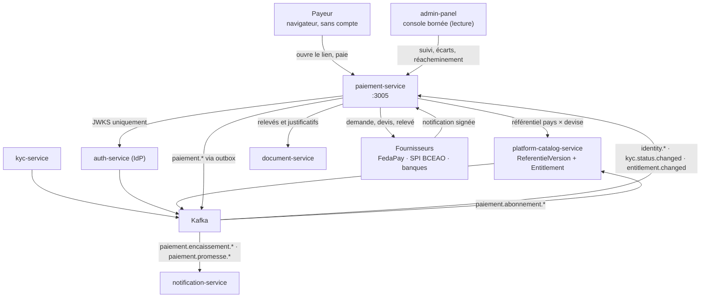
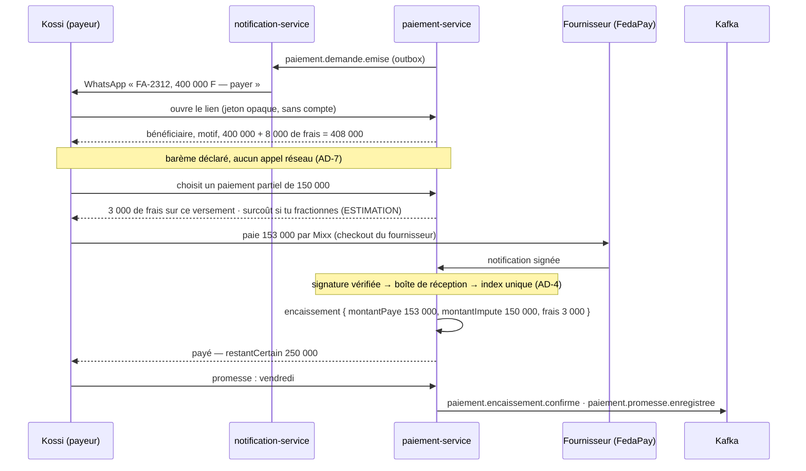

# Architecture Système : Micro-service PaiementService

**Date :** 2026-08-03
**Version :** 1.0
**Type de projet :** API (micro-service NestJS) + une surface publique server-rendered
**Statut :** Draft
**Écosystème :** PROSPERA

> **Portée de ce document.** Il détaille l'architecture de `paiement-service` (Module 2 — PI-SPI &
> encaissement) : comptes d'encaissement, fournisseurs interchangeables, demandes et liens de paiement,
> encaissement par lien et hors Prospera, réconciliation, abonnements Prospera. Il **ne couvre pas** la
> caisse et le guichet (module Caisse #15), l'émission de facture (Facturation #17), ni la décision de
> relance (Relance #24).
>
> Les **invariants** de ce service vivent dans sa colonne vertébrale,
> `architecture/architecture-paiement-service-2026-08-03/ARCHITECTURE-SPINE.md` (AD-1 → AD-18). Le
> présent document en est la mise en œuvre détaillée et le rationnel ; en cas d'écart, **la colonne
> vertébrale fait foi**.

---

## Vue d'ensemble du document

`paiement-service` est le service qui **fait entrer l'argent** dans l'écosystème PROSPERA — sans jamais
le toucher. C'est la contradiction apparente dont tout le reste découle.

Le PRD la résout par un invariant juridique : **Prospera ne détient jamais les fonds**. L'argent va
directement sur le compte du client — chez son PSP, sa banque, ou son numéro mobile money enregistré à
son nom. Encaisser pour le compte d'un tiers en UEMOA supposerait un statut d'établissement de monnaie
électronique : capital réglementaire, supervision BCEAO, obligations LCB/FT propres. Le service tel que
défini ici n'y est pas soumis.

L'architecture prend cet invariant au sérieux d'une manière précise : **elle le rend impossible à
violer par inadvertance**. Il n'existe aucun type, aucun champ, aucune collection représentant un solde
détenu, un portefeuille, un séquestre ou un reversement (**AD-1**). Le raccourci qui romprait
l'invariant — un compte de collecte au nom de Money Vibes « juste pour les tests » — ne ressemble pas à
une décision juridique, et c'en est une. Le contrôle est dans le modèle de données, pas dans la
vigilance.

Le service est *relying party* de l'IdP et consommateur de trois contrats d'événements dont il n'est la
source d'aucun : `identity.*`, `kyc.status.changed`, `entitlement.changed`.

---

## Résumé exécutif

Neuf traits définissent ce service.

1. **Il ne touche pas l'argent.** Il connaît le mouvement, jamais les fonds (AD-1).
2. **Il constate autant qu'il déclenche.** L'encaissement en espèces au commercial est un cas de
   premier rang, pas un rattrapage. Sans le groupe F du PRD, la balance créances ment.
3. **Le ledger est append-only.** Aucun encaissement ne se met à jour ; une annulation est une
   contre-passation. Le solde est une **projection**, jamais un champ mutable (AD-3).
4. **L'idempotence est arbitrée par la base**, pas par le code : un index unique partiel, et une erreur
   de clé dupliquée *est* le rejeu (AD-4). C'est l'invariant le plus coûteux à violer — un double
   encaissement se voit chez le payeur, pas dans les journaux.
5. **Les fournisseurs sont interchangeables et coexistent**, derrière un port unique, routés par pays ×
   devise × méthode selon des règles ordonnées et déterministes (AD-5, AD-6).
6. **Les frais sont annoncés avant le choix, figés à l'émission, enregistrés avec l'encaissement**, et
   confrontés la nuit aux frais réellement prélevés (AD-7).
7. **La créance est imputée du montant dû**, jamais de ce qui a été payé ni de ce qui a été reçu
   (AD-18). Sous la politique « frais au bénéficiaire », les trois nombres diffèrent — et l'écart est
   du vrai argent.
8. **Il a une vraie surface publique** : le lien de paiement, ouvert par quelqu'un qui n'a aucun compte
   Prospera, sur un téléphone modeste en réseau lent. C'est là que l'adoption se gagne (AD-9).
9. **Il publie, il ne décide pas.** Ni relance, ni facture, ni écriture comptable, ni remboursement
   (AD-17).

---

## Périmètre

### Dans le périmètre

- Raccordement du compte d'encaissement d'une organisation, par elle-même ou par l'administration
- Fournisseurs de paiement interchangeables et **simultanés**, routés par pays et devise
- Demandes de paiement, liens, QR, relance du lien
- Encaissement par lien, **paiement partiel**, promesse de compléter
- **Paiement hors Prospera** : déclaration manuelle puis validation par la remise d'espèces
- Réconciliation créance ↔ encaissements, solde vrai
- Enregistrement d'une annulation constatée, sans initier de remboursement
- Abonnements Prospera : cycle, échéance, impayé, suspension, période de grâce
- Octroi et révocation d'entitlements à l'activation et à la suspension
- Multi-pays et multi-devise d'Afrique de l'Ouest

### Hors périmètre

| Hors périmètre | Où ça vit | Pourquoi |
|---|---|---|
| Caisse, guichet, fond de caisse, clôture, écarts | Caisse (#15) | Métier différent : manipulation d'espèces et responsabilité du caissier |
| Émission de facture, proforma, e-facture, avoir | Facturation (#17) | Ce module encaisse une créance, il ne la crée pas |
| Décision de relance, escalade, recouvrement | Relance (#24) | Ce module **fournit** la promesse et le solde ; il ne décide pas |
| Envoi du lien au payeur | `notification-service` | Le lien est un message ; l'organe de parole est unique |
| Écritures comptables | `balance-service` / Comptabilité | Ce module publie l'événement, il n'écrit pas le journal |
| Initiation de remboursement | Chez le client et son PSP | Ne détenant pas les fonds, il ne peut pas les rendre |
| Conversion de devise | Nulle part | Convertir serait une activité de change, donc un agrément |
| Détention de fonds, compte de transit, séquestre | — | **Interdit par NFR-1 / AD-1** |

---

## Drivers architecturaux

Ce qui a réellement contraint la conception, par ordre de force.

| # | Driver | Conséquence architecturale |
|---|---|---|
| **D1** | Prospera ne détient jamais les fonds (régime juridique) | AD-1 — l'interdit vit dans le modèle de données, mesuré par SM-1 à zéro |
| **D2** | Un double encaissement se voit chez le payeur | AD-4 — la base arbitre, pas le code ; boîte de réception des notifications ; test de rejeu dans la définition de terminé |
| **D3** | Le XOF n'a pas de décimale | AD-8 — entiers d'unité mineure, décimales lues d'un référentiel versionné. Un traitement à deux décimales par défaut produit des montants faux d'un facteur 100 sur le marché principal |
| **D4** | Le payeur n'est pas un utilisateur Prospera et n'a pas choisi son appareil | AD-9 — rendu serveur, HTML minimal, jeton opaque, aucun appel réseau avant d'afficher un prix (AD-7) |
| **D5** | En distribution ouest-africaine, l'encaissement en espèces sur tournée n'est pas marginal | AD-3, AD-11, AD-15 — le déclaré est un citoyen de premier rang, distingué du confirmé partout |
| **D6** | Chaque organisation a son propre compte marchand, donc ses propres clés d'API | AD-14 — chiffrement en base, clé hors base, aucun chemin de lecture en clair |
| **D7** | Cinq modules dépendent de ce service (#15, #17, #21, #22, #26) | AD-17 — il publie et ne décide pas ; la dérive « les données sont déjà là » est la plus probable |
| **D8** | C8 (auth machine-à-machine) n'est pas tranchée depuis STORY-034 | AD-13 — l'octroi passe par événement, ce qui **retire** la dépendance au lieu de l'attendre |

---

## Vue d'ensemble du système

### Topologie

Aucune flèche synchrone ne remonte vers un service qui précède `paiement-service`. Les deux retours —
vers `platform-catalog-service` pour l'entitlement, vers `notification-service` pour la parole — passent
par le bus.

### Flux principal — UJ-1, le parcours de Kossi

Le PRD ne retient qu'un parcours, et l'architecture s'y mesure entièrement.

Le lendemain, le commercial saisit 100 000 F d'espèces : un encaissement à l'état `DECLARE`, qui fait
tomber `restantAffiche` à 150 000 sans toucher `restantCertain`. Le soir, le rapprochement de la remise
le fait passer à `CONFIRME`. Vendredi, un travail BullMQ constate le sort de la promesse et le publie
vers Relance (#24) — **sans intervention** (AD-12).

---

## Stack technologique

Ratifiée depuis le code de `balance-service` et des services à file. Versions vérifiées le 2026-08-03
(`registry.npmjs.org` et `docker-compose.yml` racine). Détail complet : § *Stack* de la colonne
vertébrale.

| Domaine | Choix |
|---|---|
| Runtime & langage | Node 22, TypeScript 5.7 |
| Framework | NestJS 11 (`common`, `core`, `platform-express`) |
| Données | MongoDB `mongo:7`, réplica set `rs0` (transactions multi-documents requises), Mongoose 8.24 |
| Événements | `apache/kafka:3.9.0`, kafkajs 2.2.4, outbox transactionnelle |
| Travaux récurrents | `@nestjs/bullmq` 11.0.4 / bullmq 5.81 / ioredis 5.11 sur `redis:7-alpine` |
| Sécurité | `jwks-rsa` 3.2, `passport-jwt` 4.0, `helmet` 8, `@nestjs/throttler` 6.5, AES-256-GCM |
| Observabilité | `nestjs-pino` 4.6, `nestjs-cls` 6.2, `@nestjs/terminus` 11 |
| Surface publique | `eta` 4.6 (rendu serveur, HTML minimal) |
| Fournisseur v1 | `fedapay` 1.2.5 (sandbox), signature `X-FEDAPAY-SIGNATURE` |
| Tests | Jest 29 |

> **Pourquoi `eta` et pas une app front.** NFR-8 demande une page ouvrable sur un navigateur mobile
> d'entrée de gamme en réseau lent, qui reste lisible si le réseau lâche au milieu du paiement. Un
> bundle applicatif à hydrater est exactement ce qu'il ne faut pas envoyer sur la 3G d'Agoè. Le coût
> assumé : c'est du rendu HTML dans un service NestJS, hors du moule des autres services.

---

## Composants du système

### `CompteEncaissementModule`

Déclaration, vérification et cycle de vie des comptes bénéficiaires. Porte le contrôle qui matérialise
AD-1 : un compte sans titulaire identifié est **refusé à l'enregistrement**. La vérification passe par
un **appel de validation au fournisseur** — jamais par une transaction de montant symbolique, qui coûte
de l'argent et suppose un débit sur un compte pas encore approuvé. Sans capacité de validation, le
compte est `non vérifiable` et ne peut recevoir aucune demande. Les identifiants sont chiffrés
(AD-14) ; aucune route ne les restitue.

### `FournisseurModule` — port et registre

Le contrat `PaymentProvider` et le registre des fournisseurs actifs. Chaque adaptateur déclare ses
**capacités** : pays, devises, méthodes, montants min/max, barème, paiement partiel, délai de
règlement, `modeCheckout`. Le routage est une liste **ordonnée** de règles par organisation ; zéro
fournisseur éligible produit `AUCUN_FOURNISSEUR_ELIGIBLE`, jamais un défaut silencieux (AD-6).

Le port est **asynchrone par nature** : initier rend une référence et de quoi présenter le checkout ; la
confirmation arrive comme un fait séparé. Un port synchrone exclurait tout PSP réel.

### `DemandeModule` — créance, demande, lien

Matérialise la créance projetée par upsert idempotent sur `(orgId, moduleAppelant, referenceExterne)` :
il n'existe **pas** d'API de création de créance, la première demande la porte (AD-2). Émet les
demandes, calcule et **fige** la politique de frais et la version de barème (AD-7), produit le jeton
opaque et le QR.

### `PublicModule` — la surface publique

La seule surface non authentifiée du service. Rendu serveur de la page de lien, présentation du
checkout, retour du fournisseur. Exemptée de JWT à la gateway de manière **énumérée**, avec son propre
plafond de débit par jeton et par IP. Un jeton inconnu, expiré ou révoqué rend la même réponse : on ne
distingue jamais « n'existe pas » de « plus actif » (AD-9).

### `WebhookModule` — boîte de réception

Reçoit les notifications de fournisseur. Vérifie la signature **avant** persistance, écrit la
notification brute dans une collection append-only, puis traite. Le parseur de corps **brut** est monté
uniquement ici — un parseur JSON global casserait silencieusement la vérification de signature et
rendrait NFR-3 invérifiable (AD-4).

### `EncaissementModule` — le ledger

Le cœur. Append-only, jamais de mise à jour. Trois montants nommés par encaissement (`montantPaye`,
`montantImpute`, `fraisAppliques`) dont **seul `montantImpute` bouge le solde** (AD-18). Deux natures :
origine PSP (index unique partiel sur `(fournisseur, referenceTransactionFournisseur)`) et déclaration
manuelle (clé d'idempotence propre, `(orgId, cleDeclaration)`). Porte la séparation des pouvoirs au
niveau de l'**acteur** (AD-11) et le sur-encaissement en trop-perçu explicite (AD-3).

### `RapprochementModule`

Import du relevé de fournisseur et cascade de clés FR-P38 : référence de transaction (certain) →
référence de demande au libellé (certain) → triplet montant + devise + date à ±1 jour (**proposé**,
jamais appliqué sans confirmation humaine). S'appuie sur le noyau agnostique `@prospera/rapprochement`
pour l'appariement, garde ses règles de domaine en local (AD-15). Un encaissement sans créance
identifiable est mis en attente d'affectation — jamais rattaché d'office.

### `AbonnementModule`

Cycle, échéance, impayé, suspension, grâce bornée. Une échéance **est** une créance : le cas C n'a pas
de mécanique propre, seul le bénéficiaire change. Publie `paiement.abonnement.*` ; n'appelle jamais
l'API d'entitlement (AD-13).

### `TravauxModule`

Sort des promesses, délai de 48 h ouvrées, expiration de lien, échéance et suspension d'abonnement,
confrontation nocturne des barèmes. Tous des travaux BullMQ à clé idempotente qui **écrivent le fait**
et publient l'événement. Aucun `setInterval` nulle part (AD-12).

### `AuditModule`

Journal inviolable en base séparée `paiement_service_audit`, chaîne d'empreintes **par créance**
(AD-10).

### Socle transverse

Dupliqué comme dans les autres relying parties (K4 assumé au programme) : validation JWKS, read-models
`identity.*` / `kyc.status.changed` / `entitlement.changed`, gate `@RequiresPaiementAccess`, outbox,
filtres d'erreur, `nestjs-cls` + `nestjs-pino`, terminus.

---

## Architecture des données

### Ownership

| Donnée | Propriétaire | Ce service |
|---|---|---|
| Identité, organisation, membership | `auth-service` | read-model |
| Statut KYC | `kyc-service` | read-model |
| Entitlement `(org × module)` | `platform-catalog-service` | read-model — **jamais écrit ici** (AD-13) |
| Référentiel pays × devise | `platform-catalog-service` (`ReferentielVersion`) | chargé, vérifié par checksum |
| Facture, avoir | Facturation (#17) — n'existe pas encore | **rien** ; seule une référence externe est projetée |
| **Compte d'encaissement, demande, lien** | **`paiement-service`** | source de vérité |
| **Encaissement, promesse, trop-perçu** | **`paiement-service`** | source de vérité |
| **Solde encaissé d'une créance** | **`paiement-service`** | source de vérité — *projection*, jamais un champ |
| **Abonnement Prospera** | **`paiement-service`** | source de vérité |
| Solde de compte, position de trésorerie | **personne** | **n'existe pas** (AD-1) |

### Deux bases, deux comptes

`paiement_service` (métier) et `paiement_service_audit` (journal), sur le réplica set `rs0` partagé.
Le compte applicatif détient `readWrite` sur la première et **seulement `find` + `insert`** sur la
seconde. Un privilège de collection ne suffirait pas : les privilèges MongoDB sont **additifs et sans
deny**, donc un `readWrite` sur la base métier redonnerait `remove` au journal quoi qu'on déclare par
ailleurs. La purge et la restauration emploient un second compte, absent de la configuration du
service.

### Collections append-only

`encaissements`, `notifications_entrantes`, `audit`. Elles ne se migrent **jamais** par réécriture : une
évolution de forme se fait par nouveau champ optionnel et lecture tolérante.

---

## Gate d'accès

`@RequiresPaiementAccess` = `emailVerified` (claim du jeton) + `OrgKycStatus == APPROVED` (read-model) +
entitlement paiement `ACTIVE` (read-model). Tout est local ; aucun appel réseau sur le chemin
d'autorisation, sur un chemin d'argent. L'`orgId` vient du jeton signé, jamais du corps de requête.

**La surface publique (AD-9) est la seule exception, et elle est énumérée** — pas décrite par un motif
large.

Sept droits distincts et attribuables séparément, déclarés au catalogue de permissions plateforme
(STORY-140) : émettre une demande, révoquer un lien, déclarer un encaissement, valider un encaissement,
enregistrer une annulation, attribuer une grâce, administrer les comptes d'encaissement. **AD-11 mord
par-dessus** : même si une organisation cumule les trois droits sensibles sur une seule personne, le
service refuse qu'elle valide ce qu'elle a déclaré, ou qu'elle annule ce qu'elle a déclaré ou validé.

---

## Contrats d'événements produits

Tous keyés `orgId`, publiés via outbox transactionnelle, `eventId` + `schemaVersion`, état absolu.

| Événement | Déclencheur | Consommé pour |
|---|---|---|
| `paiement.demande.emise` | Émission d'une demande | Envoi du lien (`notification-service`) |
| `paiement.encaissement.confirme` | Confirmation fournisseur ou validation d'une déclaration | Facturation (#17), Finance (#21), comptabilité |
| `paiement.encaissement.declare` | Déclaration manuelle | Suivi terrain, écarts |
| `paiement.encaissement.annule` | Contre-passation | Facturation (avoir), comptabilité |
| `paiement.creance.soldee` | Solde atteint | Facturation, Relance (#24) |
| `paiement.creance.tropPercu` | Dépassement constaté | Facturation, comptabilité |
| `paiement.promesse.enregistree` / `.echue` | Saisie / constat à date | Relance (#24), `notification-service` |
| `paiement.ecart.detecte` | Déclaration non validée hors délai, écart de rapprochement, divergence de barème | Console, Relance |
| `paiement.abonnement.echeance.encaissee` | Échéance encaissée | **`platform-catalog-service`** — octroi d'entitlement |
| `paiement.abonnement.impayee` | Impayé constaté | `platform-catalog-service` — révocation ; `notification-service` — préavis |
| `paiement.abonnement.grace.attribuee` | Grâce accordée, datée et bornée | `platform-catalog-service` |
| `paiement.abonnement.regularise` | Retard encaissé | `platform-catalog-service` — rétablissement sans intervention (FR-P47) |

---

## Authentification inter-services

**Il n'y en a pas de sortante, et c'est la décision.**

L'octroi d'entitlement aurait dû être un `PUT` authentifié vers `platform-catalog-service`, ce qui
exigeait de trancher **C8** — ouverte depuis STORY-034 et signalée bloquante pour l'incrément 3. En
passant par le bus, l'appel disparaît : `paiement-service` publie, `platform-catalog-service` consomme
et reste l'**unique écrivain** de l'entitlement (P8 intact). C8 reste ouverte pour d'autres appelants ;
elle ne l'est plus pour celui-ci (AD-13).

Le prix : l'octroi devient éventuellement cohérent — quelques secondes entre l'encaissement et
l'ouverture des droits. C'est acceptable pour un abonnement ; ça ne le serait pas pour un déblocage
temps réel, et c'est un point à rouvrir si un tel besoin apparaît.

**Condition à planifier :** `platform-catalog-service` doit devenir consommateur des topics
`paiement.abonnement.*`. C'est un travail sur cet autre service, hors de l'autorité de cette
architecture.

---

## Orchestration et déploiement

Un conteneur `paiement-service` dans le `docker-compose` racine, port **`:3005`** — vérifié libre
(3000, 3001, 3002, 3003, 3004, 3006, 3007, 3010 sont pris). Deux bases sur `rs0`. File BullMQ sur le
Redis partagé. Doit figurer dans l'`AUTH_AUDIENCE` de l'IdP.

**Deux surfaces réseau distinctes** : l'API métier derrière la gateway avec validation JWT, et le
préfixe public du lien, exempté de JWT de manière énumérée, avec son propre plafond de débit. Aucune
autre route n'est publique.

**Santé.** Le point de santé couvre Mongo (dont l'état du réplica set), Kafka, Redis, la résolution du
référentiel pays × devise, et l'état de **chaque** fournisseur configuré. Zéro fournisseur disponible ou
référentiel irrésoluble → **dégradé, pas sain**.

**Sandbox = chemin complet.** Le service est livrable et démontrable de bout en bout sur l'API de
développement du fournisseur. Le passage en production est un changement de configuration : aucun
`si production` dans le code (NFR-5).

---

## Découpage et séquence

| Incrément | Pts est. | Contenu | Dépend de |
|:--:|:--:|---|---|
| **1** | ~34 | Encaisser par lien — comptes, `PaymentProvider` + FedaPay sandbox, demande, lien, QR, webhook signé et idempotent, partiel | rien de bloquant |
| **2** | ~34 | Dire la vérité sur la créance — hors Prospera, promesses, réconciliation, relevé, annulation, audit | **extraction de `@prospera/rapprochement` + workspace npm** (AD-15) |
| **3** | ~26 | Abonnements & multi-pays — abonnement, échéance, impayé, grâce, entitlements, pays/devises, console | **consommation de `paiement.abonnement.*` par `platform-catalog-service`** (AD-13) |

L'incrément 1 ne dépend d'aucun accès de production. L'incrément 2 est celui qui tient la promesse
commerciale du bundle Finance & Recouvrement (« rapprochement manuel → 0 »). L'incrément 3 n'est plus
bloqué par C8, mais porte sa propre condition sur `platform-catalog-service`.

> **Avertissement d'estimation.** Les points (~34 / ~34 / ~26) viennent du PRD et n'ont pas été
> re-chiffrés au découpage en stories. L'estimation de `notification-service` s'était révélée basse de
> 50 % au découpage réel.

---

## Risques et points d'attention

| # | Risque | Traitement |
|---|---|---|
| **R1** | Un compte de collecte au nom de Money Vibes ouvert « pour les tests » → changement de régime juridique | AD-1 : l'interdit est dans le modèle de données. SM-1 à zéro le mesure |
| **R2** | Le XOF traité à deux décimales → montants faux d'un facteur 100 | AD-8 : entiers d'unité mineure, décimales lues du référentiel, test dédié dans la définition de terminé |
| **R3** | Double encaissement sous rejeu concurrent | AD-4 : la base arbitre. Test de rejeu désordonné, parallèle et après redémarrage, dans la définition de terminé |
| **R4** | **Le mode de checkout `API_DIRECTE` fait entrer des données de paiement dans le service** | Décision produit assumée (les deux modes en v1). AD-5 impose : en transit seulement, aucun champ de schéma ne peut les recevoir. **La conformité carte devient un NFR de premier rang du service** — à instruire avant le premier adaptateur en mode direct |
| **R5** | Le noyau `@prospera/rapprochement` n'existe pas, et le dépôt n'a aucun workspace npm | Condition explicite de AD-15. Chantier `balance-service` + outillage, à planifier **avant** l'incrément 2 |
| **R6** | Divergence entre le barème déclaré et les frais réellement prélevés, entre deux passages nocturnes | Risque résiduel **assumé** (décision produit) : la tâche nocturne est la mitigation, l'anomalie est tracée et jamais absorbée |
| **R7** | Les frais à la charge du payeur dissuadent l'usage du lien, tout le monde reste aux espèces | CM-2 surveille. Le module reste juste grâce au groupe F et à AD-3 |
| **R8** | La logique de relance ou de facturation s'installe ici « parce que les données y sont » | AD-17. C'est la dérive la plus probable de ce service |
| **R9** | Périmètre géographique élargi sans client hors Togo identifié | AD-8 : pays et devises en référentiel versionné — le coût est dans la conception, pas dans chaque ajout |

---

## Journal de décisions

Le rationnel complet, entrée par entrée, vit dans
`architecture/architecture-paiement-service-2026-08-03/.memlog.md`. Les huit décisions les plus
structurantes :

**PA-1 — Ledger append-only, solde projeté (AD-3).**
✓ Un seul chemin d'écriture, la distinction confirmé/déclaré survit partout, l'annulation est déjà
couverte par la contre-passation. ✗ Une transaction Mongo et un index à chaque écriture.
*Un `soldeRestant` mutable aurait été écrit par le webhook, la déclaration et la contre-passation —
trois chemins, trois arrondis possibles.*

**PA-2 — L'idempotence est arbitrée par la base (AD-4).**
✓ Aucune fenêtre entre un test et une écriture, y compris sous rejeu parallèle. ✗ Deux clés
d'unicité à maintenir, une par nature d'encaissement.
*Un verrou Redis expiré pendant un GC produirait exactement le double encaissement que NFR-3
interdit.*

**PA-3 — Les deux modes de checkout en v1 (AD-5).**
Décision produit **réaffirmée après mise en garde explicite**. ✓ Aucun PSP ouest-africain n'est exclu
a priori. ✗ La conformité carte/PIN devient une propriété du service, pas du fournisseur — portée en
R4 et bornée par la règle « en transit seulement ».

**PA-4 — Barème à l'affichage, réel à l'enregistrement, confrontation nocturne (AD-7).**
Solution proposée par le PO. ✓ Aucun appel réseau avant d'afficher un prix — NFR-8 préservé sur la
3G. ✗ Une dérive de barème produit un affichage faux jusqu'au passage nocturne. *L'alternative — un
devis PSP à chaque affichage — était exacte mais mettait un aller-retour réseau devant la décision de
Kossi.*

**PA-5 — Imputation par le montant dû (AD-18).**
Trouvé par la revue adverse. ✓ Un seul nombre bouge le solde, sous toutes les politiques de frais.
*Sans cette règle, `montantPaye`, `montantImpute` et le net reçu divergent sous la politique
« bénéficiaire », et deux unités auraient imputé des montants différents.*

**PA-6 — L'entitlement s'octroie par événement (AD-13).**
✓ C8 cesse d'être bloquante ; aucun appel synchrone authentifié sur un chemin d'argent ; catalog reste
l'unique écrivain. ✗ Octroi éventuellement cohérent ; un chantier à planifier sur `platform-catalog-service`.

**PA-7 — La page publique est servie par le service (AD-9).**
✓ Quelques Ko de HTML, aucun déploiement front supplémentaire, lisible même quand le réseau lâche.
✗ Du rendu HTML dans un service NestJS, hors du moule, et une exemption JWT à la gateway à énumérer.

**PA-8 — Séparation des pouvoirs au niveau de l'acteur (AD-11).**
✓ Le contrôle tient même dans une structure de trois personnes qui cumule les permissions. ✗ Une
petite organisation devra impliquer deux personnes sur un encaissement déclaré — c'est le but.

---

## Questions laissées ouvertes

| # | Question | Où elle se règle |
|---|---|---|
| **Q13** | Qui fait autorité sur le montant d'origine en cas de divergence entre la créance projetée et la facture | **Module Facturation (#17)** — décision produit. AD-2 pose le mécanisme v1 (figement + anomalie tracée), pas l'arbitrage de propriété |
| **Q11** | Grille commerciale des périodes de grâce par type de client | Décision commerciale. AD-12 la borne en attendant : 30 jours par défaut, 90 de plafond |
| — | Confirmation juridique de NFR-1 | Conseil juridique. AD-1 rend l'invariant vérifiable ; il ne rend pas l'avis inutile |
| — | Seuils de latence NFR-7 | À reconfirmer après 30 jours d'exploitation. Rien dans l'architecture n'en dépend |
| — | Coffre-fort de secrets dédié | Amendement de AD-14, quand une infrastructure de coffre existera |

---

**Document créé avec BMAD Method v6 — Phase 3 (Solutioning)**
*Colonne vertébrale : `architecture/architecture-paiement-service-2026-08-03/ARCHITECTURE-SPINE.md`
(AD-1 → AD-18). Prochaine étape : découpage en épics et stories.*
