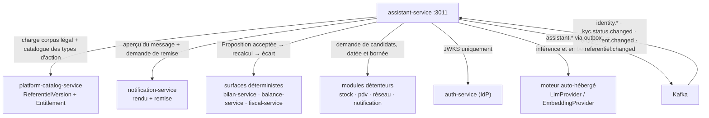
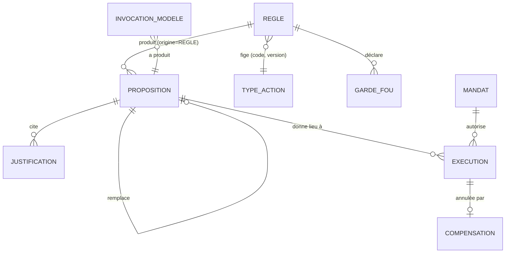
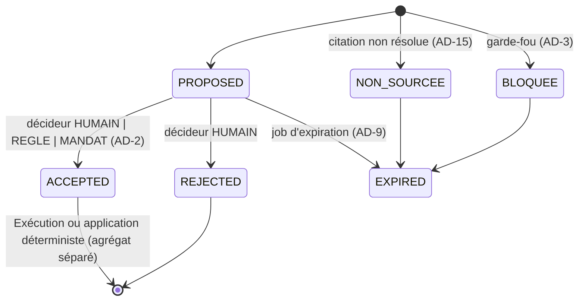

# Architecture Spine — assistant-service

> **Quatre arbitrages PO du 2026-08-16 sont intégrés** (§*Arbitrages*) : le transport de la demande
> d'exécution, l'assiette du plafond de mandat, la portée par dossier, et le portage de l'extension
> `perms[]`. ⚡ **Le premier amende FR-IA04 du PRD** — à reporter dans le PRD, sans quoi le document
> amont contredira cette spine.

## Design Paradigm

**Hexagonal (ports & adaptateurs)** autour d'un noyau **sans mémoire métier**, lui-même **relying-party**
de l'IdP.

Le noyau ne connaît que des Propositions, des Règles, des Mandats et des Exécutions. Toute donnée
métier entre par un port et **n'est jamais conservée** : le contexte vient de l'appelant (usage
interactif) ou d'un fournisseur de candidats interrogé au moment de l'évaluation (usage automatique).
Trois conséquences directes — le noyau se teste sans modèle ni infrastructure, un nouveau moteur de
langage est un adaptateur, et **une donnée métier périmée ne peut pas exister ici puisqu'aucune copie
n'est gardée**.

| Couche | Répertoire | Contenu |
| --- | --- | --- |
| Domaine | `src/domain/` | `Proposition`, `Regle`, `Mandat`, `Execution`, garde-fous, modes, calculateurs de score, politique de citation. Aucune dépendance framework |
| Application | `src/application/` | Cas d'usage, transactions, orchestration des ports, file d'arbitrage |
| Ports | `src/ports/` | `LlmProvider`, `EmbeddingProvider`, `CandidateProvider`, `ActionExecutor`, `ReferentielLoader`, `EventPublisher` |
| Adaptateurs | `src/adapters/` | Mongo, BullMQ, HTTP/événements sortants, chargement des référentiels, index vectoriel en mémoire |
| Entrée | `src/modules/` | Contrôleurs NestJS, DTO, guards, consumers des read-models d'autorisation |

## Inherited Invariants

Hérités de l'écosystème et des spines livrées. **Lecture seule** — non re-décidés ici ; un choix local
qui les contredirait est un conflit à remonter, pas une dérogation.

| Hérité | Source | Ce qu'il contraint ici |
| --- | --- | --- |
| Relying-party / JWKS RS256 | `architecture-prospera-ecosystem` | Validation locale du jeton, jamais d'appel réseau à `auth-service` sur le chemin chaud |
| `orgId` du jeton signé | `architecture-prospera-ecosystem` | L'isolation ne vient jamais du corps de requête ni d'un paramètre |
| Database-per-service · outbox transactionnelle | `architecture-prospera-ecosystem` | Base `assistant_service` propre ; tout événement publié dans la transaction qui produit le fait |
| **AD-P13** — le dossier est l'unité de travail | `architecture-prospera-ecosystem` | Le dossier vient de l'URL, jamais du jeton ; hors portée ⇒ `404`, jamais `403` |
| **AD-P15** — droits de tenant dans `perms[]`, vocabulaire fermé | `architecture-prospera-ecosystem` | FR-IA45, FR-IA46 et FR-IA36c en dépendent — ⛔ story d'extension d'`auth-service` **non livrée** |
| **AD-P16** — route de lecture plateforme nommée | `architecture-prospera-ecosystem` | La vue plateforme d'inférence passe par une route dédiée, jamais par un filtre `orgId` facultatif |
| Journal en base séparée protégée par le serveur | `paiement` AD-10/AD-12 · `fiscal` AD-10 | L'audit d'inférence n'est pas protégé par la discipline du code applicatif |
| Aucun `setInterval` — tout fait temporel est un job BullMQ à clé idempotente | `fiscal` AD-18 · `paiement` AD-12 | Déclencheurs, expirations, purges, agrégations |
| `notification-service` = organe de parole unique | `paiement` AD-17 · `notification` AD-19 | L'assistant décide qu'il faut parler ; il ne parle jamais lui-même |
| Montant = `(entier d'unité mineure, devise)`, décimales lues de `pays-devises-ao@AAAA.N` | `notification` AD-16 | Plafond de mandat (FR-IA36e) — **le XOF n'a aucune décimale** |
| Une donnée de configuration n'est jamais un programme | `notification` AD-8 · `fiscal` AD-2 | Règles, garde-fous et scores : registre de stratégies typées, aucune expression évaluée |
| `ReferentielVersion` (code, version, `artifactUri`, checksum) | `architecture-catalog-service` | Corpus légal et catalogue des types d'action s'y rattachent au lieu d'inventer un registre |
| Un fournisseur de candidats expose des **faits**, jamais un jugement ni une action | `stock` AD-15 · `reseau` AD-13 | Le jugement appartient à l'assistant ; l'action, au module exécutant |
| `:3011` réservé à `assistant-service` | spines `notification` et `fiscal` (§Déploiement) | Port acquis avant ce document |

### Réemployé de la note du 2026-07-20 (⛔ dépassée sur son principe cardinal)

Survit et n'est pas re-décidé : le **placement** (service dédié, relying party, base propre, `:3011`),
l'abstraction **`LlmProvider`** sur API standard du marché, le **RAG** et son **corpus déjà livré**
(1 185 articles CGI/LPF), l'**OCR inchangé** (Tesseract reste dans `document-service` ; un modèle vision
est hors périmètre). **Tombe** : le principe cardinal §0, le cycle de Proposition de la §5, le découpage
§10 — et donc `STORY-115→119` du tracker, qui en sont la recopie.

## Invariants & Rules



Aucune flèche ne repart d'un service vers `assistant-service` en appel direct : les retours passent par
le bus ou par la réponse à la demande. Le sens des dépendances est strictement sortant.

### AD-1 — Un seul agrégat de sortie : la Proposition, discriminée par son origine ; l'Exécution est un fait séparé

- **Binds:** §5.1, FR-IA10, FR-IA15, FR-IA29→IA33, FR-IA42
- **Prevents:** deux moteurs avec deux audits et deux régimes de validation — et son symétrique, une
  Proposition « immuable » qu'on mute pour y écrire un résultat d'exécution
- **Rule:** une `Proposition` porte `origine: LANGAGE | REGLE`. Ce que le PRD appelle une **Cible** est
  une Proposition d'origine `REGLE` portant en plus canal, message, valeur, score et échéance. Les deux
  origines partagent cycle de vie, audit et garde-fous.
- **Rule:** l'`Execution` est un **agrégat distinct et append-only** qui cite la Proposition, le mandat
  éventuel, le module exécutant et le résultat. Le statut d'une Proposition ne devient **jamais**
  `EXECUTE` : une Proposition décrit ce qui est proposé, une Exécution ce qui a eu lieu.
- **Rule:** l'évaluation de prévisualisation (FR-IA29) produit des Propositions **à blanc**, non
  persistées et explicitement marquées comme telles. Prévisualiser ne remplit pas la file d'arbitrage.

### AD-2 — Aucune décision n'est anonyme : le décideur est typé

- **Binds:** FR-IA10, FR-IA11, FR-IA34→IA37, SM-1, CM-1
- **Prevents:** un mode `AUTO` dont les Propositions apparaissent « acceptées » sans que rien ne
  distingue une validation humaine d'une exécution autonome — ce qui rend SM-1 immesurable
- **Rule:** toute transition porte un décideur **typé** : `HUMAIN` (identité), `REGLE` (identifiant +
  version), `MANDAT` (identifiant + plafond + échéance). Aucun de ces trois n'est un défaut : le champ
  est obligatoire, et il n'existe pas de quatrième valeur.
- **Rule:** SM-1 et CM-1 se calculent **exclusivement** sur ce discriminant, jamais sur une heuristique
  de délai ou d'utilisateur technique.

### AD-3 — Le garde-fou produit un état visible ; ré-proposer chaîne, ne réécrit pas

- **Binds:** FR-IA14, FR-IA15, FR-IA18, FR-IA31
- **Prevents:** une automatisation qui bloque en silence — et la perte de l'historique des refus, qui est
  la matière première de l'amélioration
- **Rule:** une Proposition retenue par un garde-fou prend l'état `BLOQUEE` **avec le garde-fou nommé**,
  elle reste listée et lisible. Une Proposition sans citation prend l'état `NON_SOURCEE` : visible, non
  acceptable. Aucun de ces deux cas ne se traduit par une absence de ligne.
- **Rule:** les Propositions sont immuables hors transition de statut. Ré-proposer crée une **nouvelle**
  Proposition qui **cite** la précédente (`remplace`) ; rien n'est réécrit.
- **Rule:** l'expiration (FR-IA14) est un job BullMQ à clé idempotente, pas un calcul à la lecture — une
  Proposition expirée doit l'être aussi pour celui qui ne la lit jamais.

### AD-4 — Le catalogue des types d'action est un référentiel versionné du catalogue plateforme, et son défaut est le régime le plus strict

- **Binds:** FR-IA23b, FR-IA23c, FR-IA27, FR-IA38, NFR-2, Q7
- **Prevents:** la doctrine du §2 réduite à une intention — ni un libellé, ni un modèle ne permettent de
  déduire qu'une action engage
- **Rule:** le catalogue est un **référentiel versionné** `types-action@AAAA.N` publié par
  `platform-catalog-service`, au patron du paquet fiscal : chargé au démarrage et sur
  `referentiel.changed`, validé par schéma, jamais saisi dans la base de l'assistant.
- **Rule:** chaque entrée déclare `code`, `reversible` (`OUI | NON | SOUS_CONDITIONS`), `engageant`
  (`OUI | NON`), `moyenAnnulation`, `serviceExecutant`. **Ces propriétés sont la seule source du
  contrôle de mode.**
- **Rule:** un type d'action **non déclaré** est traité comme **engageant et irréversible**. Un catalogue
  absent, périmé ou illisible dégrade donc vers le régime le plus strict et **jamais** vers le plus
  permissif — ce qui rend l'absence sûre plutôt que bloquante.
- **Rule:** l'assistant **ne publie pas** ce catalogue. Il le consomme. Le module qui exécute une action
  est seul à savoir ce qu'elle coûte à défaire.

### AD-5 — Le contrôle de mode est figé sur la règle et rejoué à l'exécution ; la divergence suspend

- **Binds:** FR-IA27, FR-IA36, FR-IA38, NFR-2
- **Prevents:** une règle validée en `AUTO` l'an dernier qui continue de tourner après que son action est
  devenue engageante — et son inverse, une règle qui se dégraderait sans que personne ne le voie
- **Rule:** la règle **fige** le couple `(codeTypeAction, versionReferentiel)` validé à la configuration.
- **Rule:** à chaque exécution, les propriétés courantes sont relues. Si `reversible` ou `engageant` ont
  changé, la règle est **suspendue** — ni exécutée, ni silencieusement rétrogradée — et la suspension est
  journalisée et notifiée au responsable de la règle.
- **Rule:** le service **refuse** (`422`) une configuration de mode incompatible ; il ne la déconseille
  pas. Une organisation peut abaisser un mode, jamais l'élever au-delà de ce que le catalogue autorise.
- **Rule:** ⚠️ l'indice de confiance (FR-IA13) est **exposé et n'entre dans aucune décision**. Aucun seuil
  de confiance n'ouvre l'autonomie, nulle part dans le code. Le critère est la nature de l'acte.

### AD-6 — Le mandat est une délégation bornée dont le plafond est un compteur réservé, puis confirmé

- **Binds:** FR-IA36b, FR-IA36c, FR-IA36d, FR-IA36e
- **Prevents:** « sous plafond » qui redevient de l'autonomie déguisée — et deux évaluations concurrentes
  qui dépassent ensemble un plafond qu'aucune n'a vu franchir
- **Rule:** un `Mandat` porte : délivreur, périmètre (articles, fournisseurs, règles), **plafond cumulé
  sur la période** en `(entier d'unité mineure, devise)`, **plafond unitaire optionnel**, date
  d'expiration, révocabilité immédiate. *[ARBITRÉ PO 2026-08-16 — l'assiette est **cumulée**, pas par
  acte : un plafond par acte ne borne pas l'engagement total, quarante commandes sous plafond
  l'épuisent sans jamais le franchir.]*
- **Rule:** la consommation est un **compteur transactionnel** : réservation avant la demande
  d'exécution, confirmation au succès, libération à l'échec. Aucune vérification de plafond en lecture
  seule suivie d'une écriture séparée.
- **Rule:** l'autorité du délivreur est **vérifiée** (FR-IA36c) : le service **refuse** la délivrance d'un
  mandat dont le plafond excède celui que le délivreur détient lui-même. Dépend d'**AD-P15**, dont
  l'extension d'`auth-service` est **portée par cet épic** en tête d'incrément 3 *[ARBITRÉ PO
  2026-08-16]*. ⛔ **Aucun mandat n'est délivrable avant cette story** : un mandat sans contrôle
  d'autorité est une délégation que son bénéficiaire s'accorde lui-même.
- **Rule:** chaque `Execution` sous mandat **cite** le mandat, son plafond et son échéance. Un mandat
  expiré ou révoqué fait retomber ses règles en `VALIDATION` — jamais en silence, avec notification.

### AD-7 — Aucune donnée métier n'est détenue ; les read-models d'autorisation, si

- **Binds:** FR-IA03, FR-IA03b, FR-IA47, NFR-4
- **Prevents:** une copie qui dérive et produit une relance sur une facture déjà payée — et le défaut
  symétrique, un développeur qui lit « aucun abonnement au bus » et câble un appel synchrone à l'IdP sur
  le chemin d'autorisation
- **Rule:** aucune donnée métier n'est persistée : ni read-model, ni cache, ni table de travail. Les
  données arrivent **par le contexte de l'appelant** (interactif) ou **par un fournisseur de candidats**
  (automatique), et ne survivent pas au traitement.
- **Rule:** l'interdit porte sur la **donnée métier**, pas sur l'**état tiers d'autorisation** :
  `identity.*`, `kyc.status.changed` et `entitlement.changed` sont consommés et projetés localement,
  comme dans tous les autres services. Le chemin d'autorisation ne fait aucun appel réseau.
- **Rule:** ce que l'assistant possède en propre : Propositions, Règles, Mandats, Exécutions, journal,
  gabarits et versions de gabarit, compteurs d'inférence. Rien d'autre.

### AD-8 — Le fournisseur de candidats est un port sortant unique, daté et borné ; le silence est un fait

- **Binds:** FR-IA03b, FR-IA03c, FR-IA29 · **honore** `stock` FR-S39, `pdv` FR-V37, `reseau` FR-R34,
  `notification` AD-19
- **Prevents:** quatre modules qui exposent déjà un fournisseur de candidats avec quatre formes
  différentes — et une règle qui n'a pas tourné sans que personne ne le sache
- **Rule:** **un seul contrat**, identique pour tous les modules détenteurs. Demande :
  `(regleId, conditionDeclaree, curseur, plafondDePage)`. Réponse : `(candidats[], asOf, curseurSuivant)`.
  Chaque candidat porte **des faits datés**, jamais un jugement ni une action.
- **Rule:** le délai est **borné** et déclaré. Une indisponibilité, un dépassement de délai ou une réponse
  invalide produisent une **non-exécution inscrite au journal et visible**, distincte d'un lot vide. *Un
  lot vide et une panne ne se représentent pas de la même façon.*
- **Rule:** l'assistant **ne pagine jamais indéfiniment** : le plafond de cibles par exécution est déclaré
  sur la règle, et son atteinte est elle-même un fait journalisé.

### AD-9 — Le déclencheur est un travail planifié à clé idempotente ; il n'y a ni minuterie, ni abonnement métier

- **Binds:** FR-IA04, FR-IA24, FR-IA29, NFR-7 · **hérite** `fiscal` AD-18
- **Prevents:** le trou du PRD — « un déclencheur » n'y est jamais défini — comblé par un `setInterval`
  en mémoire de processus, ou par deux ordonnanceurs qui relancent deux fois la même personne
- **Rule:** une règle déclare une **cadence bornée** ; son évaluation est un **job BullMQ à clé
  idempotente** `(regleId, fenêtre)`. Aucune minuterie applicative, nulle part.
- **Rule:** avec AD-7 (aucune copie) et FR-IA04 (aucun topic entrant métier), la **scrutation planifiée
  des fournisseurs de candidats est la seule mécanique de déclenchement**. Un déclencheur « à
  l'événement » n'existe pas au v1 et ne doit pas être simulé par une cadence d'une minute.
- **Rule:** l'expiration des Propositions, la purge du contexte d'inférence, l'agrégation des compteurs
  et l'expiration des mandats suivent le même régime.

### AD-10 — L'assistant décide ; il n'exécute rien lui-même, et l'annulation est une compensation demandée

- **Binds:** FR-IA12, FR-IA36, FR-IA37, §5.3 · **hérite** `notification` AD-19, `paiement` AD-17
- **Prevents:** un service de jugement qui se met à écrire dans les données des autres « parce qu'il les a
  déjà sous la main » — la dérive que le PRD nomme lui-même
- **Rule:** l'exécution d'une action est **demandée au `serviceExecutant` déclaré au catalogue** (AD-4).
  L'assistant n'écrit jamais dans les données d'un autre service, et une Proposition acceptée est
  appliquée par le flux déterministe de sa surface.
- **Rule:** l'annulation (FR-IA37) est une **compensation demandée au même module**, par le
  `moyenAnnulation` déclaré. L'assistant n'invente aucune écriture inverse ; il n'a pas la compétence de
  défaire ce qu'il n'a pas fait.
- **Rule:** toute exécution en `AUTO` ou `AUTO_SOUS_MANDAT` est **notifiée au responsable de la règle**.
  L'autonomie n'est jamais silencieuse.
- **Rule:** ⚡ **le transport est un événement, pas un appel** *[ARBITRÉ PO 2026-08-16]* : l'assistant
  publie **`assistant.action.demandee`** par **outbox transactionnelle**, partition `orgId`, dans la
  transaction qui écrit l'`Execution`. Le module exécutant consomme et répond par son propre événement de
  résultat. **Un seul topic sortant**, et aucune dépendance à C8.
- **Rule:** ⚠️ **ceci amende FR-IA04** (« aucun topic Kafka créé »), écrit quand l'assistant ne faisait
  que proposer. L'invariant qui survit est *aucun **bus** nouveau, aucun topic **entrant** de donnée
  métier* — AD-7 le tient. **Le PRD est à corriger sur ce point.**
- **Rule:** une demande d'exécution est **idempotente par la clé** `(executionId)` : un rejeu du
  consommateur ne produit pas une seconde action. La preuve appartient au module exécutant, pas à la
  vigilance de l'assistant.

### AD-11 — Règles, garde-fous et scores sont un vocabulaire fermé et des stratégies typées, jamais un langage

- **Binds:** FR-IA24, FR-IA25, FR-IA26, FR-IA28, FR-IA32, FR-IA33 · **hérite** `notification` AD-8,
  `fiscal` AD-2
- **Prevents:** « les règles sont des données » interprété comme un moteur d'expressions — c'est-à-dire du
  code non revu, non testé, exécuté avec les droits du service, alimenté par le client
- **Rule:** déclencheurs, conditions, garde-fous et calculateurs de score sont un **vocabulaire fermé**,
  chacun implémenté par une **classe enregistrée au démarrage**. La règle ne porte que des **paramètres**
  validés par schéma. **Aucune évaluation dynamique d'expression, à aucun endroit du service.**
- **Rule:** un socle de règles standard est livré par Prospera avec `orgId: null` ; une organisation le
  **surcharge par copie** sans altérer l'original, au patron de la chaîne de modèles de
  `notification-service`.
- **Rule:** un **quota de sollicitation** (plafond par destinataire et par période) est **obligatoire** sur
  toute règle qui contacte une personne : une règle sans quota est refusée à la création, pas avertie.
- **Rule:** un score porte **toujours** les facteurs qui l'ont produit. Un calculateur qui ne peut pas les
  restituer ne peut pas être enregistré.

### AD-12 — Le message prêt à partir est rendu par `notification-service` ; l'assistant ne détient aucun moteur de gabarit

- **Binds:** FR-IA30, FR-IA35 · **hérite** `notification` AD-8, AD-9
- **Prevents:** deux moteurs de rendu dans le programme — donc un aperçu qui montre autre chose que ce qui
  partira réellement, exactement ce que FR-IA30 cherche à empêcher
- **Rule:** l'aperçu du message est **obtenu de `notification-service`** (modèle résolu, variables
  substituées) et **figé sur la Proposition** au moment où elle est produite. L'assistant fournit les
  variables ; il ne compose pas le texte.
- **Rule:** l'assistant ne stocke ni modèle, ni gabarit de message. Il stocke le **rendu figé** de la
  cible, soumis à l'horloge courte d'AD-16 comme toute donnée personnelle.
- **Rule:** ⚠️ l'aperçu est le **seul appel synchrone sortant** de ce service — une lecture, sans secret,
  hors chemin d'autorisation. Tant que **C8** n'est pas tranchée, il **dégrade explicitement** : la cible
  est produite avec `apercuIndisponible` et la règle **ne peut pas passer en `AUTO`** faute de
  prévisualisation (FR-IA29). ⛔ **Le repli interdit est de rendre le message localement** : deux moteurs
  de rendu produiraient un aperçu différent du message réellement envoyé.

### AD-13 — L'écart entre l'impact annoncé et l'impact recalculé est un fait retourné, agrégé par surface

- **Binds:** FR-IA12b, FR-IA12c, NFR-1, SM-7
- **Prevents:** « le déterministe fait foi » qui reste une affirmation — un utilisateur qui a tranché sur
  un chiffre faux sans jamais voir le vrai
- **Rule:** la surface consommatrice **retourne l'impact recalculé** après application. L'écart est
  persisté sur la Proposition et **restitué à celui qui a tranché**, dans 100 % des cas.
- **Rule:** l'écart est **agrégé par surface** et remonté comme **défaut de qualité de cette surface** avec
  son taux, jamais comme un incident isolé.
- **Rule:** ⛔ obligation croisée : sans une story côté `bilan-service` qui renvoie cet impact, SM-7 est
  immesurable. Elle est nommée ici et appartient au découpage de la surface pilote.

### AD-14 — Le corpus est un référentiel versionné ; l'index vectoriel est un dérivé reconstructible

- **Binds:** FR-IA16, FR-IA20, NFR-3, Q4, A3
- **Prevents:** de la connaissance légale en dur, et une dépendance d'exploitation (store vectoriel) prise
  pour 925 Ko de texte
- **Rule:** le corpus est un **référentiel versionné par pays et par année** `corpus-legal-<pays>@AAAA.N`,
  publié par `platform-catalog-service` avec son checksum. L'extension multi-pays est une **donnée**, pas
  un développement.
- **Rule:** l'index d'embeddings est **construit au démarrage et à chaque changement de version**, tenu en
  mémoire du processus, et **n'est jamais une source** : le perdre n'entraîne aucune perte de donnée. Un
  store dédié devient une conséquence de croissance (Q4), pas un prérequis.
- **Rule:** `EmbeddingProvider` est un port au même titre que `LlmProvider`. Changer de moteur
  d'embeddings **invalide l'index et le reconstruit** ; les Propositions déjà produites gardent la version
  de corpus sous laquelle elles ont été écrites.

### AD-15 — La citation se résout contre la version de corpus figée ; sinon, la Proposition n'est pas applicable

- **Binds:** FR-IA17, FR-IA18, FR-IA19, NFR-3, SM-2
- **Prevents:** une référence plausible qui ne pointe nulle part — l'hallucination sous sa forme la plus
  coûteuse, parce qu'elle est vérifiable et fausse
- **Rule:** toute Proposition fige la `versionCorpus` qui l'a produite. Une référence qui **ne résout pas
  dans cette version** vaut **absence de citation**.
- **Rule:** sans citation résolue, la Proposition est `NON_SOURCEE` : **visible, non acceptable**. Le refus
  est porté par le domaine, pas par l'interface — aucun appelant ne peut accepter une Proposition non
  sourcée, quel que soit le chemin.
- **Rule:** l'extrait affiché est **relu du corpus** au moment de la restitution, jamais recopié depuis la
  réponse du modèle.

### AD-16 — L'audit d'inférence vit dans une base protégée et porte deux horloges

- **Binds:** FR-IA44, FR-IA48, NFR-6, NFR-4 · **hérite** `paiement` AD-10, `notification` AD-15
- **Prevents:** la contradiction entre NFR-6 (reconstituable à deux ans) et FR-IA48 (minimisation) tranchée
  au hasard par un développeur — et un journal d'audit qui devient le contournement de toute règle de
  conservation
- **Rule:** l'audit est **append-only**, dans une **base séparée** (`assistant_service_audit`) dont la
  protection vient du **rôle serveur**, pas de la discipline du code.
- **Rule:** **deux horloges.** La *trace opposable* — décision, décideur typé, citations, modèle, version
  de gabarit, écart, coût — est conservée au long cours pour NFR-6. Le *contexte brut envoyé au modèle*
  et le *rendu figé* sont purgés à échéance courte et paramétrable : ils portent de la donnée métier du
  client, parfois personnelle.
- **Rule:** le contexte envoyé est **minimisé à la surface** : jamais un dossier entier par confort
  d'implémentation. La minimisation est une propriété du gabarit, vérifiable à la revue.
- **Rule:** aucune sortie vers une API externe sans **activation explicite par organisation**, accord
  interdisant l'entraînement, minimisation et audit de chaque envoi. Jamais un défaut.

### AD-17 — La mesure d'inférence est figée à l'appel ; le quota est fail-closed et refuse explicitement

- **Binds:** FR-IA49, FR-IA50, FR-IA51 · **hérite** `notification` AD-16, `ecosystem` AD-P16
- **Prevents:** une organisation qui sature le modèle partagé pour toutes les autres — et une restitution
  commerciale qui devient la porte par laquelle le cloisonnement tombe
- **Rule:** **aucune invocation anonyme.** Chaque appel fige organisation, surface, **auteur** (utilisateur
  *ou* règle), taille de contexte, durée, modèle et version de gabarit, au moment de l'appel — jamais
  recalculés à la lecture.
- **Rule:** le dépassement de quota **refuse la fonctionnalité avec un code d'erreur nommé et un message
  clair**. Jamais une file d'attente sans fin, jamais une dégradation silencieuse de la réponse.
- **Rule:** la vue plateforme lit **exclusivement des compteurs pré-agrégés** par
  `(orgId, surface, période)`. **Aucun chemin de code ne rend l'`orgId` facultatif** sur une collection
  opérationnelle : pas de `if PLATFORM_ADMIN` dans un dépôt.

### AD-18 — Deux files d'inférence, équité par tourniquet entre organisations, jamais FIFO global

- **Binds:** FR-IA52, NFR-7
- **Prevents:** un dossier fiscal argumenté d'une organisation qui retarde les mappings de toutes les
  autres — le PRD exige l'équité, une file unique la rend impossible
- **Rule:** deux classes de travail séparées : **interactive** (P95 < 10 s visé) et **différée** (dossier
  long, progression visible). Un travail long ne peut pas entrer dans la file interactive.
- **Rule:** l'ordonnancement au sein d'une file est un **tourniquet entre organisations**, pas un premier
  arrivé premier servi. Une organisation ne peut pas occuper la file par le volume.
- **Rule:** les cibles de NFR-7 sont des **cibles à reconfirmer après mesure**, consignées comme telles ;
  aucune n'est traitée comme un seuil acquis avant la première mesure réelle.

### AD-19 — Gate local, droits séparés, cloisonnement par organisation *et* par dossier

- **Binds:** FR-IA01, FR-IA45, FR-IA46, FR-IA47, Q5 · **hérite** `ecosystem` AD-P13, AD-P15
- **Prevents:** un passage en `AUTO` traité comme une opération quotidienne — et une Proposition affichée
  sur le mauvais dossier, défaut silencieux et parfaitement plausible
- **Rule:** gate local — `emailVerified` (claim) + KYC `APPROVED` + entitlement assistant `ACTIVE`, **tous
  lus des read-models locaux**. Aucun appel réseau sur le chemin d'autorisation.
- **Rule:** cinq droits **distincts et attribuables séparément**, déclarés au catalogue de permissions :
  créer une règle · **changer son mode** · arbitrer une file · accepter une Proposition · administrer les
  modèles. **Changer un mode est plus restreint qu'arbitrer** : c'est une décision de gouvernance.
- **Rule:** ⚡ toute Proposition portant sur un espace comptable porte son **`dossierId`** **dès
  l'incrément 1** *[ARBITRÉ PO 2026-08-16]*, vérifié contre la **portée serveur** ; hors portée ⇒ `404`,
  jamais `403`. Le dossier vient de l'URL, jamais du jeton. **Ceci amende FR-IA47**, écrit avant AD-P13 :
  le cloisonnement est par organisation **et** par dossier. *Le défaut évité n'est pas un refus d'accès,
  c'est une Proposition affichée sur le mauvais dossier — fausse et parfaitement plausible.*
- **Rule:** FR-IA45/IA46 et l'autorité de mandat (AD-6) dépendent d'**AD-P15**. `assistant-service` est le
  **quatrième module** bloqué dessus, et **c'est cet épic qui porte la story d'extension d'`auth-service`**
  *[ARBITRÉ PO 2026-08-16]* — en tête d'incrément 3, avec ses quatre consommateurs nommés (`reseau`,
  `catalogue`, `stock`, `assistant`). ⚠️ Elle touche un service **livré et central** : story dédiée,
  jamais un effet de bord de ce module.

### AD-20 — Démarrage dégradé, indépendance des moteurs, et un interrupteur lu à l'exécution

- **Binds:** FR-IA02, FR-IA39, NFR-5
- **Prevents:** un service qui ne démarre pas parce qu'un GPU est absent — et un interrupteur général
  implémenté comme « désactiver les règles une par une », qui laisse passer ce qui était déjà en vol
- **Rule:** l'absence du fournisseur de modèle n'empêche ni le démarrage ni le moteur de règles :
  `/health` annonce `llm: down`. Les deux moteurs partagent un contrat, **pas une dépendance**.
- **Rule:** une règle dont l'action exige le modèle est **suspendue visiblement** quand `llm: down`, jamais
  sautée en silence.
- **Rule:** l'interrupteur général est un **état lu à l'exécution**, fail-closed : toute exécution
  autonome le vérifie juste avant d'agir. Le lever et le baisser sont journalisés avec leur auteur.

### AD-21 — Le fournisseur de modèle est un port ; changer de modèle est une configuration, et chaque Proposition dit lequel l'a produite

- **Binds:** FR-IA05, FR-IA06, FR-IA07, FR-IA08, FR-IA09, NFR-4, R1 · **réemploi** note du 20/07 §2
- **Prevents:** un service soudé à un modèle concret — et une régression de qualité indiagnosticable
  parce que rien ne dit quel modèle, sous quel gabarit, a produit quoi
- **Rule:** un port unique `LlmProvider` sur une **API standard du marché**. Le service ne référence
  **jamais** un modèle concret dans son code. Changer de modèle est **`LLM_BASE_URL` + `LLM_MODEL`**,
  zéro ligne de code.
- **Rule:** chaque Proposition et chaque invocation figent **le modèle et la version de gabarit**. Les
  gabarits sont **versionnés et possédés par le service**, jamais des chaînes littérales dispersées.
- **Rule:** ⚠️ le modèle de développement valide **la mécanique** — appel, RAG, contrat, audit — **jamais
  la qualité**. Un petit modèle hallucine les citations légales : c'est assumé, et NFR-3 est le filet
  (AD-15). Aucun jeu de tests ne conclut à la qualité depuis l'environnement de développement.
- **Rule:** le modèle de production est **auto-hébergé sur l'infrastructure Money Vibes**. Une API externe
  n'est jamais un défaut : activation explicite par organisation, accord interdisant l'entraînement,
  minimisation et audit de chaque envoi (AD-16).

### AD-22 — Une surface est un gabarit versionné et une configuration ; le noyau ne bouge pas

- **Binds:** FR-IA21, FR-IA22, FR-IA23, FR-IA12, SM-5, A4
- **Prevents:** un socle qui n'en est pas un — chaque nouvelle surface ajoutant du code au cœur, jusqu'à
  ce que le conseil fiscal, l'analyse financière et les anomalies soient trois moteurs déguisés
- **Rule:** ajouter une surface = **un gabarit versionné + une configuration** (contexte attendu, mode de
  citation, surface consommatrice, expiration). **Le noyau n'est pas touché** ; SM-5 se mesure sur ce
  critère et non sur une impression.
- **Rule:** une surface **consomme** des Propositions ; elle ne les applique **jamais** elle-même sans son
  flux déterministe. Le mapping de comptes **alimente** le flux de surcharge existant de `bilan-service`
  (FR-008), il ne le court-circuite pas.
- **Rule:** le choix du mapping comme surface pilote est **structurant, pas décoratif** : c'est la seule
  dont le pire cas est une suggestion refusée. Aucune surface dont un chiffre officiel dépend avant
  validation n'entre avant que le contrat soit éprouvé.

### AD-23 — La file d'arbitrage est bornée : décider en masse doit rester décider

- **Binds:** FR-IA40, FR-IA41, FR-IA42, FR-IA43, CM-1, CM-3, R2
- **Prevents:** la validation de façade que CM-1 surveille — accepter 500 cibles d'un clic — et une file
  qu'on n'arbitre plus pendant qu'une automatisation continue de tourner
- **Rule:** la file est triée **par valeur et par urgence**, filtrable par règle et par poste. Le détail de
  chaque cible reste accessible **depuis le lot**.
- **Rule:** la décision groupée est **plafonnée dans le domaine** — défaut 25 cibles, plafond dur 100 — et
  au-delà du défaut un **motif** est exigé. Ces bornes sont des **paramètres de configuration**, jamais
  des constantes dispersées dans l'interface : l'interface ne peut pas les contourner.
- **Rule:** chaque règle expose ses **statistiques** (exécutions, succès, impact, temps évité) et le
  **journal des exécutions** est restituable par période et par règle. Une règle qui n'a jamais réussi
  doit être **visible comme telle** — c'est la seule façon de rendre CM-3 observable.

## Consistency Conventions

| Concern | Convention |
| --- | --- |
| Nommage — domaine | Français métier : `Proposition`, `Regle`, `Mandat`, `Execution`, `GardeFou`, `TypeAction`, `Corpus`. Le mot « Cible » **n'est pas un type** — c'est une Proposition d'origine `REGLE` (AD-1) |
| Nommage — événements | `assistant.<agrégat>.<fait-au-passé>` : `assistant.proposition.acceptee`, `assistant.action.demandee`, `assistant.mandat.revoque` |
| Nommage — fichiers | Convention NestJS en place : `*.schema.ts`, `*.service.ts`, `*.controller.ts`, `*.dto.ts`, `*.spec.ts` |
| Identifiants | `ObjectId` Mongo en interne ; `orgId` du jeton, `dossierId` de l'URL vérifié contre la portée |
| Montants | Entiers en unités mineures + devise. Décimales lues du référentiel, jamais présumées. Aucun flottant sur un plafond de mandat |
| Dates | ISO 8601, UTC en stockage. Tout candidat et toute projection portent un `asOf` |
| Versions | Toute Proposition fige `modele`, `versionGabarit`, `versionCorpus`. Toute règle fige `(codeTypeAction, versionReferentiel)` |
| Erreurs | Codes nommés et stables : `MODE_INTERDIT_PAR_CATALOGUE`, `TYPE_ACTION_NON_DECLARE`, `MANDAT_EXPIRE`, `PLAFOND_MANDAT_DEPASSE`, `QUOTA_INFERENCE_DEPASSE`, `PROPOSITION_NON_SOURCEE`, `REGLE_SANS_QUOTA`, `DETENTEUR_INDISPONIBLE` |
| Erreurs — statut HTTP | Correspondance fixe : mode incompatible avec le catalogue → `422` · règle sans quota → `422` · transition interdite sur un état → `409` · quota d'inférence dépassé → `429` · module détenteur indisponible → `503` (et journalisé) · ressource hors organisation ou hors portée de dossier → `404` |
| Mutation d'état | Toute transition passe par le cas d'usage dédié, qui écrit la transition **et** son entrée d'audit dans la même transaction Mongo |
| Idempotence | Toute écriture déclenchée par un job, un événement ou une réponse de candidats est rejouable : clé unique et `findOneAndUpdate`, jamais un `insert` nu |
| Décideur | Aucune transition sans décideur typé (AD-2). Il n'existe pas de valeur `SYSTEME` |
| Journalisation | `nestjs-pino`, corrélation `nestjs-cls`. **Aucun contexte envoyé au modèle, aucun rendu de message, aucun montant nominatif dans les journaux applicatifs** — ils vivent dans la base d'audit, sous horloge courte |
| Configuration | `@nestjs/config`, variables d'environnement uniquement. Aucun seuil métier, aucune règle, aucun type d'action en configuration — ils viennent des référentiels |
| Tests | Le domaine se teste sans modèle ni infrastructure. Toute règle de mode est couverte par un test de mutation : rendre le catalogue permissif doit faire **rougir** la suite |

## Stack

Ratifiée depuis le code des services livrés — brownfield, on aligne plutôt qu'on invente.

| Name | Version |
| --- | --- |
| Node.js (types) | 22 |
| TypeScript | 5.7 |
| NestJS (`common`, `core`, `platform-express`) | 11 |
| `@nestjs/mongoose` / Mongoose | 11 / 8.24 |
| MongoDB | 7 (réplica set — transactions requises) |
| kafkajs | 2.2.4 |
| `@nestjs/bullmq` / `bullmq` / `ioredis` | 11.0.4 / 5.81 / 5.11 |
| Redis | 7-alpine |
| `@nestjs/config` · `@nestjs/swagger` · `@nestjs/terminus` · `@nestjs/throttler` | 4.0 · 11 · 11 · 6.5 |
| `nestjs-cls` / `nestjs-pino` / `helmet` | 6.2 / 4.6 / 8 |
| `class-validator` / `class-transformer` | 0.14 / 0.5 |
| Jest | 29 |
| Moteur de langage — développement | petit modèle local en conteneur, API standard du marché (`LLM_BASE_URL`, `LLM_MODEL`) |
| Moteur de langage — production | modèle auto-hébergé sur l'infrastructure Money Vibes — ⛔ machine et modèle **non spécifiés** (Q2) |

## Structural Seed

### Entités du noyau



`TYPE_ACTION` est **lu du référentiel**, pas possédé (AD-4). `COMPENSATION` est le fait d'annulation
obtenu du module exécutant, pas une écriture de l'assistant (AD-10).

### Cycle de vie d'une Proposition



Il n'existe **pas** d'état `EXECUTE` : l'exécution est un agrégat distinct (AD-1).

### Déploiement et exploitation

Un conteneur `assistant-service` dans le `docker-compose` racine, port **`:3011`** — réservé par les
spines `notification` et `fiscal`. **Deux bases** sur le réplica set `rs0` partagé : `assistant_service`
pour le métier, `assistant_service_audit` pour l'audit d'inférence (AD-16). Files BullMQ sur le Redis
partagé : `assistant-evaluation`, `assistant-inference-interactive`, `assistant-inference-differee`,
`assistant-maintenance`. Doit figurer dans l'`AUTH_AUDIENCE` de l'IdP.

Le moteur de langage est un **conteneur séparé** en développement et une **machine d'inférence** en
production ; il n'est jamais un prérequis de démarrage (AD-20). ⛔ La machine de production n'est pas
spécifiée (Q2) : l'incrément 1 est démontrable sans elle, la **qualité** ne l'est pas.

### Arborescence

```text
assistant-service/
  src/
    domain/          # Proposition, Regle, Mandat, Execution, gardes-fous, modes, scores, citation
    application/     # cas d'usage, file d'arbitrage, évaluation, quotas, mesure
    ports/           # LlmProvider, EmbeddingProvider, CandidateProvider, ActionExecutor, ReferentielLoader
    adapters/
      llm/           # adaptateur API standard (dev conteneur / prod auto-hébergé)
      rag/           # chargement du corpus versionné + index en mémoire
      catalogue/     # types d'action + corpus, via ReferentielVersion
      candidats/     # client du contrat unique (AD-8)
      executants/    # demande d'exécution + compensation (AD-10)
      mongo/ kafka/ bullmq/
    modules/         # contrôleurs, DTO, guards, consumers des read-models d'autorisation
```

## Capability → Architecture Map

| Capacité (incrément PRD) | Vit dans | Gouverné par |
| --- | --- | --- |
| **I1 — Le socle propose** (A · B · C · K : FR-IA01→IA15, IA49→IA52) | `domain/proposition`, `ports/llm`, `application/mesure` | AD-1, AD-2, AD-3, AD-7, AD-16, AD-17, AD-18, AD-19, AD-20, **AD-21** |
| **I2 — Le socle ne ment pas** (D · E : FR-IA16→IA23) | `adapters/rag`, `application/mapping` | AD-13, AD-14, AD-15, **AD-22** |
| **I3 — Le socle agit** (F · G · H · I · J : FR-IA23b→IA48) | `domain/regle`, `domain/mandat`, `adapters/candidats`, `adapters/executants`, `application/arbitrage` — **+ extension `perms[]` dans `auth-service`, en tête d'incrément** | AD-4, AD-5, AD-6, AD-8, AD-9, AD-10, AD-11, AD-12, AD-19, **AD-23** |

## Arbitrages du 2026-08-16 et conditions restantes

### Tranché par le PO — intégré aux AD

| # | Question | Décision | Où elle vit |
| --- | --- | --- | --- |
| 1 | Transport de la demande d'exécution — FR-IA04 interdisait tout topic, AD-10 en exige un | **Un topic `assistant.action.*` par outbox.** ⚡ **Amende FR-IA04** ; aucune dépendance à C8 | AD-10 |
| 2 | Assiette du plafond de mandat, non dite par le PRD | **Cumulée sur la période**, plafond unitaire optionnel | AD-6 |
| 3 | FR-IA47 (« par organisation ») écrit avant AD-P13 | **`dossierId` dès l'incrément 1**, vérifié contre la portée serveur. ⚡ **Amende FR-IA47** | AD-19 |
| 4 | Qui porte l'extension `perms[]` d'AD-P15 | **L'épic Assistant la porte**, en tête d'incrément 3, avec ses quatre consommateurs nommés | AD-6, AD-19 |

⚠️ **Deux amendements remontent au PRD** (FR-IA04 et FR-IA47). Tant qu'ils n'y sont pas portés, le
document amont contredit cette spine — c'est exactement le défaut qui a rendu la note du 20/07 dangereuse.

### Ce qui reste ouvert — sans bloquer le découpage

1. **Obligation croisée sur `bilan-service`** (AD-13) : sans une story qui renvoie l'impact recalculé,
   SM-7 est immesurable et NFR-1 reste une affirmation. À créer avec la surface pilote.
2. **C8 (authentification machine-à-machine)** — n'affecte plus l'exécution (arbitrage 1), seulement
   l'**aperçu** du message. Dégradation explicite définie en AD-12 ; aucune règle de communication ne
   passe en `AUTO` sans aperçu.
3. **Q2 — serveur d'inférence** : machine et modèle de production non spécifiés depuis le 2026-07-20.
   Borne la **qualité mesurable** de NFR-3, pas la livraison de l'incrément 1.

## Deferred

- **Copilot conversationnel et modules de scoring/prévision.** Hors périmètre par décision produit. Le
  contrat Proposition et `LlmProvider` leur serviront de socle ; aucune amende de spine attendue.
- **Déclencheur événementiel.** AD-9 ne retient que la scrutation planifiée. Un déclencheur au fil de
  l'eau supposerait un abonnement métier — donc une amende d'AD-7, à traiter comme telle.
- **Store vectoriel dédié** (Q4). Conséquence de croissance du corpus (multi-pays), pas un prérequis :
  AD-14 rend l'index reconstructible, donc remplaçable sans reprise de données.
- **`TranscriptionProvider`** (STORY-170). Quatrième déclinaison du patron de port ; attend le dépôt
  mobile. Aucune question d'architecture ouverte ici.
- **OCR par modèle vision.** Reste chez `document-service` derrière `OcrProvider`. Ce service ne fait pas
  d'OCR.
- **Facturation de l'inférence.** AD-17 rend le modèle de coût complet pour qu'une facturation s'y branche
  sans reprise de données ; la politique appartient au produit.
- **Nom du service** (Q3). Sans conséquence technique ; le **code de module** au catalogue, lui, est à
  arrêter avant l'entitlement.
