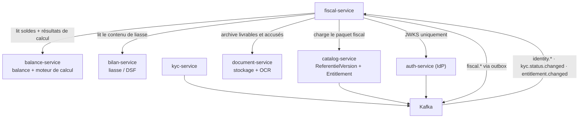
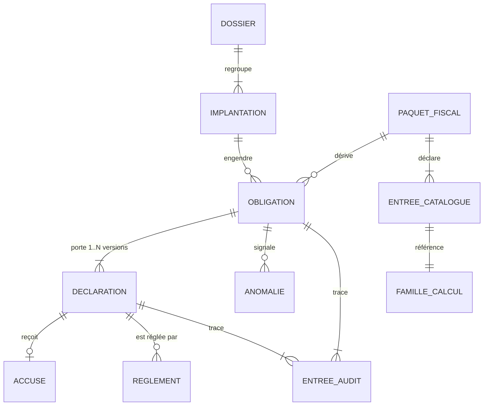
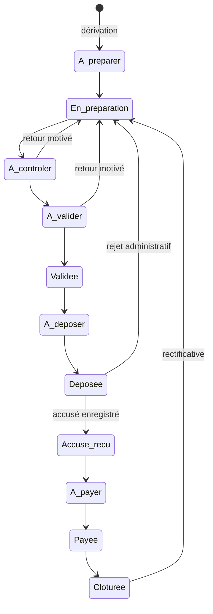

# Architecture Spine — fiscal-service

## Design Paradigm

**Hexagonal (ports & adaptateurs)** autour d'un noyau métier pur, lui-même **relying-party** de l'IdP.

Le noyau ne connaît que des obligations, des déclarations et des familles de calcul. Tout le reste entre
et sort par des ports : la balance, le paquet fiscal, la liasse, les documents, les canaux
administratifs, le bus. Deux conséquences directes — le noyau se teste sans infrastructure, et un
nouveau canal ou un nouveau vertical est un adaptateur, jamais une modification du noyau.

| Couche | Répertoire | Contenu |
| --- | --- | --- |
| Domaine | `src/domain/` | Obligation, Déclaration, familles de calcul, pipeline de modificateurs, règles d'échéance. Aucune dépendance framework |
| Application | `src/application/` | Cas d'usage, transactions, orchestration des ports |
| Ports | `src/ports/` | Interfaces sortantes : balance, paquet, liasse, documents, canal, événements |
| Adaptateurs | `src/adapters/` | Mongo, Kafka, HTTP vers balance/bilan/document, canaux de dépôt |
| Entrée | `src/modules/` | Contrôleurs NestJS, DTO, guards, consumers |

## Inherited Invariants

Hérités de l'écosystème et des services livrés. **Lecture seule** — non re-décidés ici ; un choix local
qui les contredirait est un conflit à remonter, pas une dérogation.

| Hérité | Source | Ce qu'il contraint ici |
| --- | --- | --- |
| Relying-party / JWKS | `architecture-prospera-ecosystem` | Validation locale du JWT RS256, jamais d'appel réseau à `auth-service` sur le chemin chaud |
| Read-models par événements | `architecture-prospera-ecosystem` | Identité, rôles, statut KYC et entitlement sont répliqués localement, jamais interrogés à chaud |
| `orgId` du jeton signé | `architecture-prospera-ecosystem` | L'isolation ne vient jamais du corps de requête ni d'un paramètre |
| Database-per-service | `architecture-prospera-ecosystem` | `fiscal-service` ne lit aucune base d'un autre service |
| Carte de propriété | `architecture-prospera-ecosystem` | Aucune donnée possédée ailleurs n'est dupliquée en source de vérité |
| Patron de gate `@RequiresBilanAccess` | `architecture-bilan-service` | Gate local : `emailVerified` + KYC `APPROVED` + entitlement `ACTIVE` |
| `ReferentielVersion` (code, version, artifactUri, checksum) | `architecture-catalog-service` | Le paquet fiscal s'y rattache au lieu d'inventer un registre |
| Unités mineures entières | contrat canonique STORY-101 | Aucun flottant sur un montant opposable |
| Outbox transactionnelle | STORY-099 | Publication d'événement dans la transaction qui produit le fait |

## Invariants & Rules



Aucune flèche ne repart de `fiscal-service` vers un service qui le précède : le sens des dépendances est
strictement descendant, et les retours passent par le bus.

### AD-1 — Le noyau ne calcule aucun impôt

- **Binds:** FR-F22→F26, tout le domaine
- **Prevents:** deux moteurs fiscaux divergents dans le programme, chacun avec ses arrondis
- **Rule:** `fiscal-service` consomme les résultats du moteur de `balance-service` (EPIC-023/024). Il
  n'implémente aucune règle d'imposition. Ce qu'il possède, c'est l'obligation, son cycle et sa preuve.

### AD-2 — Familles de calcul par registre de stratégies typées, jamais par interpréteur

- **Binds:** FR-F11→F15
- **Prevents:** un paquet de données qui devient du code exécutable non testé, échappant à la revue
- **Rule:** chaque famille est une classe implémentant une interface unique, enregistrée au démarrage.
  Le paquet fiscal ne porte que des **paramètres** validés par schéma au chargement. Aucune évaluation
  dynamique d'expression, à aucun endroit du service.

### AD-3 — Les modificateurs sont un pipeline ordonné et déclaré

- **Binds:** FR-F12, FR-F13
- **Prevents:** deux implémentations appliquant plancher, taux et minimum dans un ordre différent, donc
  deux montants différents pour la même taxe
- **Rule:** l'ordre d'application est fixe et déclaré :
  `assiette → PLANCHER/PLAFOND_ASSIETTE → AIGUILLAGE → famille → MAXIMUM_DE → MINIMUM_PERCEPTION`.
  L'expressivité vient de la composition, pas d'un langage. Un modificateur hors de cette liste n'existe
  pas.

### AD-4 — Une famille sans stratégie enregistrée refuse ; elle n'approxime jamais

- **Binds:** FR-F09, FR-F14, NFR-F01
- **Prevents:** un montant plausible mais faux, déposé et opposable
- **Rule:** une taxe dont la famille n'a pas de stratégie enregistrée produit une obligation à **montant
  saisi**, portant un refus nommé de calcul. Aucun repli, aucune valeur par défaut, aucun zéro.

### AD-5 — Le paquet fiscal est une `ReferentielVersion` de `catalog-service`

- **Binds:** FR-F67→F70, NFR-F04
- **Prevents:** un second registre de versionnement, avec sa propre notion d'empreinte et de publication
- **Rule:** le paquet est publié comme `ReferentielVersion`, le triplet type d'entité × pays × année
  encodé dans le `code` (`fiscal-tg-entreprise@2026.1`). Chargement par `artifactUri` avec vérification
  du `checksum` sha256 ; une empreinte non conforme est une erreur d'intégrité, pas un avertissement.

### AD-6 — Un seul artefact de paquet, des consommateurs déclarés

- **Binds:** FR-F68
- **Prevents:** deux copies du même paquet divergeant en silence — déjà survenu (finding F-078-1)
- **Rule:** `balance-service` et `fiscal-service` chargent le **même** artefact. Aucun service n'embarque
  de copie du paquet dans un autre artefact. La liste des consommateurs est déclarée dans l'artefact, et
  **le chargement refuse un paquet dont cette liste ne nomme pas le service qui le charge.**

### AD-7 — L'implantation fiscale est l'entité comptable

- **Binds:** FR-F01→F05, contrat canonique
- **Prevents:** une dimension de clé supplémentaire sur la balance, et l'ambiguïté « quelle balance
  alimente quelle déclaration »
- **Rule:** l'entité qui tient des livres et qui dépose **est** l'implantation. La clé du contrat
  canonique doit donc porter une dimension d'entité — `(orgId, entité, exercice, source, version)` — et
  **une seule**. Le client ou le groupe se place au-dessus, dans `fiscal-service` seul, et n'apparaît
  jamais dans la clé de balance.
- **État réel constaté le 2026-08-03**, dans le code et non dans les trackers : `balance-service` ne
  porte **aucune** dimension d'entité — la clé vaut `(orgId, exercice.debut, exercice.fin, source,
  version)`, et `societeId`, `entiteId` et `implantation` y sont introuvables. La story qui devait
  l'apporter n'existe ni en fichier ni au tracker. La dimension est donc **à créer**, pas à
  réinterpréter.
- **Condition :** cet AD ne tient que si la dimension d'entité est ajoutée au contrat canonique **avant**
  que `fiscal-service` ne s'y branche (STORY-187 et STORY-205). C'est un travail sur `balance-service`,
  hors de l'autorité de cette colonne, et il doit être planifié comme tel.

### AD-8 — L'obligation est matérialisée et re-dérivable

- **Binds:** FR-F06, FR-F10, FR-F16→F21, NFR-F03
- **Prevents:** un calendrier incapable de signaler ce qui n'a pas encore été fait
- **Rule:** l'obligation est persistée avant toute action humaine, porte échéance, responsable et statut,
  et stocke la **version de paquet** qui l'a dérivée. La re-dérivation à partir de
  `(implantation, version de paquet, période)` est déterministe et ne détruit ni statut ni affectation.

### AD-9 — La déclaration est append-only

- **Binds:** FR-F24, FR-F37, FR-F38, NFR-F08
- **Prevents:** la correction silencieuse d'un montant déjà déposé
- **Rule:** chaque version de déclaration est un document neuf. Aucun chemin applicatif ne met à jour une
  version existante. L'obligation pointe la version courante ; une rectificative en crée une nouvelle en
  conservant motif, auteur et date.

### AD-10 — Le journal d'audit est protégé par le serveur, pas par le code

- **Binds:** NFR-F08, FR-F51, FR-F52
- **Prevents:** un module futur qui efface des traces sans que rien ne casse — déjà rencontré (STORY-079)
- **Rule (isolation) :** le journal vit dans une **base distincte** `fiscal_audit`, sur laquelle le compte
  applicatif ne détient que `find` et `insert`. Un privilège de collection ne suffirait pas : les
  privilèges MongoDB sont **additifs et sans deny**, donc un `readWrite` sur la base métier rendrait
  `remove` au journal quoi qu'on déclare par ailleurs. La séparation de base est la seule montée où
  l'interdiction tient. La purge de rétention emploie un second compte, absent de la configuration du
  service.
- **Rule (chaînage) :** la chaîne d'empreintes est **par périmètre — une chaîne par obligation**, jamais
  une chaîne globale. Chaque entrée porte `(perimetre, seq, empreintePrecedente)` avec un index unique
  sur `(perimetre, seq)`. Deux dossiers n'entrent donc jamais en concurrence, et deux écritures
  simultanées sur le même périmètre échouent proprement au lieu de forker la chaîne. Une chaîne globale
  est interdite : elle sérialiserait tout le service sur une seule ligne.

### AD-11 — Le contenu de la liasse vient de `bilan-service` ; `fiscal-service` en fait l'emballage

- **Binds:** FR-F39, FR-F45
- **Prevents:** deux producteurs de liasse, donc deux liasses possibles pour un même exercice
- **Rule:** pour toute déclaration dont le contenu existe déjà ailleurs — liasse, DSF —
  `fiscal-service` l'obtient par un port et ne le reproduit pas. Il ne produit lui-même que les livrables
  sans autre propriétaire.

### AD-12 — Le canal est un adaptateur ; le noyau ignore comment on dépose

- **Binds:** FR-F39→F44, NFR-F15
- **Prevents:** la logique d'un portail national infiltrée dans le domaine
- **Rule:** un canal est un adaptateur derrière un port unique — produire le livrable, guider, enregistrer
  l'accusé. Le dépôt assisté et un futur connecteur automatisé sont deux implémentations du même port.
  Aucun nom de pays, de portail ou de guichet n'apparaît dans le domaine.
- **Rule (forme du port) :** le port est **asynchrone par nature**. Déposer rend un identifiant de dépôt ;
  l'accusé arrive comme un **fait séparé**, jamais comme valeur de retour. Le dépôt assisté ne peut pas
  rendre l'accusé dans l'appel — un humain le fournira plus tard — et un connecteur automatisé produira
  simplement ce fait immédiatement. Un port synchrone exclurait l'implémentation de la v1.

### AD-13 — Aucun secret d'accès à un canal n'est stocké

- **Binds:** FR-F02, NFR-F05
- **Prevents:** l'ouverture d'une surface de compromission avant qu'un connecteur ne l'exige
- **Rule:** en v1, aucun identifiant ni mot de passe de portail administratif n'entre dans le service,
  sous aucune forme, y compris en champ libre. L'introduction d'un coffre-fort est un amendement de cette
  colonne vertébrale, pas une évolution de configuration.

### AD-14 — Le service est agnostique de la source de la balance

- **Binds:** FR-F76, FR-F77
- **Prevents:** du code spécifique par vertical, qui ferait diverger microfinance, assurance et
  distributeur
- **Rule:** le port de balance ne connaît que le contrat canonique et son tag de référentiel. L'origine —
  atelier, import de logiciel comptable, ingestion directe d'un vertical — n'est jamais lue ni testée
  dans le domaine.

### AD-15 — Type d'entité et référentiel comptable ne peuvent pas diverger

- **Binds:** FR-F71, FR-F72, FR-F78
- **Prevents:** un dossier microfinance calculé sur le paquet entreprise
- **Rule:** la résolution du paquet fiscal et celle du référentiel comptable partent du **même** type
  d'entité. Une combinaison incohérente, ou un type sans paquet publié pour son pays et son exercice,
  produit un refus nommé — jamais un repli sur un paquet voisin.

### AD-16 — Gate d'accès local `@RequiresFiscalAccess` [ADOPTED]

- **Binds:** toutes les opérations métier, NFR-F06
- **Prevents:** une autorisation qui dépendrait de la disponibilité d'un autre service
- **Rule:** `emailVerified` (claim) + `OrgKycStatus == APPROVED` (read-model) + entitlement fiscal
  `ACTIVE` (read-model). Tout est local ; aucun appel réseau sur le chemin d'autorisation.

### AD-17 — La dérivation des obligations a un propriétaire unique et une clé d'idempotence

- **Binds:** FR-F06, FR-F10, AD-8
- **Prevents:** des obligations en double, ou aucune, selon l'ordre des événements — chaque unité
  supposant que l'autre a dérivé
- **Rule:** un seul cas d'usage dérive les obligations. Ses déclencheurs légitimes sont exactement trois :
  création ou modification d'une implantation, publication d'une version de paquet, ouverture d'une
  période. Toute dérivation est idempotente sur la clé unique `(implantation, taxe, période)` ; une
  re-dérivation met à jour l'échéance et le montant attendu **sans jamais écraser** le statut, le
  responsable ni les déclarations attachées.

### AD-18 — Tout travail récurrent passe par la file partagée

- **Binds:** FR-F19, FR-F20, AD-17
- **Prevents:** des alertes envoyées en double par deux répliques, et perdues au redémarrage
- **Rule:** alertes d'échéance, dérivations périodiques et rapprochements différés sont des travaux
  BullMQ portant une clé de travail idempotente. Aucun ordonnancement en mémoire de processus —
  ni `setInterval`, ni minuterie applicative — nulle part dans le service.

### AD-19 — Le journal d'audit est sauvegardé et restauré à part

- **Binds:** NFR-F08, NFR-F10, AD-10
- **Prevents:** une restauration de sauvegarde qui réécrit en masse ce que le rôle Mongo interdit
  d'écrire ligne à ligne
- **Rule:** la collection d'audit a sa propre politique de sauvegarde et de restauration, distincte de
  celle des données métier. Une restauration est un acte tracé hors application ; elle ne peut pas être
  déclenchée par un chemin applicatif, et la validité des chaînes d'empreintes est revérifiée après
  toute restauration.

## Consistency Conventions

| Concern | Convention |
| --- | --- |
| Nommage — domaine | Français métier : `Obligation`, `Declaration`, `Implantation`, `PaquetFiscal`, `FamilleCalcul`, `Canal`. Jamais de nom national dans un type |
| Nommage — événements | `fiscal.<agrégat>.<fait-au-passé>` en v1 : `fiscal.obligation.derivee`, `fiscal.declaration.deposee`, `fiscal.reglement.rapproche` |
| Nommage — fichiers | Convention NestJS déjà en place : `*.schema.ts`, `*.service.ts`, `*.controller.ts`, `*.dto.ts`, `*.spec.ts` |
| Identifiants | `ObjectId` Mongo en interne ; `orgId` et identité d'implantation opaques, issus du jeton ou du référentiel |
| Montants | Entiers en unités mineures. Aucun `number` flottant, aucune conversion implicite |
| Dates et périodes | ISO 8601, UTC en stockage. Une période fiscale est un intervalle fermé `[debut, fin]`, jamais une chaîne libre |
| Erreurs | Codes nommés et stables, jamais un message libre : `PAQUET_NON_PUBLIE`, `FAMILLE_NON_SUPPORTEE`, `REFERENTIEL_INCOHERENT`, `OBLIGATION_CLOTUREE`, `ACCUSE_REQUIS` |
| Erreurs — statut HTTP | Correspondance fixe, jamais au choix de l'appelé : donnée absente du référentiel → `409` · transition interdite sur un état → `409` · intégrité d'artefact → `502` · règle métier violée sur une entrée valide → `422` · validation de forme → `400` · ressource hors organisation → `404` (anti-énumération) |
| Domicile des montants | Tout montant — calculé ou saisi — appartient à la **déclaration**. L'obligation ne porte que l'avancement : échéance, responsable, statut |
| Mutation d'état | Toute transition d'obligation passe par le cas d'usage dédié qui écrit la transition **et** son entrée d'audit dans la même transaction Mongo |
| Idempotence | Toute écriture déclenchée par un événement ou un import est rejouable : clé unique et `findOneAndUpdate`, jamais un `insert` nu |
| Journalisation | `nestjs-pino`, corrélation par `nestjs-cls`. Aucun montant nominatif ni identifiant fiscal en clair dans les journaux applicatifs |
| Configuration | `@nestjs/config`, variables d'environnement uniquement. Aucun taux, seuil ou échéance en configuration — ils viennent du paquet |
| Tests | Le domaine se teste sans infrastructure. Toute famille de calcul est couverte par les valeurs réelles du paquet du pays |

## Stack

Ratifiée depuis le code de `balance-service` — brownfield, on aligne plutôt qu'on invente.

| Name | Version |
| --- | --- |
| Node.js (types) | 22 |
| TypeScript | 5.7 |
| NestJS (`common`, `core`, `platform-express`) | 11 |
| `@nestjs/mongoose` / Mongoose | 11 / 8.24 |
| MongoDB | 7 (réplica set — transactions requises) |
| kafkajs | 2.2.4 |
| `@nestjs/bullmq` / `bullmq` / `ioredis` | 11.0.4 / 5.81 / 5.11 |
| Redis | 7-alpine |
| `@nestjs/config` | 4.0 |
| `@nestjs/swagger` | 11 |
| `@nestjs/terminus` | 11 |
| `@nestjs/throttler` | 6.5 |
| `nestjs-cls` | 6.2 |
| `nestjs-pino` | 4.6 |
| `helmet` | 8 |
| `class-validator` / `class-transformer` | 0.14 / 0.5 |
| Jest | 29 |

## Structural Seed

### Entités du noyau



`DOSSIER` regroupe les implantations d'un même client et **n'existe que dans `fiscal-service`** : il
n'apparaît dans aucune clé partagée. `ENTREE_AUDIT` vit dans la collection protégée par AD-10.

### Cycle de vie de l'obligation



### Déploiement et exploitation

Un conteneur `fiscal-service` dans le `docker-compose` racine, port **`:3012`** — `:3005` est réservé à
`paiement-service` et `:3011` à `assistant-service`. **Deux bases** sur le réplica set `rs0` partagé (les
transactions multi-documents l'exigent) : `fiscal` pour le métier, `fiscal_audit` pour le journal. File
BullMQ sur le Redis partagé. Doit figurer dans l'`AUTH_AUDIENCE` de l'IdP.

| Dimension | Règle |
| --- | --- |
| Comptes de base | **Deux, provisionnés par environnement** : l'applicatif (`readWrite` sur `fiscal`, `find`+`insert` seulement sur `fiscal_audit`) et un compte de maintenance réservé à la purge et à la restauration. Le second n'est jamais présent dans la configuration du service |
| Environnements | Développement, recette, production partagent la **même** définition de rôles. Un environnement où le compte applicatif détient `remove` sur `fiscal_audit` est non conforme, y compris en développement — sinon la contrainte n'est jamais éprouvée avant la production |
| Migrations | Les collections append-only (`audit`, `declarations`) ne se migrent **jamais** par réécriture. Une évolution de forme se fait par nouveau champ optionnel et lecture tolérante ; une transformation rétroactive exige le compte de maintenance et une trace hors application |
| Santé | Le point de santé couvre Mongo (dont l'état du réplica set), Kafka, Redis, et la résolution du paquet fiscal actif. Un paquet irrésoluble rend le service dégradé, pas sain |
| Journalisation | Aucun montant nominatif ni identifiant fiscal en clair. La corrélation passe par `nestjs-cls` |

### Arborescence

```text
fiscal-service/
  src/
    domain/        # obligation, declaration, familles, modificateurs, echeances — sans framework
    application/   # cas d'usage, transactions, orchestration
    ports/         # interfaces sortantes (balance, paquet, liasse, documents, canal, evenements)
    adapters/      # mongo, kafka, http, canaux
    modules/       # controleurs, dto, guards, consumers NestJS
    common/        # gate, filtres d'erreur, cls, pino
  test/
```

## Capability → Architecture Map

| Capacité (incrément PRD) | Vit dans | Gouverné par |
| --- | --- | --- |
| I1 — Socle fiscal (FR-F01→F15, F67→F78) | `domain/familles`, `application/catalogue`, `adapters/catalog` | AD-2, AD-3, AD-4, AD-5, AD-6, AD-7, AD-15 |
| I2 — Calendrier et responsabilité (FR-F16→F21) | `domain/echeances`, `application/calendrier` | AD-8 |
| I3 — Chaîne déclarative (FR-F22→F26, F33→F38, F51, F56, F62→F66) | `application/declaration`, `adapters/balance` | AD-1, AD-8, AD-9, AD-10, AD-14 |
| I4 — Dépôt assisté et preuve (FR-F39→F45, F52→F55, F57→F59) | `adapters/canal`, `adapters/document`, `application/preuve` | AD-11, AD-12, AD-13, AD-16 |
| I5 — Règlement et social (FR-F46→F50, F27→F32) | `application/reglement`, `application/remuneration` | AD-9, AD-10 |

## Deferred

- **Coffre-fort d'identifiants et connecteur automatisé.** Attend le premier canal dont le volume le
  justifie. Amendement de AD-13, pas une évolution de configuration.
- **Familles `SPECIFIQUE_UNITE`, `PAR_ACTE`, `VALEUR_LOCATIVE`.** Déclarables, non calculables (AD-4).
  Leur arrivée n'ouvre pas de question d'architecture : une stratégie de plus dans le registre.
- **Format d'import de la base de rémunération.** Aucune pièce réelle en main ; décider sans elle
  produirait un adaptateur à jeter.
- **Multi-devises.** La zone franc suffit à la v1 ; l'ouverture touche le contrat canonique, pas ce
  service seul.
- **Stratégie de purge après dix ans.** Le mécanisme est posé (compte de maintenance séparé) ; la
  politique appartient à l'exploitation.
- **Exécution du règlement par mandat habilité.** Suspendue à un cadre légal et technique par pays.
