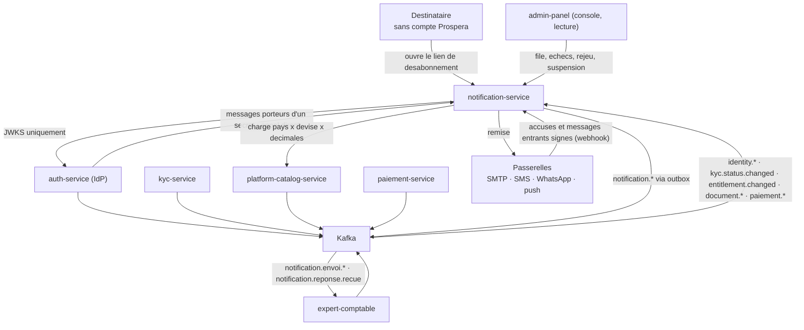
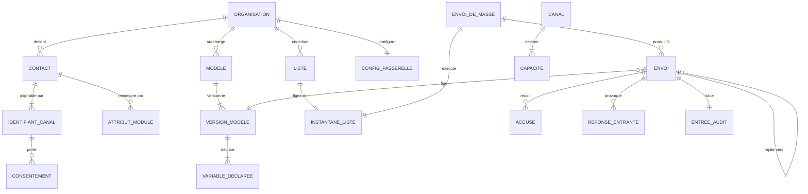
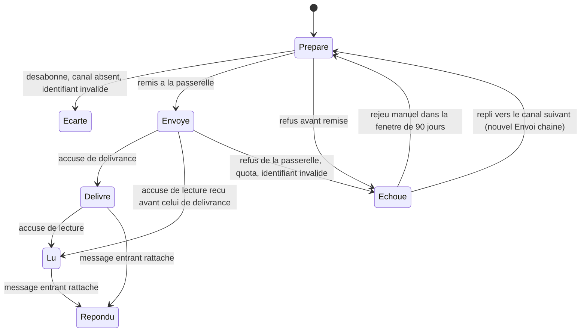

# Architecture Spine — notification-service

## Design Paradigm

**Hexagonal (ports & adaptateurs)** autour d'un noyau métier pur, lui-même **relying-party** de l'IdP.

Le noyau ne connaît que des contacts, des modèles, des envois et des accusés. Tout ce qui touche un
être humain réel entre et sort par des ports : les passerelles de canal, le bus, le stockage, le
chiffrement. Deux conséquences directes — le noyau se teste sans réseau ni passerelle, et l'arrivée
d'un sixième canal est un adaptateur, jamais une modification du noyau.

Une particularité distingue ce service des huit autres du programme : **il a deux entrées de plein
droit**, l'API et le bus. Il est le premier service dont le déclencheur principal n'est pas un appel
mais un fait publié par quelqu'un d'autre (AD-2).

| Couche | Répertoire | Contenu |
| --- | --- | --- |
| Domaine | `src/domain/` | Contact, IdentifiantCanal, Modele, Envoi, EnvoiDeMasse, Consentement, Accuse, Cout, machine à états, normalisation, segmentation. Aucune dépendance framework |
| Application | `src/application/` | Cas d'usage, transactions Mongo, orchestration des ports |
| Ports | `src/ports/` | Interfaces sortantes : canal, événements, chiffrement, stockage de fichier, référentiel |
| Adaptateurs | `src/adapters/` | Mongo, Kafka, BullMQ, e-mail SMTP, SMS, WhatsApp, push, in-app, chiffrement |
| Entrée | `src/modules/` | Contrôleurs NestJS, DTO, guards, consumers du bus, webhooks de passerelle, **et la surface publique de désabonnement** |

## Inherited Invariants

Hérités de l'écosystème et des spines livrées. **Lecture seule** — non re-décidés ici ; un choix local
qui les contredirait est un conflit à remonter, pas une dérogation.

| Hérité | Source | Ce qu'il contraint ici |
| --- | --- | --- |
| Relying-party / JWKS | `architecture-prospera-ecosystem` (P3) | Validation locale du JWT RS256, jamais d'appel réseau à `auth-service` sur le chemin chaud |
| Read-models par événements | `architecture-prospera-ecosystem` (P4) | Identité, rôles, statut KYC, entitlement et **pays de l'organisation** sont répliqués localement, jamais interrogés à chaud |
| `orgId` du jeton signé | `architecture-prospera-ecosystem` | L'isolation ne vient jamais du corps de requête — **sauf sur les deux surfaces publiques, qui n'ont pas de jeton** (AD-17) |
| Database-per-service | `architecture-prospera-ecosystem` | `notification-service` ne lit aucune base d'un autre service |
| Outbox transactionnelle | `architecture-prospera-ecosystem` (P6) | Publication d'événement dans la transaction qui produit le fait |
| Partition Kafka par `orgId` | `architecture-prospera-ecosystem` | Ordre garanti par organisation sur tous les topics `notification.*` |
| Kafka pour l'inter-services, BullMQ pour l'interne | `architecture-prospera-ecosystem` (P6) | La file d'envoi est interne au service ; elle n'est **jamais** un canal inter-services |
| Moule unique des 18 services | `architecture-prospera-ecosystem` (P12) | NestJS relying-party, une base par service, abstraction provider par capacité externe |
| Schema registry, compatibilité BACKWARD en CI | `architecture-prospera-ecosystem` (P9) | Les schémas des topics `notification.*` y sont enregistrés ; un producteur ne peut plus retirer un champ lu par un consommateur. Le rejet du merge en CI remplace la discipline manuelle |
| Journal protégé par base séparée | `architecture-fiscal-service` (AD-10, AD-19) · `paiement` (AD-10) | Les privilèges MongoDB sont **additifs et sans deny** — repris ici tel quel (AD-14) |
| File partagée, jamais de minuterie | `architecture-fiscal-service` (AD-18) · `paiement` (AD-12) | Aucun `setInterval` ni ordonnancement en mémoire de processus, nulle part |
| Montants en entier d'unité mineure + `ReferentielVersion` | `paiement` (AD-8) | Le coût d'envoi réutilise `pays-devises-ao@AAAA.N` de `platform-catalog-service` ; aucun second registre (AD-16) |
| Secrets chiffrés, clé hors base | `paiement` (AD-14) | Les identifiants de passerelle sont chiffrés en AES-256-GCM, la clé maîtresse vient de l'environnement, aucun chemin d'API ne restitue le clair — pas même pour un `PLATFORM_ADMIN` |
| `notification-service` est l'organe de parole unique | `paiement` (AD-17) | `paiement-service` ne parle jamais directement au payeur ; il publie et ce service parle. La réciproque tient : ce service ne décide de rien (AD-19) |
| Régime des données d'un destinataire sans compte | `paiement` (Consistency Conventions) | `paiement-service` renvoie explicitement à ce carnet. AD-11 **honore** ce renvoi, il ne le re-décide pas |

## Invariants & Rules



Le sens des dépendances est strictement descendant : **aucune flèche synchrone ne repart de
`notification-service` vers un service métier**. La restitution des accusés aux modules appelants
(FR-N38) et le routage des réponses (FR-N42) passent par le bus — c'est ce qui permet à Relance,
Marketing et Support d'exister plus tard sans que ce service les connaisse. La seule flèche synchrone
entrante est celle d'AD-2, et elle est limitée aux messages porteurs d'un secret.

### AD-1 — L'`Envoi` est la remise unitaire ; la `nature` naît du point d'entrée, jamais d'un paramètre

- **Binds:** §1.3 du PRD, FR-N23, FR-N26, FR-N29, FR-N35, FR-N38, FR-N39, FR-N46, FR-N50, FR-N59
- **Prevents:** les deux défauts symétriques que le §1.3 nomme — une promotion envoyée sous le régime
  « service » à quelqu'un qui l'a refusée, et une mise en demeure bloquée par un désabonnement
  marketing. Il suffit d'un `nature: "TRANSACTIONNEL"` écrit par copier-coller pour que le régime saute
  sans qu'aucun test ne casse
- **Rule (agrégat) :** `Envoi` est la **remise unitaire à un destinataire sur un canal** — unité du
  journal, de l'accusé, du rejeu et de la mesure de consommation, conformément au glossaire du PRD.
  `EnvoiDeMasse` est un **orchestrateur** au-dessus : il produit N `Envoi`, il n'en est pas un.
- **Rule (naissance de la nature) :** **aucun cas d'usage n'accepte `nature` en entrée.** Un `Envoi`
  de nature `TRANSACTIONNEL` ne peut naître que du cas d'usage transactionnel (appel direct ou
  consumer d'événement) ; un `Envoi` de nature `MASSE` ne peut naître que de l'exécution d'un
  `EnvoiDeMasse`. Un appelant **n'a pas de champ** pour demander un envoi de masse sous le régime de
  service. Aucun DTO d'entrée ne porte ce mot.
- **Rule (rendu d'essai) :** la prévisualisation (FR-N15) emprunte un chemin de code qui **ne peut pas
  produire d'`Envoi`** — la fonction de rendu est pure et partagée, l'écriture ne l'est pas. Aucun
  quota consommé, aucune ligne au journal, aucun coût.

### AD-2 — Deux chemins d'entrée, discriminés par le contenu ; un secret ne touche jamais le bus

- **Binds:** FR-N23, FR-N24, FR-N25, FR-N27, SM-1, SM-5
- **Prevents:** un jeton de vérification d'e-mail ou de réinitialisation de mot de passe déposé sur un
  topic Kafka — c'est-à-dire un journal **durable, rejouable depuis l'offset 0, lisible par tout
  consumer group du programme et copié dans les sauvegardes**. Le lien à usage unique *est* la preuve
  d'identité : qui l'a, prend le compte
- **Rule (discriminant) :** le discriminant est le **contenu**, jamais l'appelant. Un message qui
  transporte un **lien à usage unique ou un code** (vérification d'e-mail, invitation, réinitialisation
  de mot de passe) entre par **appel direct authentifié machine-à-machine**. Tout autre déclencheur
  entre par **événement consommé sur le bus**. Le test est binaire et vérifiable en revue.
- **Rule (le fait reste publié) :** l'appel direct ne remplace pas l'événement. `auth-service` publie
  toujours `identity.user.registered` pour les read-models des autres services — **sans le secret**.
- **Rule (disponibilité) :** une indisponibilité de ce service **ne fait pas échouer l'inscription**.
  Le client sortant de l'appelant réessaie avec backoff — une file de réessai n'est ni un appel SMTP ni
  un appel de canal, donc `SM-1` reste à zéro — et tout message porteur d'un secret expose un chemin
  de **renvoi à l'initiative de l'utilisateur**.
- **Rule (mise à mort de la dette) :** `auth-service`, `kyc-service` et `expert-comptable` perdent
  **tout** code d'envoi : plus de `nodemailer`, plus de `.hbs` sur disque, plus de sujet en dur, plus
  de `MAIL_QUEUE`. `SM-1 = 0` est le critère de sortie de l'incrément 2, mesuré par recherche de
  `nodemailer` et `createTransport` dans les trois services.
- **Condition :** **C8** — l'authentification machine-à-machine entre services — est une décision
  **programme encore ouverte** ; la spine `paiement-service` l'a explicitement contournée par événement
  (AD-13) et note qu'elle reste ouverte pour d'autres appelants. Ici elle **ne peut pas** être
  contournée. Elle doit être tranchée **avant l'incrément 2**. Hors de l'autorité de cette colonne.

### AD-3 — L'idempotence est arbitrée par la base, sur les trois chemins d'écriture

- **Binds:** FR-N06, FR-N25, FR-N30, NFR-4, SM-1
- **Prevents:** la fenêtre entre un `find` et un `insert` sous rejeu parallèle. Un doublon d'envoi se
  voit chez un être humain et se paie à la passerelle, pas dans les journaux
- **Rule (trois clés, trois index) :** chaque chemin d'écriture porte sa propre clé et son **index
  unique**. Envoi transactionnel :
  `(orgId, cleIdempotence, regleDeclenchementId, destinataireRef, canal)`, la `cleIdempotence` venant
  de l'appelant ou de l'`eventId` du bus. Ligne d'envoi de masse : `(envoiDeMasseId, contactId, canal)`.
  Accusé entrant : `(passerelle, referenceAccuse)`. Inscription de contact : l'identifiant de canal
  normalisé (AD-11).
- **Rule (pourquoi la clé n'est pas le seul `eventId`) :** un même événement déclenche légitimement
  **plusieurs** envois — `kyc.status.changed` prévient le dirigeant par e-mail *et* le gestionnaire de
  compte en in-app, et FR-N24 rend la correspondance événement → modèle configurable par organisation.
  Une clé réduite à `(orgId, eventId, canal)` ferait **avaler silencieusement** le second envoi comme
  un rejeu. La règle de déclenchement et le destinataire font donc partie de la clé.
- **Rule (le rejeu est un succès) :** une erreur de clé dupliquée **est** le rejeu : elle se traite
  comme un succès, jamais comme une panne, jamais comme un `409`. Aucun verrou applicatif, aucun verrou
  Redis, aucun `find` préalable sur ces chemins. Toute écriture rejouable emploie `findOneAndUpdate` ou
  `insertMany` en `ordered: false`, jamais un `insert` nu.
- **Condition observable :** rejouer N fois la même demande et le même événement — dans le désordre, en
  parallèle, et après redémarrage du service — produit exactement un message chez le destinataire. Le
  test appartient à la définition de terminé, pas à la recette (NFR-4).

### AD-4 — Les accusés sont une boîte de réception append-only ; le statut est la projection du plus avancé

- **Binds:** FR-N36, FR-N37, FR-N38, FR-N40, FR-N45, NFR-1a, NFR-4
- **Prevents:** un statut qui **recule** de `lu` à `délivré` quand WhatsApp émet ses deux accusés en
  rafale inversée — exactement le saut arrière que FR-N36 interdit — et, à l'inverse, la perte de
  l'information de lecture si l'on rejetait l'accusé hors ordre. Sur WhatsApp l'inversion est la norme,
  pas l'exception
- **Rule (boîte de réception) :** tout accusé de passerelle est persisté **brut** dans une collection
  append-only, avec sa clé d'unicité (AD-3). La **signature est vérifiée avant persistance** ; un
  accusé non signé ou mal signé est rejeté et tracé, jamais traité. On peut ainsi rejouer la dérivation
  après un bug et prouver ce que la passerelle a réellement envoyé.
- **Rule (projection) :** le domaine porte un **ordre total** —
  `préparé < envoyé < délivré < lu < répondu` — et le statut de l'`Envoi` est
  `max(états observés)`, **jamais le dernier reçu**. Il ne recule donc jamais, quel que soit l'ordre
  d'arrivée. `échoué` est un état terminal atteignable depuis `préparé` et `envoyé` uniquement, avec un
  motif exploitable et nommé.
- **Rule (maintien) :** la projection est écrite sur l'`Envoi` **dans la transaction Mongo qui insère
  l'accusé**, jamais recalculée à la lecture — sinon FR-N39 (journal filtrable par statut) devient une
  agrégation sur toute la collection.

### AD-5 — La certitude vient des capacités déclarées du canal ; aucune décision automatique ne se prend sur le « lu »

- **Binds:** NFR-1, NFR-1a, NFR-1b, FR-N20, FR-N37, FR-N19
- **Prevents:** une surface qui affiche « non lu » quand la vraie réponse est « on ne peut pas savoir »,
  et — plus grave — une escalade de relance qui se déclencherait systématiquement au barreau SMS, qui
  n'a pas la notion de lecture, y compris pour les débiteurs qui ont lu et vont payer
- **Rule (origine) :** le niveau de certitude (`confirmé` · `présumé` · `indisponible sur ce canal`)
  est **lu des capacités déclarées par le `ChannelProvider`** (AD-6). Il n'est ni codé en dur, ni dérivé
  du statut, ni décidé par l'appelant. Ajouter un canal ne demande donc aucune modification du noyau
  pour que sa certitude soit juste.
- **Rule (opposabilité) :** aucune API, aucun événement sortant, aucune vue ne restitue un statut de
  lecture **sans** son niveau de certitude. Les deux voyagent ensemble ou ni l'un ni l'autre.
- **Rule (interdit) :** **aucun automatisme de ce service ne se déclenche sur un statut de lecture** —
  ni le repli de canal (AD-7), ni une relance, ni un blocage. Le repli se déclenche sur **échec
  technique du canal** uniquement. Le « lu » informe un humain ; il ne décide pas à sa place.

### AD-6 — Un seul port `ChannelProvider` ; aucun canal n'est un prérequis de démarrage

- **Binds:** FR-N16, FR-N17, FR-N18, FR-N20, FR-N22, NFR-6, SM-3, R1, R2
- **Prevents:** la logique d'une passerelle infiltrée dans le noyau — et un service qui refuse de
  démarrer parce qu'aucun contrat WhatsApp n'est signé, alors que l'incrément 1 n'en a pas besoin
- **Rule (capacités déclarées) :** chaque adaptateur déclare, en données et non en code appelant :
  longueur maximale et encodages supportés, pièces jointes, accusé de délivrance, accusé de lecture et
  **son niveau de certitude**, bidirectionnalité, référence de conversation transportée ou non (AD-10),
  exigence d'approbation de modèle, barème de tarif, devise. Un appelant **interroge** ce qu'un canal
  sait faire (FR-N20) au lieu de le supposer.
- **Rule (approbation) :** le statut d'approbation par canal (FR-N16) est une **capacité du
  fournisseur**, pas une propriété du modèle en dur. Inerte avec la passerelle du v1, il devient
  bloquant sans changement de modèle de données si le projet bascule sur l'API officielle WhatsApp
  (R1) — c'est la mitigation du risque accepté par le PO.
- **Rule (démarrage) :** l'absence d'une passerelle dégrade **le canal**, jamais le service. L'état de
  santé distingue explicitement « service indisponible » de « canal indisponible ». Aucun `si
  production` dans le code : le passage du bac à sable à la production est une configuration.
- **Rule (in-app) :** le canal in-app est un adaptateur comme les autres, sans passerelle externe. Il
  est le seul dont la certitude de lecture est `confirmé` **par construction** — l'accusé n'est pas
  reçu d'un tiers, il est écrit par le service lui-même.

### AD-7 — Le repli est une chaîne d'`Envoi`, jamais une tentative cachée

- **Binds:** FR-N21, FR-N35, FR-N38, FR-N57, FR-N59, CM-1
- **Prevents:** un coût de SMS invisible parce qu'il s'est produit « à l'intérieur » d'un envoi
  WhatsApp — et, si l'on choisissait l'inverse, un `Envoi` qui cesserait d'être l'unité de mesure et
  contredirait AD-1
- **Rule:** « WhatsApp, sinon SMS » produit **un `Envoi` par canal tenté**, chaînés par
  `envoiPrecedentId`. Chacun porte son canal, son statut, son coût et ses accusés — l'`Envoi` reste
  l'unité, comme le veut le glossaire du PRD.
- **Rule (restitution) :** FR-N38 restitue au module appelant l'état du **dernier maillon de la
  chaîne**, pas celui de chaque maillon ni le plus avancé de tous. Le repli ne s'enclenchant que sur
  échec (AD-5), le dernier maillon est le seul qui porte le sort réel du message. Le module a parlé une
  fois ; il apprend une fois.
- **Rule (compteurs) :** la contre-métrique **CM-1** (volume moyen reçu par destinataire) compte les
  `Envoi` **délivrés**, jamais les `Envoi` créés — sinon un repli gonfle artificiellement le compteur
  et le garde-fou anti-sur-sollicitation se met à mentir.

### AD-8 — Le rendu est une substitution de variables déclarées, jamais la compilation d'un programme

- **Binds:** FR-N09, FR-N12, FR-N15, NFR-7
- **Prevents:** l'exécution de code arbitraire sur le serveur. FR-N12 exige que le client écrive ses
  propres modèles ; compiler un template venu de la base est une surface d'injection côté serveur
  documentée, et la recommandation universelle est de **ne jamais compiler un modèle de source non
  fiable**
- **Rule (moteur) :** un modèle stocké en base est **du texte à trous**, et le rendu est une
  substitution sur une **liste fermée de variables déclarées par le modèle**. Aucun helper, aucun
  partiel, aucune expression de bloc, aucune boucle, aucun accès au prototype. Le moteur ne compile
  rien : il substitue.
- **Rule (frontière) :** un moteur de template complet reste autorisé pour la **mise en page HTML
  système livrée avec le code** — jamais pour un contenu lu en base. La frontière est l'origine du
  texte, pas sa forme.
- **Rule (variables typées) :** le modèle **déclare** ses variables et leur type. Une variable
  manquante ou mal typée à l'envoi est un **refus nommé**, jamais un trou dans le message ni la chaîne
  `undefined` chez un client.
- **Coût assumé :** pas de conditionnel dans un modèle client. Une variante se fait par **deux modèles
  et une règle de déclenchement**, ce qui a l'avantage d'être visible au journal.

### AD-9 — Les modèles se résolvent en chaîne et se figent sur l'`Envoi`

- **Binds:** FR-N09, FR-N10, FR-N11, FR-N13, FR-N14, FR-N35
- **Prevents:** une nouvelle version d'un modèle système qui modifierait un envoi déjà préparé ou
  réécrirait a posteriori ce que dit le journal — et, si l'on copiait à la surcharge, une correction du
  socle (une faute, une mention légale manquante) qui n'atteindrait jamais les organisations qui ont
  surchargé
- **Rule (résolution) :** une seule copie du socle, portée par `orgId = null`. La résolution cherche
  `Modele(orgId, cle, canal, langue)` puis retombe sur `Modele(null, cle, canal, langue)`. Une
  organisation surcharge **sans altérer** le socle des autres.
- **Rule (figement) :** la résolution a lieu **à la préparation de l'`Envoi`**, et la version résolue
  est **figée** sur lui. Une publication ultérieure de version ne touche aucun envoi déjà préparé.
- **Rule (immutabilité) :** un modèle utilisé au moins une fois est **immuable**. Modifier crée une
  version, n'en réécrit jamais une.
- **Rule (langue) :** la langue est un attribut du **couple (modèle, canal)**, jamais du seul modèle —
  une langue à caractères non latins bascule le SMS en UCS-2, donc **70 caractères par segment au lieu
  de 160**, ce qui change le coût et le point de troncature (AD-16). Ajouter une langue est une donnée,
  pas un développement.

### AD-10 — Une réponse entrante porte un niveau de certitude de rattachement

- **Binds:** FR-N41, FR-N42, FR-N43, FR-N44, FR-N45, NFR-1b
- **Prevents:** une réponse **devinée** présentée à un module appelant comme un fait — donc une
  promesse de paiement enregistrée automatiquement à partir d'un message qui répondait à autre chose
- **Rule (cascade) :** le rattachement est déterminé dans cet ordre, et **son niveau est enregistré
  avec la réponse** : **(1)** le canal transporte une référence au message d'origine ⇒ rattachement
  `CONFIRME` vers le `moduleAppelant` de l'`Envoi` désigné ; **(2)** une conversation ouverte existe
  pour `(contact, canal)` ⇒ rattachement `PRESUME` vers le module du dernier `Envoi` ; **(3)** sinon
  ⇒ rattachement `ABSENT` et routage vers la destination par défaut configurée par l'organisation
  (FR-N43).
- **Rule (miroir de NFR-1b) :** **aucun module ne déclenche d'automatisme sur un rattachement
  `PRESUME`.** Il peut l'afficher à un humain ; il ne peut pas en déduire un fait métier. C'est la même
  règle que pour le « lu » (AD-5), appliquée à l'attribution.
- **Rule (le désabonnement est intercepté avant le routage) :** sur les canaux dont le moyen de
  désabonnement **est un message entrant** — « répondez STOP » en SMS et WhatsApp (FR-N47) — le message
  correspondant aux mots-clés déclarés du canal est **intercepté avant la cascade de rattachement** et
  enregistré comme un désabonnement (AD-14). Il n'est **jamais** routé vers un module comme une
  réponse. Sans cette règle, un « STOP » partirait chez Relance comme un message ordinaire et le refus
  resterait sans effet — alors que FR-N48 le veut opposable immédiatement.
- **Rule (consommateur, pas propriétaire) :** l'inbox centralisée du Studio social (#14) **s'abonne**
  au flux des réponses ; elle n'en est ni le propriétaire ni le déversoir par défaut.
- **Rule (statut) :** une réponse fait passer l'`Envoi` d'origine à `répondu` — via la boîte de
  réception d'AD-4, donc sans jamais faire reculer le statut.

### AD-11 — Le carnet ne porte que ce qui sert à joindre ; l'identifiant normalisé est la clé, et il est stocké

- **Binds:** FR-N01→N08, FR-N51, NFR-5, §9.3
- **Prevents:** un échec **silencieux** du dédoublonnage — un numéro béninois normalisé en `+228` par
  une organisation togolaise multi-pays produit soit deux fiches pour une personne, soit une fusion à
  tort, et rien ne le signale. Et, du côté des données, un carnet qui dérive en second CRM
- **Rule (minimisation) :** le carnet stocke **le nom d'usage, les identifiants de canal, la langue et
  le consentement**. Aucune donnée métier — montant dû, solde, score, statut de dossier — n'y entre :
  elle reste dans le module propriétaire et transite comme **variable de message** (AD-8). Aucun champ
  de schéma ne peut la recevoir.
- **Rule (normalisation) :** la normalisation est une **fonction pure du domaine** (format international
  pour le téléphone, minuscules pour l'e-mail). L'indicatif par défaut vient du **pays de
  l'organisation** dans le read-model `identity.org`, et il est **surchargeable par import** — c'est
  nécessaire dès qu'une organisation opère dans plusieurs pays, ce que FR-N57c prévoit déjà.
- **Rule (la clé est stockée) :** la forme normalisée est **persistée** et porte l'index unique
  `(orgId, canal, identifiantNormalise)` ; la **forme brute saisie est conservée à côté**. Une mauvaise
  normalisation devient donc diagnosticable et corrigeable au lieu d'être invisible. Le compte rendu
  d'import (FR-N08) montre **les deux formes avant persistance**.
- **Rule (frontière d'organisation) :** le dédoublonnage s'arrête à la frontière de l'organisation.
  Deux organisations détenant le même numéro détiennent **deux contacts distincts**, sans lien ni
  visibilité mutuelle — y compris à la recherche par identifiant (FR-N07).
- **Rule (visibilité par module) :** un contact est **un document**, portant les attributs renseignés
  **par module inscripteur**. La lecture filtre sur les modules souscrits par l'organisation, lus du
  read-model d'entitlement. L'inscription est idempotente et **n'écrase jamais un consentement**.

### AD-12 — Le destinataire est polymorphe ; le canal in-app ne crée aucun contact miroir

- **Binds:** FR-N19, FR-N01, §9.2, ownership map de l'écosystème
- **Prevents:** un contact miroir créé pour chaque utilisateur Prospera « par uniformité » — il
  tomberait sous la purge du §9 (3 ans sans interaction) et sous le désabonnement, et constituerait une
  **seconde source de vérité** de l'identité, qui appartient à `auth-service`
- **Rule:** le `Destinataire` d'un `Envoi` est **polymorphe** : `Contact` (carnet, tous les canaux
  externes) ou `Utilisateur` (read-model d'identité, canal in-app **uniquement**). Aucun chemin de code
  ne crée un `Contact` à partir d'un utilisateur, et le carnet n'est jamais alimenté par `identity.*`.
- **Rule (in-app) :** l'état lu / non lu de l'in-app est écrit par ce service, donc `confirmé` par
  construction (AD-6). Le désabonnement de masse ne s'applique pas à l'in-app : ce sont des alertes
  applicatives, de nature transactionnelle.

### AD-13 — L'envoi de masse : instantané de liste, curseur, matérialisation par lot avant remise

- **Binds:** FR-N28→N34, FR-N48, NFR-2, NFR-3, SM-1, SM-4, critère de sortie de l'incrément 3
- **Prevents:** un arrêt en plein lot qui rejoue jusqu'à 500 remises déjà faites — chez de vrais
  destinataires, avec de vrais SMS facturés deux fois — et un index de liste qui ne désigne plus la même
  personne d'un lot à l'autre, puisque FR-N28 laisse un module alimenter une liste en cours de route
- **Rule (instantané) :** la préparation **fige l'appartenance de la liste** en un instantané.
  L'exécution ne relit jamais la liste vivante. C'est ce qui rend la preuve de FR-N30 possible :
  comparer le journal à l'instantané.
- **Rule (matérialisation par lot) :** le curseur avance lot par lot, et **chaque lot écrit ses lignes
  `Envoi{préparé}` en `insertMany(ordered: false)` AVANT toute remise à un canal**, sous l'index unique
  d'AD-3. Rien n'est écrit d'avance pour la liste entière : le profil de coût reste celui d'un curseur.
- **Rule (reprise) :** une interruption laisse les lignes du lot en place. La reprise retrouve les
  `préparé` restants ; les `envoyé` sont protégés du doublon par l'index. Une reprise avant l'avancée
  du curseur rejoue l'`insertMany`, dont les doublons sont **rejetés par la base, jamais ré-envoyés**.
- **Rule (écartés) :** les destinataires écartés sont écrits eux aussi, avec leur **motif nommé**
  (`DESABONNE`, `CANAL_ABSENT`, `IDENTIFIANT_INVALIDE`). Le compte rendu préalable de FR-N31 est donc
  une agrégation, sans machinerie supplémentaire.
- **Rule (consentement revérifié) :** le consentement est vérifié **deux fois** — à la préparation pour
  le compte rendu, et **à l'instant de la remise** pour l'opposabilité. C'est la seule façon d'honorer
  FR-N48 : un désabonnement doit éteindre un envoi de masse **déjà en cours d'exécution**.
- **Rule (garde-fous) :** le plafond par période et la fenêtre horaire de l'organisation (FR-N33) sont
  évalués **par lot**. Un envoi qui atteint le bord de la fenêtre **suspend** et reprend à l'ouverture
  suivante — conséquence directe du curseur, aucun mécanisme dédié. La validation préalable par un rôle
  habilité (FR-N34) bloque le passage de `préparé` à l'exécution, jamais un lot au milieu.
- **Rule (exécution unique) :** un `EnvoiDeMasse` n'a **jamais deux exécutants concurrents** — le
  travail BullMQ porte l'identifiant de l'envoi de masse comme clé de travail (AD-18).
- **Rule (le transactionnel ne fait jamais la queue derrière la masse) :** les envois transactionnels
  et les envois de masse **ne partagent ni file ni pool d'exécutants**. Un envoi de masse de 50 000
  destinataires placé sur la file commune retarderait un **code de vérification** de plusieurs heures,
  alors que NFR-3 lui impose `P95 < 10 s`. Trois files distinctes : `transactionnel-prioritaire`
  (messages sensibles au temps — code, lien à usage unique), `transactionnel` et `masse`, chacune avec
  sa propre concurrence. Un envoi de masse ne peut **en aucun cas** être placé sur une file
  transactionnelle, et la nature d'AD-1 détermine la file — elle n'est pas choisie par l'appelant.

### AD-14 — Les preuves et la trace d'audit vivent dans une base protégée par le serveur, pas par le code

- **Binds:** FR-N46, FR-N48, FR-N49, FR-N52, FR-N68, §9.2
- **Prevents:** un module futur qui efface une preuve de désabonnement — c'est-à-dire la pièce même qui
  prouve la conformité — ou la trace de ce qui a été envoyé, sans que rien ne casse
- **Rule (isolation) :** `consentements`, `desabonnements` et `audit_envois` vivent dans une **base
  distincte** `notification_service_preuves`, sur laquelle le compte applicatif ne détient que `find`
  et `insert`. Un privilège de collection ne suffirait pas : les privilèges MongoDB sont **additifs et
  sans deny**, donc un `readWrite` sur la base métier redonnerait `remove`. La purge et la restauration
  emploient un **second compte, absent de la configuration du service**.
- **Rule (append-only) :** un revirement de consentement est une **entrée de plus**, jamais un `update`.
  L'état courant est la projection de la dernière entrée par `(identifiantCanal, canal, nature)`.
- **Rule (deux journaux distincts) :** l'`Envoi` reste **opérationnel** dans la base métier — statut
  projeté, variables purgées, détail purgé à 13 mois, filtrable, exportable, rejouable. **En plus**,
  chaque remise écrit une **entrée d'audit** dans la base protégée : `orgId`, `moduleAppelant`,
  `identifiantCanal`, `canal`, `modele@version`, `cout`, horodatage — **sans variables et sans rendu**,
  donc sans donnée personnelle au-delà de l'identifiant de canal. Elle **survit à la purge des 13
  mois** : on peut toujours prouver que et quand on a parlé.
- **Rule (atomicité entre les deux bases) :** l'entrée d'audit est écrite dans la **même transaction
  Mongo** que la transition de l'`Envoi` vers `envoyé`. Le réplica set `rs0` étant partagé par les deux
  bases, la transaction multi-base est possible — c'est **la raison** pour laquelle la base protégée
  vit sur le même réplica set et non sur une instance séparée. Écrire l'audit après le commit
  produirait des remises sans trace, exactement dans le cas qui compte : le plantage.
- **Rule (survie à l'effacement) :** un effacement demandé par une personne (FR-N51) supprime le contact
  et le journal détaillé, et **conserve la preuve du désabonnement**. Effacer sa propre preuve de
  conformité en même temps que la donnée qu'elle protège est un contresens.
- **Rule (le refus suit la personne) :** le contact étant unique dans l'organisation (AD-11), un refus
  vaut pour **tous** les modules de cette organisation. Il n'éteint pas les messages transactionnels
  (AD-1).

### AD-15 — Les variables ont leur propre horloge ; le rendu n'est jamais conservé ; les durées sont bornées

- **Binds:** FR-N35, FR-N40, FR-N51, FR-N64→N68, §9.2, §9.3
- **Prevents:** un journal présenté comme minimisé alors qu'il porte `{montantDu, nom}` pendant treize
  mois — le §9.3 du PRD affirme que ne pas conserver le rendu évite de dupliquer les variables
  sensibles, alors que FR-N35 les journalise explicitement. Stocker un montant dû et un nom est
  exactement aussi personnel que stocker le texte rendu
- **Rule (deux horloges) :** le **journal détaillé** est conservé 13 mois puis remplacé par des
  **agrégats anonymes** (compteurs par envoi de masse, canal et période). Les **variables** portent une
  horloge **plus courte** — 90 jours par défaut — au terme de laquelle elles sont retirées, laissant le
  squelette : destinataire, `modele@version`, canal, statut, coût.
- **Rule (les accusés suivent le journal) :** la boîte de réception d'accusés (AD-4) porte **la même
  échéance que le journal détaillé** — 13 mois — et disparaît avec lui. Elle n'a pas d'horloge propre :
  un accusé sans l'`Envoi` qu'il qualifie ne prouve rien et ne s'interprète plus. La preuve de ce qui a
  été envoyé est portée par la trace d'audit (AD-14), pas par les accusés.
- **Rule (conséquence à dire) :** la fenêtre de **rejeu manuel** d'un envoi échoué (FR-N40) est donc
  **bornée à 90 jours** et doit être annoncée comme telle dans la console. Au-delà, on ne peut plus
  rendre le message.
- **Rule (rendu) :** le rendu figé n'est **pas conservé**. La seule exception est le message à valeur
  probante (mise en demeure), conservé 5 ans, plafond 10.
- **Rule (plafond opposable) :** toute durée est paramétrable par organisation **dans la limite d'un
  plafond que le service refuse de dépasser**. Une tentative au-delà est **rejetée par une erreur
  nommée**, jamais silencieusement ramenée au plafond — sinon l'organisation croit avoir configuré ce
  qu'elle n'a pas.
- **Rule (purge tracée) :** chaque exécution de purge écrit son compte rendu — volume, catégorie,
  échéance appliquée — consultable. Une purge qui ne laisse pas de trace n'est pas vérifiable.
- **Rule (résiliation) :** export du carnet et du journal mis à disposition, puis **suppression complète
  à 90 jours**. Aucune donnée d'un client résilié ne survit ni ne sert à un autre.

### AD-16 — La mesure de consommation est figée à l'envoi ; les montants sont des entiers d'unité mineure

- **Binds:** FR-N14, FR-N31, FR-N57, FR-N57b, FR-N57c, FR-N58→N63
- **Prevents:** le XOF traité à deux décimales — des coûts faux d'un facteur 100 sur le marché principal
  — un total « toutes devises confondues » qui n'a aucun sens, et un changement d'affectation d'un
  salarié qui réécrirait l'historique de consommation de son ancienne équipe
- **Rule (montants) :** tout coût est un couple `(montantMineur: entier, devise)` porté par un type
  unique du domaine. Le nombre de décimales est **lu du référentiel** `pays-devises-ao@AAAA.N` de
  `platform-catalog-service`, jamais présumé. **Le XOF et le GNF n'ont aucune décimale.** Aucun
  flottant, aucun coût nu en signature de fonction.
- **Rule (jamais d'agrégat inter-devises) :** la restitution est **par devise**, sans conversion ni
  total agrégé. Additionner des XOF et des NGN ne produit aucun nombre qui veuille dire quelque chose.
- **Rule (segments) :** le calcul du nombre de segments (GSM-7 à 160 caractères, UCS-2 à 70) est une
  **fonction pure du domaine**, pas une compétence de la passerelle — il faut pouvoir l'annoncer
  **avant** de choisir un canal (FR-N14, FR-N31). Le coût réellement facturé, quand la passerelle le
  transporte, est enregistré avec sa `sourceCout` (`REEL` ou `BAREME`).
- **Rule (figement) :** le **tarif appliqué** et le **rattachement organisationnel de l'auteur** sont
  figés **au moment de l'envoi**, jamais recalculés à la lecture. Aucun envoi n'est anonyme : il porte
  l'utilisateur qui l'a déclenché, ou à défaut le module ou la règle automatique à l'origine.
- **Rule (ventilation) :** au v1 la ventilation interne se fait par **utilisateur et par rôle**,
  disponibles dans le read-model d'identité. La ventilation par **équipe** au sens métier arrive avec le
  module Équipe (#18) et n'exige **aucune reprise de données**, le rattachement étant déjà figé.
- **Rule (la vue plateforme ne lève jamais le filtre d'organisation) :** la vue toutes-organisations de
  FR-N61 lit **exclusivement des compteurs pré-agrégés** par `(orgId, canal, nature, période, devise)`,
  maintenus à l'écriture. **Aucun chemin de code ne rend l'`orgId` facultatif sur une collection
  opérationnelle** — pas de `if PLATFORM_ADMIN` dans un dépôt, pas de filtre conditionnel. Sans cette
  règle, la restitution commerciale devient la porte par laquelle NFR-5 tombe : un contact, un journal
  ou un modèle deviendrait lisible hors de son organisation, ce qu'aucune exigence ne demande.
- **Rule (pas de facturation) :** aucune facturation ni blocage sur dépassement au v1. Le modèle de coût
  est complet pour que la facturation s'y branche **sans reprise de données** (FR-N63).

### AD-17 — Deux surfaces non authentifiées, énumérées et bornées

- **Binds:** FR-N41, FR-N47, FR-N48, NFR-5, NFR-7
- **Prevents:** un désabonnement forgé pour un tiers, l'énumération des destinataires d'une organisation
  à partir d'un lien, et un webhook falsifié qui écrirait des accusés
- **Rule (énumération) :** exactement **deux** préfixes sont exemptés de la validation JWT à la
  gateway, **nommément et de manière énumérée**, jamais par un motif large : la surface publique de
  **désabonnement** et les **webhooks de passerelle**. Aucune autre route n'est publique.
- **Rule (jeton de désabonnement) :** le lien porte un jeton **opaque à forte entropie**, sans aucun
  identifiant devinable — ni `orgId`, ni identifiant de contact, ni séquence. Il ne désigne qu'un couple
  `(identifiantCanal, canal)` et n'ouvre **aucune lecture** du carnet. Un jeton inconnu et un jeton
  révoqué rendent la **même** réponse.
- **Rule (webhooks) :** la signature est vérifiée **avant** persistance (AD-4), sur le **corps de requête
  non parsé**. Le parseur brut est monté **uniquement** sur les routes de webhook ; un parseur global
  casse silencieusement la vérification.
- **Rule (débit) :** chaque surface publique porte son propre plafond de débit, par jeton et par IP.

### AD-18 — Gate d'accès local, permissions déclarées au catalogue, faits temporels en file partagée

- **Binds:** FR-N53, FR-N54, FR-N55, FR-N64, FR-N65, Q6
- **Prevents:** une autorisation qui dépendrait de la disponibilité d'un autre service, un rôle codé en
  dur qu'aucune organisation ne peut ajuster, et une purge ou un envoi de masse qui ne partiraient
  jamais parce qu'ils reposaient sur une minuterie de processus
- **Rule (gate) :** `emailVerified` (claim du jeton) + `OrgKycStatus == APPROVED` + entitlement
  notification `ACTIVE`, **tous lus des read-models locaux**. Aucun appel réseau sur le chemin
  d'autorisation. Le cloisonnement vient de l'`orgId` du jeton signé, jamais du corps de requête — les
  deux surfaces d'AD-17 sont la seule exception, et elles sont énumérées.
- **Rule (permissions) :** les cinq droits — rédiger un modèle, exécuter un envoi de masse, valider un
  envoi de masse, consulter le journal, administrer les canaux — sont déclarés au **catalogue de
  permissions plateforme** (STORY-140) et **attribuables séparément**. Aucun rôle n'est codé en dur.
  *Q6 (rôle nouveau ou permission ajoutée à un rôle existant) est délégué au découpage en stories par
  décision produit ; cette règle tient dans les deux cas.*
- **Rule (faits temporels) :** l'exécution d'un envoi de masse, sa planification, la purge, l'agrégation
  à 13 mois, la suppression à 90 jours après résiliation et l'expiration d'un jeton de désabonnement
  sont des **travaux BullMQ à clé idempotente**. Aucun `setInterval`, aucune minuterie applicative,
  aucun ordonnancement en mémoire de processus — nulle part dans le service.

### AD-19 — Ce module exécute ; il ne cible pas, ne décide pas, ne rédige pas

- **Binds:** §4.1 et §4.3 du PRD, FR-N28, FR-N38, FR-N42, FR-N56b, A1
- **Prevents:** la segmentation métier, les règles d'escalade ou la rédaction assistée qui s'installent
  ici « parce que les données y sont déjà » — la dérive la plus probable de ce service, et celle que le
  PRD nomme lui-même comme une frontière mince
- **Rule:** `notification-service` porte l'**exécution** : contacts, modèles, listes, canaux, envoi,
  journal, désabonnement. Il ne porte **ni le ciblage, ni le budget, ni le ROI** (Marketing #10), **ni
  la décision de relancer ou d'escalader** (Relance #24), **ni le dossier de support** (Support #8),
  **ni la publication sur les réseaux sociaux** (Studio social #14), **ni la rédaction assistée par IA**
  (Assistant #6 propose, ce service envoie), **ni la facturation** (PI-SPI).
- **Rule (liste remise, jamais construite) :** une liste remise par un module appelant est **exécutée**
  ici ; elle n'est pas **construite** ici. Aucun critère de segmentation métier n'entre dans le modèle
  de données.
- **Rule (identité de l'appelant) :** tout `Envoi` porte le **module qui a parlé**. C'est ce qui rend
  possible la restitution des accusés (FR-N38) et le routage des réponses (AD-10) sans que ce service
  connaisse les modules à venir.
- **Rule (fournisseur de candidats) :** le service expose un **fournisseur de candidats** au moteur de
  règles de l'assistant (`FR-IA03b`) — envois échoués non rejoués, destinataires dont tous les canaux
  échouent, modèles en attente d'approbation, envois de masse préparés jamais exécutés. Il **propose**
  des candidats ; il ne déclenche aucune automatisation.

## Consistency Conventions

| Concern | Convention |
| --- | --- |
| Nommage — domaine | Français métier : `Contact`, `IdentifiantCanal`, `Modele`, `VersionModele`, `Envoi`, `EnvoiDeMasse`, `Liste`, `Consentement`, `Accuse`, `ReponseEntrante`, `Cout`. Jamais de nom de passerelle dans un type du domaine |
| Nommage — vocabulaire | **« Envoi » partout.** Le mot « notification » ne désigne jamais un objet du domaine — il nomme le service. Un `Envoi` de masse ne s'appelle jamais « campagne » : la campagne est l'objet du module Marketing (#10) |
| Nommage — événements | `notification.<agrégat>.<fait-au-passé>` : `notification.envoi.delivre`, `notification.envoi.echoue`, `notification.envoi.lu`, `notification.reponse.recue`, `notification.envoi_de_masse.termine`, `notification.desabonnement.enregistre` |
| Nommage — fichiers | Convention NestJS déjà en place : `*.schema.ts`, `*.service.ts`, `*.controller.ts`, `*.dto.ts`, `*.regles.ts`, `*.processor.ts`, `*.spec.ts` |
| Identifiants | `ObjectId` Mongo en interne ; `orgId` opaque issu du jeton ; **jeton de désabonnement opaque à forte entropie**, jamais dérivé d'un identifiant métier |
| Identifiant de canal | Toujours stocké sous **deux formes** : `identifiantNormalise` (la clé, indexée) et `identifiantBrut` (ce que l'humain a saisi). Jamais un seul champ (AD-11) |
| Coûts | `Cout = (montantMineur: entier, devise)`. Aucun `number` flottant, aucune conversion, aucun total inter-devises (AD-16) |
| Statuts | `prepare` · `envoye` · `delivre` · `lu` · `repondu` · `echoue` · `ecarte`. Un statut de lecture ne circule **jamais** sans son `niveauCertitude` (AD-5) ; un rattachement de réponse jamais sans le sien (AD-10) |
| Dates | ISO 8601, UTC en stockage. La fenêtre horaire de FR-N33 se calcule dans le fuseau **déclaré de l'organisation** — `[ASSUMPTION A4 : UTC+0 pour le Togo]`, à revoir au premier client hors fuseau |
| Erreurs | Codes nommés et stables, jamais un message libre : `VARIABLE_MANQUANTE`, `VARIABLE_MAL_TYPEE`, `IDENTIFIANT_NON_NORMALISABLE`, `CANAL_INDISPONIBLE`, `CANAL_ABSENT_DU_CONTACT`, `DESTINATAIRE_DESABONNE`, `MODELE_INTROUVABLE`, `MODELE_NON_APPROUVE`, `PLAFOND_ENVOI_ATTEINT`, `HORS_FENETRE_AUTORISEE`, `DUREE_AU_DELA_DU_PLAFOND`, `VALIDATION_REQUISE`, `SIGNATURE_INVALIDE`, `FENETRE_REJEU_EXPIREE` |
| Erreurs — statut HTTP | Correspondance fixe : transition interdite → `409` · **clé dupliquée sur rejeu → succès, jamais `409`** (AD-3) · signature de webhook invalide → `401` · règle métier violée sur une entrée valide → `422` · validation de forme → `400` · ressource hors organisation → `404` (anti-énumération) · intégrité d'artefact de référentiel → `502` |
| Mutation d'état | Les accusés et les preuves ne se mutent pas (AD-4, AD-14). La projection de statut s'écrit dans la transaction qui insère l'accusé |
| Idempotence | Toute écriture déclenchée par un appel, un événement, un webhook ou un lot est rejouable : clé unique + `findOneAndUpdate` ou `insertMany(ordered: false)`, jamais un `insert` nu (AD-3) |
| Corps de requête | Parseur brut **uniquement** sur les routes de webhook (AD-17). Parseur JSON standard partout ailleurs |
| Rendu | Substitution de variables déclarées sur les modèles de la base ; moteur de template complet réservé aux gabarits HTML livrés **avec le code** (AD-8). Aucune compilation d'un texte lu en base |
| Journalisation | `nestjs-pino`, corrélation par `nestjs-cls`. **Jamais** un secret de passerelle, jamais un lien à usage unique, jamais un rendu de message, jamais un numéro ou une adresse en clair — l'identifiant de canal est journalisé **masqué** |
| Permissions | Les cinq droits sont déclarés au catalogue plateforme (STORY-140), attribuables séparément. Aucun rôle codé en dur (AD-18) |
| Configuration | `@nestjs/config`, variables d'environnement uniquement. Aucun tarif, aucun plafond de rétention, aucune décimale de devise en configuration — ils viennent des capacités de canal et du référentiel |
| Tests | Le domaine se teste sans infrastructure ni passerelle. Trois tests appartiennent à la définition de terminé, pas à la recette : le rejeu d'envoi (AD-3), la reprise d'un envoi de masse interrompu (AD-13), et l'exactitude du XOF à zéro décimale (AD-16). Seuils du moule : 65/90/90/90 |

## Stack

Ratifiée depuis le code du dépôt le **2026-08-04** — brownfield, on aligne plutôt qu'on invente.
`nodemailer` et `handlebars` proviennent d'`auth-service` : ce sont exactement les dépendances que ce
service **reprend** en soldant la dette (AD-2).

| Name | Version |
| --- | --- |
| Node.js (types) | 22 |
| TypeScript | 5.7 |
| NestJS (`common`, `core`, `platform-express`) | 11 |
| `@nestjs/mongoose` / Mongoose | 11 / 8.24 |
| MongoDB | `mongo:7` (réplica set `rs0` — transactions requises) |
| Apache Kafka | `apache/kafka:3.9.0` |
| kafkajs | 2.2.4 |
| `@nestjs/bullmq` / `bullmq` / `ioredis` | 11.0.4 / 5.79 / 5.11 |
| Redis | 7-alpine |
| `nodemailer` (adaptateur e-mail, Mailhog en dev) | 6.9.16 |
| `handlebars` (gabarits HTML **livrés avec le code** uniquement — AD-8) | 4.7.8 |
| `@nestjs/config` | 4.0 |
| `@nestjs/swagger` | 11 |
| `@nestjs/terminus` | 11 |
| `@nestjs/throttler` | 6.5 |
| `jwks-rsa` / `passport-jwt` | 3.2 / 4.0 |
| `nestjs-cls` | 6.2 |
| `nestjs-pino` / `pino` | 4.6 / 10.3 |
| `helmet` | 8 |
| `class-validator` / `class-transformer` | 0.14 / 0.5 |
| Jest | 29 |

Les bibliothèques de passerelle SMS, WhatsApp et push ne sont **pas épinglées** : aucun contrat n'est
signé (R2), et le choix est un adaptateur derrière AD-6, pas une décision de cette colonne.

## Structural Seed

### Entités du noyau



`ACCUSE` est append-only et le statut de l'`ENVOI` en est la projection (AD-4). `CONSENTEMENT` et
`ENTREE_AUDIT` vivent dans la base protégée d'AD-14. Le `Destinataire` d'un `ENVOI` est **polymorphe**
et n'apparaît donc pas comme une relation unique : `CONTACT` pour les canaux externes, read-model
`UTILISATEUR` pour l'in-app (AD-12). Il n'existe **aucune** entité « campagne » : elle appartient au
module Marketing (AD-19).

### Cycle de vie d'un `Envoi`



La transition `Envoye → Lu` **sans passer par `Delivre`** n'est pas une tolérance : c'est la
conséquence directe d'AD-4, qui projette le plus avancé des états observés quand WhatsApp émet ses deux
accusés en rafale inversée. Aucun retour arrière n'existe : `Delivre` n'est jamais atteignable depuis
`Lu`. Le repli (AD-7) et le rejeu (AD-15) ne réécrivent pas l'`Envoi` échoué — ils en produisent un
nouveau, chaîné.

### Déploiement et exploitation

Un conteneur `notification-service` dans le `docker-compose` racine, port **`:3008`** — vérifié libre
le 2026-08-04 (3000 `expert-comptable`, 3001 `auth`, 3002 `kyc`, 3003 `platform-catalog`, 3004
`bilan`, 3006 `document`, 3007 `balance`, 3010 `admin-panel` ; 3005, 3011 et 3012 réservés par les
spines `paiement`, `assistant-ia` et `fiscal`). **Deux bases** sur le réplica set `rs0` partagé :
`notification_service` pour le métier et le journal, `notification_service_preuves` pour les
consentements, les désabonnements et l'audit — convention de nommage constatée dans le
`docker-compose`. File BullMQ sur le Redis partagé. Doit figurer dans l'`AUTH_AUDIENCE` de l'IdP.

| Dimension | Règle |
| --- | --- |
| Comptes de base | **Deux, provisionnés par environnement** : l'applicatif (`readWrite` sur `notification_service`, `find`+`insert` seulement sur `notification_service_preuves`) et un compte de maintenance réservé à la purge et à la restauration, **jamais dans la configuration du service** (AD-14) |
| Environnements | Développement, recette et production partagent la **même** définition de rôles et le **même** chemin de code. Un environnement où le compte applicatif détient `remove` sur `notification_service_preuves` est non conforme, y compris en développement — sinon la contrainte n'est jamais éprouvée avant la production |
| Surface réseau | Trois préfixes : l'API métier derrière la gateway avec validation JWT ; le préfixe **public de désabonnement** ; le préfixe **webhooks de passerelle**. Les deux derniers sont exemptés de JWT de manière **énumérée**, avec leur propre plafond de débit (AD-17) |
| Passerelles | Aucune n'est un prérequis de démarrage (AD-6). En dev, l'e-mail passe par **Mailhog** (déjà au `docker-compose`) ; SMS, WhatsApp et push démarrent en adaptateur de test tant qu'aucun contrat n'est signé (R2) |
| Console d'exploitation | Vit sur `admin-panel` (BFF, **lecture**) et reste **bornée à quatre usages** (FR-N55) : consulter la file, consulter les échecs et leur motif, rejouer un envoi échoué, suspendre un envoi de masse en cours. Le rejeu y obéit à la fenêtre de 90 jours d'AD-15 — la console n'est pas un chemin d'écriture privilégié. Toute autre surface est hors v1 |
| Secrets | Clé maîtresse de chiffrement et identifiants de passerelle en variables d'environnement uniquement. Aucun secret en base en clair, aucun en image, aucun restitué par l'API (NFR-7) |
| Migrations | Les collections append-only (`accuses`, `consentements`, `desabonnements`, `audit_envois`) ne se migrent **jamais** par réécriture. Une évolution de forme se fait par nouveau champ optionnel et lecture tolérante |
| Santé | Le point de santé couvre Mongo (dont l'état du réplica set), Kafka, Redis, la résolution du référentiel pays × devise, et l'état de **chaque** canal configuré. Zéro canal disponible ou référentiel irrésoluble → **dégradé**, pas sain. Un canal absent → dégradé sur ce canal, sain pour le service (NFR-6) |
| Sauvegarde | `notification_service_preuves` a sa propre politique de sauvegarde et de restauration, distincte du métier. C'est la base qui porte la preuve de conformité (AD-14) |
| Files | **Trois files BullMQ distinctes**, jamais fusionnées : `transactionnel-prioritaire`, `transactionnel`, `masse` — chacune avec son pool d'exécutants et sa concurrence, de sorte qu'un envoi de masse ne puisse pas retarder un code de vérification (AD-13, NFR-3) |
| Débit sortant | Le nombre de remises en vol par canal et par organisation est **borné par configuration**, pour ne pas faire tomber une passerelle avec un envoi de masse. Le curseur d'AD-13 rend cette limite naturelle : c'est la taille de lot |

### Arborescence

```text
notification-service/
  src/
    domain/        # contact, identifiant-canal, modele, envoi, envoi-de-masse,
                   # consentement, accuse, cout, etats, normalisation, segmentation
                   # — sans framework
    application/   # cas d'usage, transactions, orchestration des ports
    ports/         # canal, evenements, chiffrement, stockage, referentiel
    adapters/      # mongo, kafka, bullmq, email-smtp, sms, whatsapp, push, in-app, chiffrement
    modules/       # controleurs, dto, guards, consumers du bus, processors bullmq
      webhooks/    # accuses et messages entrants — raw body, signature verifiee
      public/      # surface de desabonnement — la seule autre route non authentifiee
    common/        # gate, filtres d'erreur, cls, pino
  test/
```

## Capability → Architecture Map

| Capacité (incrément PRD) | Vit dans | Gouverné par |
| --- | --- | --- |
| **I1 (S23) — Le service parle** : carnet, modèles, envoi transactionnel, journal, e-mail (FR-N01→N15, N23→N26, N35→N40) | `domain/`, `application/envoi`, `adapters/email-smtp`, `modules/` | AD-1, AD-3, AD-4, AD-5, AD-8, AD-9, AD-11, AD-15, AD-18 |
| **I2 (S24) — Il remplace l'existant et gagne ses canaux** : migration ×3, in-app, SMS/WhatsApp/push, réponses entrantes, consentement, mesure, console (FR-N16→N22, N27, N41→N63) | `adapters/*`, `application/reponse`, `application/consommation`, `modules/webhooks` | AD-2, AD-6, AD-7, AD-10, AD-12, AD-14, AD-16, AD-17, AD-19 |
| **I3 (S25) — Il fait campagne** : listes, envoi de masse par lots, garde-fous, validation, rétention et purge (FR-N28→N34, N48, N64→N68) | `application/envoi-de-masse`, `application/retention`, `adapters/bullmq` | AD-13, AD-14, AD-15, AD-18, AD-19 |

## Deferred

- **C8 — authentification machine-à-machine entre services.** Condition **bloquante** d'AD-2 et donc
  de l'incrément 2. Décision programme, hors de l'autorité de cette colonne. `paiement-service` l'a
  contournée par événement ; ici elle ne peut pas l'être, puisque les messages d'`auth-service` portent
  des secrets. À trancher avant S24.
- **Contrats de passerelle — WhatsApp, agrégateur SMS Togo, service de push.** Aucun n'est signé (R2).
  Ce sont des adaptateurs derrière AD-6 : leur arrivée n'ouvre aucune question d'architecture, c'est
  précisément ce que le port garantit. L'incrément 1 n'en dépend d'aucun.
- **Bascule vers l'API officielle WhatsApp (R1).** Risque accepté par le PO le 2026-08-02. AD-6 garde
  la place du statut d'approbation en capacité déclarée, de sorte que la bascule reste une
  configuration.
- **Durée de conservation de la trace d'audit d'envoi (AD-14).** Objet **nouveau**, absent du PRD.
  Proposition alignée sur la preuve de consentement du §9.2 — 3 ans après la fin de la relation,
  plafond 5 ans. **À confirmer par le PO.**
- **Correction du §9.3 du PRD.** Il affirme que ne pas conserver le rendu évite de dupliquer les
  variables sensibles au journal, alors que FR-N35 les journalise. AD-15 rend l'affirmation vraie au
  bout de 90 jours ; le texte du PRD reste à amender.
- **Q6 — rôle nouveau ou permission ajoutée à un rôle existant** pour la rédaction de modèle. Délégué
  au découpage en stories par décision produit. AD-18 tient dans les deux cas.
- **Q8 — seuil opposable du taux de délivrance (SM-2).** À fixer après 30 jours de mesure réelle. Rien
  dans cette colonne n'en dépend.
- **Ventilation par équipe métier (FR-N60, A2).** Attend le module Équipe (#18). AD-16 fige déjà le
  rattachement, donc l'arrivée du module n'exigera **aucune reprise de données**.
- **Topics `paiement.*` (A3).** `paiement-service` est construit avant ce module ; si ses topics ne
  sont pas publiés à S23, seuls les envois transactionnels liés au paiement manquent. Le reste
  fonctionne.
- **Fuseau horaire unique UTC+0 (A4).** La fenêtre d'envoi de FR-N33 s'entend dans le fuseau déclaré de
  l'organisation ; le v1 n'en connaît qu'un. À revoir au premier client hors fuseau.
- **Validation juridique des durées (§9.1).** Loi togolaise n° 2019-014 et Acte additionnel CEDEAO,
  auprès de l'IPDCP. AD-15 rend les durées bornées et opposables dans le code ; il ne rend pas l'avis
  juridique inutile.
