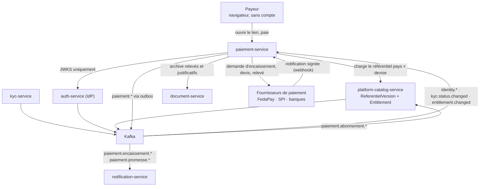
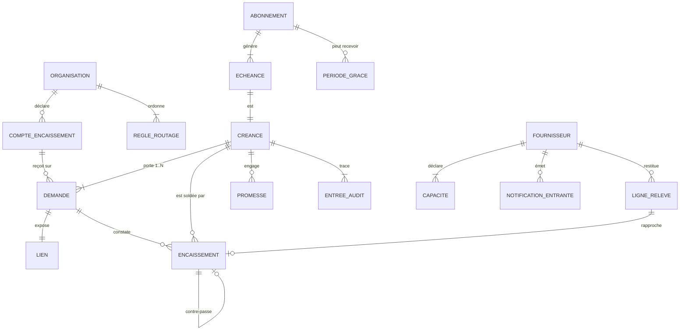
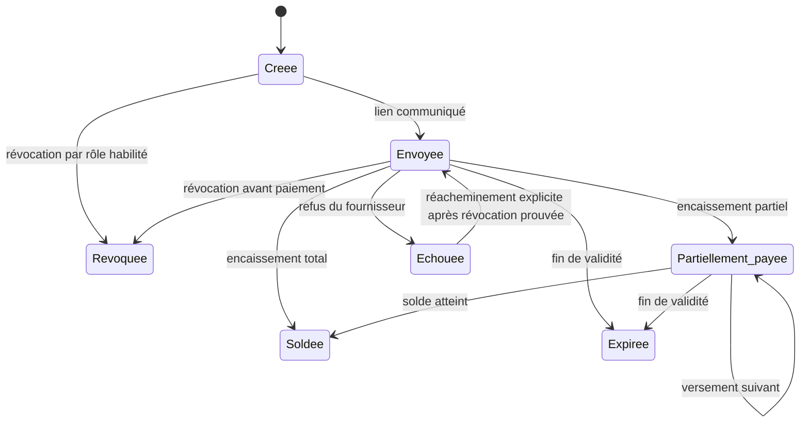

# Architecture Spine — paiement-service

## Design Paradigm

**Hexagonal (ports & adaptateurs)** autour d'un noyau métier pur, lui-même **relying-party** de l'IdP.

Le noyau ne connaît que des créances, des demandes, des encaissements et des promesses. Tout ce qui
touche l'argent réel entre et sort par des ports : les fournisseurs de paiement, le relevé, les
documents, le bus, le canal de notification. Deux conséquences directes — le noyau se teste sans
réseau ni PSP, et l'arrivée d'un fournisseur ou du SPI BCEAO est un adaptateur, jamais une
modification du noyau.

| Couche | Répertoire | Contenu |
| --- | --- | --- |
| Domaine | `src/domain/` | Créance, Demande, Encaissement, Promesse, Abonnement, Montant, machine à états. Aucune dépendance framework |
| Application | `src/application/` | Cas d'usage, transactions Mongo, orchestration des ports |
| Ports | `src/ports/` | Interfaces sortantes : fournisseur de paiement, relevé, documents, notification, événements, chiffrement |
| Adaptateurs | `src/adapters/` | Mongo, Kafka, BullMQ, FedaPay et fournisseurs suivants, chiffrement des secrets |
| Entrée | `src/modules/` | Contrôleurs NestJS, DTO, guards, consumers, **et la surface publique du lien** |

## Inherited Invariants

Hérités de l'écosystème et des services livrés. **Lecture seule** — non re-décidés ici ; un choix local
qui les contredirait est un conflit à remonter, pas une dérogation.

| Hérité | Source | Ce qu'il contraint ici |
| --- | --- | --- |
| Relying-party / JWKS | `architecture-prospera-ecosystem` (P3) | Validation locale du JWT RS256, jamais d'appel réseau à `auth-service` sur le chemin chaud |
| Read-models par événements | `architecture-prospera-ecosystem` (P4) | Identité, rôles, statut KYC et entitlement sont répliqués localement, jamais interrogés à chaud |
| `orgId` du jeton signé | `architecture-prospera-ecosystem` | L'isolation ne vient jamais du corps de requête ni d'un paramètre — **sauf sur la surface publique, qui n'a pas de jeton** (AD-9) |
| Database-per-service | `architecture-prospera-ecosystem` | `paiement-service` ne lit aucune base d'un autre service |
| Outbox transactionnelle | `architecture-prospera-ecosystem` (P6) | Publication d'événement dans la transaction qui produit le fait |
| Partition Kafka par `orgId` | `architecture-prospera-ecosystem` | Ordre garanti par organisation sur tous les topics `paiement.*` |
| Abonnement ≠ entitlement | `architecture-prospera-ecosystem` (P8) | `platform-catalog-service` reste l'**unique écrivain** de l'entitlement ; ce service déclenche, il ne possède pas |
| Moule unique des 18 services | `architecture-prospera-ecosystem` (P12) | NestJS relying-party, une base par service, abstraction `PaymentProvider` déjà nommée au programme |
| Port `:3005` | `architecture-fiscal-service` | Réservé à ce service — vérifié libre dans le `docker-compose` racine le 2026-08-03 |
| Journal protégé par base séparée | `architecture-fiscal-service` (AD-10, AD-19) | Les privilèges MongoDB sont additifs et sans deny — repris ici tel quel |
| `ReferentielVersion` versionnée | `architecture-catalog-service` · `fiscal` (AD-5, AD-6) | Les données de référence s'y rattachent au lieu d'inventer un second registre |
| File partagée, jamais de minuterie | `architecture-fiscal-service` (AD-18) | Aucun `setInterval` ni ordonnancement en mémoire de processus |
| Le système propose, l'humain tranche | `balance-service` STORY-090 | Aucun appariement forcé, aucun écart comblé d'office |

## Invariants & Rules



Le sens des dépendances est strictement descendant : aucune flèche synchrone ne repart de
`paiement-service` vers un service qui le précède. Les deux retours vers `platform-catalog-service` et
`notification-service` passent par le bus — c'est ce qui désamorce C8 (AD-13) et ce qui garde
l'organe de parole unique (AD-17).

### AD-1 — Aucune détention de fonds n'existe dans le modèle de données

- **Binds:** NFR-1, NFR-1a, NFR-1b, NFR-1c, FR-P01→P03, FR-P24, FR-P49, SM-1
- **Prevents:** un compte de collecte au nom de Money Vibes ouvert « juste pour les tests » et jamais
  défait — un changement de régime juridique déguisé en raccourci d'implémentation
- **Rule:** aucun type, aucun champ, aucune collection ne représente un **solde détenu**, un
  portefeuille, un séquestre ou un reversement. Le service enregistre des **mouvements constatés**
  (montant, devise, horodatage, référence fournisseur), jamais une position de trésorerie. Tout
  `CompteEncaissement` porte un titulaire identifié, un pays et une devise ; sans titulaire, il est
  refusé à l'enregistrement. Le seul cas où Money Vibes est bénéficiaire est l'abonnement (cas C), sur
  son propre compte. L'apparition d'un de ces concepts est le signal d'un changement de régime, pas
  une évolution de schéma.

### AD-2 — La créance projetée est matérialisée par upsert idempotent, jamais créée deux fois

- **Binds:** FR-P13, FR-P13b, FR-P37, A2, Q13
- **Prevents:** deux créances pour la même facture — donc deux soldes, chacun juste de son côté et
  faux ensemble — quand un appelant relance ou fractionne
- **Rule:** il n'existe **pas** d'API de création de créance. La première demande de paiement porte la
  créance et la matérialise, par `findOneAndUpdate` sur la clé unique
  `(orgId, moduleAppelant, referenceExterne)`. Le `montantOrigine` est **figé à la création** ; une
  demande ultérieure portant un montant d'origine différent produit une **anomalie tracée**, jamais un
  écrasement. Plusieurs demandes visent légitimement la même créance.
- **Rule (origine) :** toute créance porte son `moduleAppelant`, y compris quand l'appelant est un
  humain — une créance saisie à la main porte une origine `SAISIE_MANUELLE` **explicite**, pas un
  appelant vide. C'est ce qui permettra, le jour où Facturation (#17) existera, de savoir lesquelles
  ne doivent pas être dupliquées. Facturation deviendra **un second émetteur**, jamais un
  remplacement : le contrat de créance projetée est le même quelle que soit l'origine, et aucune
  reprise de données n'est à prévoir.
- **Limite assumée :** ce service n'est pas propriétaire de la facture. Qui fait autorité en cas de
  divergence relève du module Facturation (#17) — hors de cette colonne.

### AD-3 — Le ledger d'encaissements est append-only ; le solde est une projection décomposée

- **Binds:** FR-P24, FR-P25, FR-P26, FR-P27, FR-P32, FR-P37, FR-P50, FR-P52, NFR-1b, NFR-4
- **Prevents:** un `soldeRestant` mutable écrit par trois chemins — webhook, déclaration manuelle,
  contre-passation — qui divergent, et la disparition de la distinction entre le certain et le déclaré
- **Rule:** aucun chemin applicatif ne met à jour un encaissement existant. Une annulation est une
  **contre-passation** : une écriture de plus, référençant celle qu'elle annule (FR-P52). Le solde est
  **calculé**, maintenu par un seul cas d'usage dans la transaction Mongo qui écrit l'encaissement, et
  **jamais restitué comme un nombre unique**.
- **Rule (deux restants nommés) :** « le solde restant » n'existe pas — la question « le déclaré
  compte-t-il ? » a deux réponses légitimes et deux unités les choisiraient différemment. Toute lecture
  rend donc explicitement :
  `restantCertain = montantOrigine − confirmé` et
  `restantAffiche = montantOrigine − confirmé − déclaréNonValidé`,
  en plus de `confirmé`, `déclaréNonValidé` et `promessesEnCours`. Aucun champ ni aucune route ne
  s'appelle `restant` tout court, dans le domaine comme dans les DTO.
- **Rule (concurrence et sur-encaissement) :** toute écriture d'encaissement touche le document de
  créance **dans la même transaction**, ce qui sérialise deux versements concurrents au lieu de les
  laisser lire un solde périmé. Un encaissement qui dépasserait `restantCertain` n'est **jamais rejeté
  ni silencieusement tronqué** — l'argent est déjà parti chez le payeur : il est enregistré en entier
  et la créance porte un **trop-perçu** explicite, publié comme tel. Un trop-perçu est une
  constatation, pas des fonds détenus (AD-1).

### AD-4 — L'idempotence est arbitrée par la base, jamais par le code

- **Binds:** NFR-3, FR-P19, FR-P20, FR-P22, SM-5
- **Prevents:** la fenêtre entre un `find` et un `insert` sous rejeu parallèle — le double encaissement
  se voit chez le payeur, pas dans les journaux
- **Rule (arbitre) :** index **unique partiel** sur `(fournisseur, referenceTransactionFournisseur)`,
  **restreint aux encaissements d'origine PSP**. Une erreur de clé dupliquée **est** le rejeu : elle se
  traite comme un succès, pas comme une panne. Aucun verrou applicatif, aucun verrou Redis, aucun
  `find` préalable sur ce chemin.
- **Rule (l'autre nature) :** un encaissement **déclaré** (FR-P31) n'a ni fournisseur ni référence de
  transaction. Il ne peut donc pas partager cet index — un index unique non partiel ferait collisionner
  toutes les déclarations entre elles sur leurs valeurs nulles, et un index rendu creux perdrait la
  protection côté PSP. Une déclaration porte sa **propre clé d'idempotence**, fournie par le client de
  l'API et unique sur `(orgId, cleDeclaration)` : c'est ce qui rend un double envoi depuis le téléphone
  d'un commercial en réseau instable inoffensif.
- **Rule (boîte de réception) :** la notification du fournisseur est persistée **brute** dans une
  collection append-only avant tout traitement — miroir entrant de l'outbox — avec sa propre clé
  d'unicité. La signature est vérifiée **avant** persistance ; une notification non signée ou mal
  signée est rejetée et tracée, jamais traitée. On peut ainsi rejouer et prouver ce que le PSP a
  réellement envoyé.
- **Rule (corps brut) :** la vérification de signature exige le corps de requête **non parsé**. Le
  parseur JSON brut est monté **uniquement** sur la route de webhook ; un parseur global casse
  silencieusement la vérification et rendrait NFR-3 invérifiable.
- **Condition observable :** rejouer N fois la même notification — dans le désordre, en parallèle, et
  après redémarrage du service — produit exactement un encaissement. Le test appartient à la
  définition de terminé, pas à la recette.

### AD-5 — Un seul port `PaymentProvider` ; les données de paiement ne sont jamais persistées

- **Binds:** FR-P07, FR-P09, FR-P10, FR-P11, FR-P14, NFR-5, NFR-6, SM-6
- **Prevents:** la logique d'un PSP infiltrée dans le domaine, et un mode de checkout qui ferait entrer
  des données de paiement dans le service sans que personne ne l'ait décidé
- **Rule (forme du port) :** le port est **asynchrone par nature**. Initier un encaissement rend une
  référence et de quoi présenter le checkout ; la confirmation arrive comme un **fait séparé** (AD-4),
  jamais comme valeur de retour. Un port synchrone exclurait tout PSP réel.
- **Rule (capacités) :** chaque fournisseur déclare pays, devises, méthodes, montants minimum et
  maximum, paiement partiel, délai de mise à disposition, et son
  `modeCheckout: REDIRECTION | API_DIRECTE`. Rien de tout cela n'est codé en dur ni lu ailleurs.
- **Amendement du 2026-09-05 (STORY-603) — le barème n'est PAS une capacité.** La règle ci-dessus
  citait le « barème de frais » parmi les capacités ; il en est sorti. Une **capacité** dit ce que
  le code **sait faire**, et c'est pour cela qu'elle ne peut pas être administrable (AD-6). Un
  **tarif** ne dit pas *si*, il dit *combien* : il ne peut ouvrir aucun chemin que la capacité ne
  déclare déjà, donc il peut être une donnée sans qu'AD-6 soit amendé. L'adaptateur ne déclare
  plus qu'une **grille publiée facultative** (`baremePublie`), datée et non administrable ; le
  tarif réellement appliqué à une organisation est le barème de **son contrat**, qui prime.
  Un barème de contrat portant un couple ou une méthode que l'adaptateur ne déclare pas est
  **refusé** — sans quoi une donnée administrable élargirait une capacité par la porte de derrière.
- **Rule (données de paiement) :** les deux modes de checkout sont livrés en v1. En mode
  `API_DIRECTE`, les données de paiement — PAN, PIN, OTP — sont **en transit seulement** : jamais
  persistées, jamais journalisées, jamais présentes dans la boîte de réception, dans le journal
  d'audit ni dans une trace d'erreur. Aucun champ de schéma ne peut les recevoir.
- **Rule (démarrage) :** aucun fournisseur n'est un prérequis de démarrage ; le service démarre dégradé
  et l'annonce dans son état de santé. Le passage du sandbox à la production est une **configuration**
  — aucun `si production` dans le code.

### AD-6 — Le routage entre fournisseurs est ordonné, déterministe et sans repli implicite

- **Binds:** FR-P05, FR-P08, FR-P12, FR-P58
- **Prevents:** deux implémentations qui choisissent un fournisseur différent pour la même demande, et
  un réacheminement automatique qui doublerait un encaissement déjà communiqué au payeur
- **Rule (résolution) :** le routage est une liste **ordonnée** de règles par organisation sur
  `(pays, devise, méthode)`. La première règle éligible gagne. Zéro fournisseur éligible produit un
  refus nommé `AUCUN_FOURNISSEUR_ELIGIBLE` — **jamais** un défaut silencieux, jamais le « premier
  fournisseur actif ».
- **Rule (réacheminement) :** réacheminer une demande vers un autre fournisseur est un **acte
  explicite** exigeant la **révocation prouvée** de la demande chez le fournisseur d'origine. Aucun
  chemin automatique n'existe. Un fournisseur indisponible laisse la demande ouverte ; il ne la
  déplace pas.
- **Rule (registre administrable) :** **activer** un fournisseur pour un pays et **régler** son
  routage sont des données administrables — au patron du catalogue de modules — de sorte qu'ouvrir un
  marché ne demande aucun déploiement. Ce registre ne contredit pas AD-5 : il porte l'**activation,
  le routage et les identifiants**, jamais les **capacités**, qui restent déclarées par l'adaptateur.
  Confondre les deux ferait mentir une capacité sur ce que le code sait réellement faire.

### AD-7 — Le barème fait foi à l'affichage, le réel à l'enregistrement, la nuit tranche

- **Binds:** FR-P09, FR-P23, FR-P23b, FR-P23c, FR-P24b, FR-P58, NFR-8, CM-2
- **Prevents:** un montant découvert après coup par le payeur, et un tarif recalculé à la lecture qui
  changerait rétroactivement ce qu'un payeur a supporté
- **Rule (affichage) :** les frais annoncés viennent du **barème applicable** — celui du contrat de
  l'organisation s'il existe, la **grille publiée** du fournisseur à défaut (STORY-603). Aucun appel
  réseau n'est fait avant d'afficher un prix — la page doit rester ouvrable sur une 3G d'Agoè
  (NFR-8) ; la résolution a lieu à l'émission de la demande, et la page publique lit la version
  **figée**, jamais un tarif re-résolu.
- **Rule (absence de tarif, 2026-09-05 / STORY-603) :** un couple **couvert mais non tarifé** — ni
  contrat, ni grille publiée — produit un refus nommé `TARIF_NON_CONTRACTE`, rendu à
  l'**organisation**, à l'émission. **Jamais des frais nuls**, et jamais `AUCUN_FOURNISSEUR_ELIGIBLE`,
  qui désigne le routage : les deux causes ne se soignent pas pareil.
- **Rule (version, 2026-09-05 / STORY-603) :** la version d'un barème **saisi** est **dérivée de son
  contenu** ; celle d'une grille publiée reste **déclarée**, avec sa date de relevé. Une version
  saisie laisserait deux jeux de chiffres porter le même nom, et la version figée sur une demande
  ancienne désignerait des nombres qui ont changé.
- **Rule (figement) :** la politique de frais **et** la version du barème sont **figées à l'émission de
  la demande**, jamais relues à l'encaissement. Un changement de politique ou de barème ne modifie
  aucune demande déjà communiquée à un payeur.
- **Rule (enregistrement) :** l'encaissement porte `fraisAppliques`, `sourceFrais`
  (`REEL` quand la notification du fournisseur les transporte, `BAREME` sinon) et la version de barème
  figée. Jamais recalculé à la lecture.
- **Rule (confrontation) :** un travail nocturne confronte le barème déclaré aux frais réellement
  prélevés côté fournisseur. Une divergence est une **anomalie tracée**, jamais une correction
  silencieuse ni une reprise rétroactive.
- **Rule (simulation) :** le surcoût de fractionnement présenté au payeur est calculé sur le barème et
  **étiqueté estimation**. Il n'engage rien et n'est jamais enregistré comme un frais.

### AD-8 — Les montants sont des entiers d'unité mineure ; pays et devises sont un référentiel versionné

- **Binds:** FR-P54, FR-P55, FR-P56, FR-P57, NFR-2, R2, A4
- **Prevents:** le XOF traité à deux décimales — des montants faux d'un facteur 100 sur le marché
  principal — et un second registre de référentiels dans le programme
- **Rule (montants) :** tout montant est un couple `(montantMineur: entier, devise)` porté par un type
  unique du domaine. Aucun flottant, aucune conversion implicite, aucun montant nu dans une signature
  de fonction. Le nombre de décimales est **lu du référentiel**, jamais présumé.
- **Rule (référentiel) :** le jeu pays × devise × décimales est publié comme `ReferentielVersion` de
  `platform-catalog-service` (`pays-devises-ao@AAAA.N`), chargé par `artifactUri` avec vérification du
  `checksum` sha256. Une empreinte non conforme est une erreur d'intégrité, pas un avertissement ; un
  référentiel irrésoluble rend le service **dégradé, pas sain**.
- **Rule (devise unique) :** une créance, ses demandes et ses encaissements sont dans **une seule et
  même devise**. Aucun code de conversion n'existe — convertir serait une activité de change. Les
  créances de devises différentes ne se compensent jamais.

### AD-9 — La surface publique est servie par le service, non authentifiée, sur jeton opaque

- **Binds:** FR-P14, FR-P15, FR-P16, FR-P18, FR-P62, NFR-8, UJ-1, CM-2
- **Prevents:** une surface publique mélangée à une application authentifiée, et l'énumération des
  liens de paiement d'une organisation
- **Rule (rendu) :** la page de lien est **rendue côté serveur par ce service**, en HTML minimal sans
  bundle applicatif. Elle reste lisible si le réseau lâche au milieu du paiement : le payeur doit
  toujours savoir s'il a payé ou non.
- **Rule (jeton) :** le lien porte un jeton **opaque à forte entropie**, sans aucun identifiant
  devinable — ni `orgId`, ni numéro de facture, ni séquence. Un jeton inconnu, expiré ou révoqué rend
  la même réponse qu'un jeton valide mais éteint : on ne distingue jamais « n'existe pas » de « plus
  actif ». Le QR encode ce même jeton.
- **Rule (frontière) :** le préfixe public est **exempté de la validation JWT à la gateway**, de
  manière explicite et énumérée — jamais par un motif large. Il porte son propre plafond de débit par
  jeton et par IP. Aucune route publique ne lit ni n'écrit hors de la créance que son jeton désigne.
- **Rule (validité) :** défaut 30 jours, paramétrable par organisation, plafond 90. Expiré, le lien
  n'encaisse plus et le dit, avec le moyen d'en demander un nouveau.

### AD-10 — Le journal d'audit est protégé par le serveur, pas par le code

- **Binds:** NFR-4, FR-P61, FR-P52, FR-P35
- **Prevents:** un module futur qui efface des traces d'opérations d'argent sans que rien ne casse
- **Rule (isolation) :** le journal vit dans une **base distincte** `paiement_audit`, sur laquelle le
  compte applicatif ne détient que `find` et `insert`. Un privilège de collection ne suffirait pas :
  les privilèges MongoDB sont **additifs et sans deny**, donc un `readWrite` sur la base métier
  redonnerait `remove` au journal quoi qu'on déclare par ailleurs. La purge et la restauration
  emploient un second compte, absent de la configuration du service.
- **Rule (chaînage) :** la chaîne d'empreintes est **par créance**, jamais globale. Chaque entrée porte
  `(creanceId, seq, empreintePrecedente)` avec un index unique sur `(creanceId, seq)`. Une chaîne
  globale sérialiserait tout le service sur une seule ligne.
- **Rule (sauvegarde) :** la base d'audit a sa propre politique de sauvegarde et de restauration. Une
  restauration est un acte tracé hors application ; les chaînes sont revérifiées après.

### AD-11 — La séparation des pouvoirs mord au niveau de l'acteur, pas du rôle

- **Binds:** FR-P31, FR-P33, FR-P35, FR-P36, FR-P51, FR-P59, FR-P60
- **Prevents:** un contrôle qui s'évapore dès qu'une petite structure donne deux rôles à la même
  personne — la réalité d'un distributeur de trois salariés
- **Rule:** le cas d'usage refuse qu'une même personne **valide** un encaissement qu'elle a
  **déclaré**, et qu'elle **annule** un encaissement qu'elle a déclaré ou validé. Le refus est nommé
  `SEPARATION_POUVOIRS_VIOLEE` et ne dépend d'aucune configuration de rôles : il tient même quand
  l'organisation cumule les trois permissions sur une seule personne.
- **Rule (attribution) :** l'**auteur de la saisie** et l'**encaisseur** sont deux champs distincts —
  ils ne sont pas toujours la même personne, et confondre les deux rend un écart de caisse
  inattribuable.

### AD-12 — Tout fait temporel passe par la file partagée et s'écrit

- **Binds:** FR-P15, FR-P28, FR-P29, FR-P30, FR-P34, FR-P45, FR-P48, FR-P64
- **Prevents:** un fait qui n'est jamais écrit donc jamais publiable — Relance (#24) devrait alors
  sonder ce service, ce qui inverse le sens des dépendances — et des alertes doublées par deux
  répliques
- **Rule:** le sort d'une promesse, le délai de validation d'un encaissement déclaré (défaut 48 h
  ouvrées, plafond 7 jours), l'expiration d'un lien, l'échéance et la suspension d'un abonnement sont
  des **travaux BullMQ à clé idempotente**. À leur date, ils **écrivent le fait** et publient
  l'événement sortant. Aucun `setInterval`, aucune minuterie applicative, aucun ordonnancement en
  mémoire de processus — nulle part dans le service.
- **Rule (grâce) :** une période de grâce porte **obligatoirement** une durée maximale (défaut 30
  jours, plafond 90) et son travail d'échéance est posé à l'attribution. Une grâce sans terme est une
  suspension qui n'arrive jamais.

### AD-13 — L'entitlement s'octroie par événement ; `platform-catalog-service` reste l'unique écrivain

- **Binds:** FR-P42→P48, Q9 (C8), R4
- **Prevents:** une dépendance synchrone authentifiée posée sur un chemin d'argent, et un second
  écrivain de l'entitlement qui casserait P8
- **Rule:** `paiement-service` publie `paiement.abonnement.echeance.encaissee`,
  `paiement.abonnement.impayee`, `paiement.abonnement.grace.attribuee` et
  `paiement.abonnement.regularise` via son outbox. `platform-catalog-service` les consomme et écrit
  l'entitlement. Ce service **n'appelle jamais** l'API d'entitlement et n'en tient aucune copie
  faisant foi — il lit son read-model `entitlement.changed` comme tout le monde.
- **Conséquence :** la décision **C8** (authentification machine-à-machine) cesse d'être bloquante pour
  l'incrément 3. Elle reste ouverte pour d'autres appelants ; elle ne l'est plus pour celui-ci.
- **Condition :** `platform-catalog-service` doit devenir consommateur des topics `paiement.abonnement.*`.
  C'est un travail sur ce service, hors de l'autorité de cette colonne, et il doit être planifié comme
  tel avant l'incrément 3.

### AD-14 — Les secrets de fournisseur sont chiffrés et la clé vit hors de la base

- **Binds:** FR-P06, NFR-6, FR-P01, FR-P02
- **Prevents:** un dump Mongo qui livre les clés d'API marchandes de toutes les organisations clientes
- **Rule:** les identifiants de compte et de fournisseur sont chiffrés en **AES-256-GCM** avant
  écriture ; la clé maîtresse vient de l'environnement et **n'est jamais en base**. Le déchiffrement
  n'a lieu que dans l'adaptateur de fournisseur, au moment de l'appel sortant.
- **Rule (aucune lecture) :** aucun chemin d'API ne restitue le clair — pas même pour un
  `PLATFORM_ADMIN`. Seule une empreinte partielle est lisible. Les secrets ne sont ni journalisés, ni
  inclus dans une réponse, ni dans une trace d'erreur, ni dans le journal d'audit.
- **Rule (vérification) :** un compte d'encaissement est vérifié avant activation par **appel de
  validation au fournisseur** — jamais par une transaction de montant symbolique, qui coûte de
  l'argent et suppose un débit sur un compte pas encore approuvé. Sans capacité de validation, le
  compte est marqué `non vérifiable` et ne peut recevoir aucune demande.

### AD-15 — Le noyau de rapprochement est partagé et agnostique ; les règles de domaine restent locales

- **Binds:** FR-P38, FR-P39, FR-P41, SM-3
- **Prevents:** deux moteurs d'appariement qui divergent sur l'ambiguïté ou la fenêtre de date, et à
  l'inverse une bibliothèque qui remonterait les types métier d'un service dans un autre
- **Rule (partagé) :** le noyau `@prospera/rapprochement` ne contient que l'**agnostique** : types
  génériques de ligne et de candidat, fenêtre floue de date, **refus d'apparier en cas d'ambiguïté**
  (deux candidats équivalents ⇒ les deux proposés, aucun choisi), scoring de libellé, qualification
  d'écart, empreinte de ligne contre le doublon au ré-import. Aucun type métier d'un service n'y entre.
- **Rule (local) :** les règles de domaine restent dans chaque service. Ici, c'est la cascade de clés
  de FR-P38 : **(1)** référence de transaction du fournisseur — clé primaire, rapprochement certain ;
  **(2)** référence de demande portée au libellé — certain si présente ; **(3)** triplet montant +
  devise + date à ±1 jour — **proposé, jamais appliqué sans confirmation humaine**. Ce qui ne tombe
  dans aucune des trois est listé comme écart, avec son motif.
- **Rule (orphelins) :** un encaissement sans créance identifiable n'est jamais perdu : il est mis en
  attente d'affectation et rattachable manuellement. Il n'est **jamais** rattaché d'office.
- **Condition :** la bibliothèque **n'existe pas**. Le dépôt n'a aucun workspace npm, et
  `balance-service/src/modules/rapprochement/rapprochement.regles.ts` — 598 lignes de règles pures,
  extractibles sur le principe — est typé sur son propre domaine (`LigneCahierAApparier`,
  `TypeCompteTresorerie`, `MoyenPaiement`). L'extraction, la généralisation des types et le
  rebranchement de `balance-service` (service **livré**) sont un chantier hors de l'autorité de cette
  colonne, à planifier **avant** que `paiement-service` s'y branche, en incrément 2.

### AD-16 — Gate d'accès local `@RequiresPaiementAccess`

- **Binds:** FR-P59, FR-P62, toutes les opérations authentifiées
- **Prevents:** une autorisation qui dépendrait de la disponibilité d'un autre service, sur un chemin
  d'argent
- **Rule:** `emailVerified` (claim du jeton) + `OrgKycStatus == APPROVED` (read-model) + entitlement
  paiement `ACTIVE` (read-model). Tout est local ; aucun appel réseau sur le chemin d'autorisation.
  Le cloisonnement par organisation vient de l'`orgId` du jeton signé — jamais du corps de requête.
  **La surface publique (AD-9) est la seule exception, et elle est énumérée.**

### AD-17 — Ce module publie ; il ne décide pas, ne facture pas, n'écrit aucune écriture

- **Binds:** FR-P17, FR-P30, FR-P40, FR-P53, FR-P64, §5.2 du PRD
- **Prevents:** la logique de relance, d'émission de facture ou de comptabilisation qui s'installe ici
  parce que « les données y sont déjà » — la dérive la plus probable de ce service
- **Rule:** `paiement-service` publie les encaissements, les promesses, les soldes, les annulations et
  les candidats de relance. Il **ne décide d'aucune relance** (Relance #24), **n'émet aucune facture**
  (Facturation #17), **ne passe aucune écriture** (comptabilité), **n'initie aucun remboursement**
  (il ne détient pas les fonds), **ne manipule aucune espèce** (Caisse #15) et **ne parle jamais
  directement au payeur** : le lien est un message, et `notification-service` est l'organe de parole
  unique.

### AD-18 — La créance est imputée du montant dû ; les frais ne touchent jamais le solde

- **Binds:** FR-P23, FR-P23b, FR-P24, FR-P24b, FR-P25, FR-P26, FR-P37, AD-3, AD-7
- **Prevents:** trois soldes possibles pour un même versement — imputer ce que le payeur a **payé**, ce
  que le bénéficiaire a **reçu**, ou ce qui était **dû** — selon quelle unité a écrit le code. Sous la
  politique `bénéficiaire`, les trois nombres diffèrent, et l'écart est du vrai argent
- **Rule:** un encaissement porte trois montants distincts et nommés : `montantPaye` (ce que le payeur
  a débité), `montantImpute` (ce qui s'applique à la créance) et `fraisAppliques`. **Seul
  `montantImpute` bouge le solde**, sous toutes les politiques de frais. Aucun calcul de solde ne lit
  `fraisAppliques` ni `montantPaye`, nulle part.
- **Rule (dérivation) :** `montantImpute` est **figé à l'encaissement** avec la politique et le barème
  de la demande (AD-7), jamais redérivé à la lecture. Politique `payeur` :
  `montantPaye = montantImpute + fraisAppliques`. Politique `bénéficiaire` :
  `montantPaye = montantImpute`, et le bénéficiaire reçoit net — un fait sur le versement, **pas** une
  réduction de la dette du payeur.

## Consistency Conventions

| Concern | Convention |
| --- | --- |
| Nommage — domaine | Français métier : `Creance`, `DemandeDePaiement`, `Encaissement`, `Promesse`, `CompteEncaissement`, `Fournisseur`, `Abonnement`, `Montant`. Jamais de nom de PSP dans un type du domaine |
| Nommage — vocabulaire | **« Encaissement » partout.** Le mot « règlement » n'apparaît nulle part — ni type, ni champ, ni route, ni message |
| Nommage — événements | `paiement.<agrégat>.<fait-au-passé>` : `paiement.encaissement.confirme`, `paiement.encaissement.declare`, `paiement.encaissement.annule`, `paiement.promesse.echue`, `paiement.abonnement.echeance.encaissee` |
| Nommage — fichiers | Convention NestJS déjà en place : `*.schema.ts`, `*.service.ts`, `*.controller.ts`, `*.dto.ts`, `*.regles.ts`, `*.spec.ts` |
| Identifiants | `ObjectId` Mongo en interne ; `orgId` opaque issu du jeton ; **jeton de lien opaque à forte entropie**, jamais dérivé d'un identifiant métier |
| Montants | `Montant = (montantMineur: entier, devise)`. Aucun `number` flottant, aucune conversion, aucun montant nu en signature |
| Montants — nommage | Jamais de champ `montant` nu sur un encaissement : `montantPaye`, `montantImpute`, `fraisAppliques` (AD-18). Jamais de champ `restant` nu : `restantCertain`, `restantAffiche` (AD-3) |
| Dates | ISO 8601, UTC en stockage. Le délai « 48 h **ouvrées** » se calcule sur un calendrier explicite, jamais en heures brutes |
| Erreurs | Codes nommés et stables, jamais un message libre : `AUCUN_FOURNISSEUR_ELIGIBLE`, `COMPTE_NON_VERIFIE`, `LIEN_EXPIRE`, `DEVISE_INCOHERENTE`, `SEPARATION_POUVOIRS_VIOLEE`, `SIGNATURE_INVALIDE`, `MONTANT_HORS_CAPACITE`, `CREANCE_SOLDEE` |
| Erreurs — statut HTTP | Correspondance fixe : transition interdite sur un état → `409` · clé dupliquée sur rejeu → **succès**, jamais `409` · signature invalide → `401` · règle métier violée sur une entrée valide → `422` · validation de forme → `400` · ressource hors organisation → `404` (anti-énumération) · intégrité d'artefact de référentiel → `502` |
| Mutation d'état | Toute transition de demande écrit la transition **et** son entrée d'audit dans la même transaction Mongo. Les encaissements ne se mutent pas (AD-3) |
| Idempotence | Toute écriture déclenchée par une notification, un événement ou un import est rejouable : clé unique et `findOneAndUpdate`, jamais un `insert` nu |
| Corps de requête | Parseur brut **uniquement** sur les routes de webhook (AD-4). Parseur JSON standard partout ailleurs |
| Journalisation | `nestjs-pino`, corrélation par `nestjs-cls`. Aucun secret, aucune donnée de paiement, aucun numéro de payeur en clair. Un montant journalisé l'est sans identité nominative |
| Permissions | Les sept droits (émettre, révoquer, déclarer, valider, annuler, attribuer une grâce, administrer les comptes) sont déclarés au **catalogue de permissions plateforme** (STORY-140), attribuables séparément. Aucun rôle n'est codé en dur dans le service ; AD-11 mord par-dessus, indépendamment de ce que le catalogue autorise |
| Données du payeur | Le payeur n'a **pas** de compte Prospera. Même régime que le carnet de contacts de `notification-service` (§9 de son PRD), non re-décidé ici : ce service ne constitue aucun profil de payeur et n'en dérive aucun usage au-delà de l'encaissement qui l'a créé |
| Configuration | `@nestjs/config`, variables d'environnement uniquement. Aucun barème, aucun plafond de montant, aucune décimale de devise en configuration — ils viennent des capacités et du référentiel |
| Tests | Le domaine se teste sans infrastructure ni PSP. Le rejeu de notification (AD-4) et l'exactitude XOF à zéro décimale (AD-8) sont couverts par des tests dédiés, dans la définition de terminé |

## Stack

Ratifiée depuis le code de `balance-service` et des services à file — brownfield, on aligne plutôt
qu'on invente. Versions vérifiées le 2026-08-03.

| Name | Version |
| --- | --- |
| Node.js (types) | 22 |
| TypeScript | 5.7 |
| NestJS (`common`, `core`, `platform-express`) | 11 |
| `@nestjs/mongoose` / Mongoose | 11 / 8.24 |
| MongoDB | `mongo:7` (réplica set `rs0` — transactions requises) |
| Apache Kafka | `apache/kafka:3.9.0` |
| kafkajs | 2.2.4 |
| `@nestjs/bullmq` / `bullmq` / `ioredis` | 11.0.4 / 5.81 / 5.11 |
| Redis | 7-alpine |
| `@nestjs/config` | 4.0 |
| `@nestjs/swagger` | 11 |
| `@nestjs/terminus` | 11 |
| `@nestjs/throttler` | 6.5 |
| `jwks-rsa` / `passport-jwt` | 3.2 / 4.0 |
| `nestjs-cls` | 6.2 |
| `nestjs-pino` | 4.6 |
| `helmet` | 8 |
| `class-validator` / `class-transformer` | 0.14 / 0.5 |
| `eta` (rendu de la page publique) | 4.6 |
| `fedapay` (adaptateur v1, sandbox) | 1.2.5 |
| Jest | 29 |

## Structural Seed

### Entités du noyau



`ENCAISSEMENT` est append-only et porte son propre état (`DECLARE` | `CONFIRME` | `CONTRE_PASSE`) —
il n'y a **pas** d'entité solde. `ENTREE_AUDIT` vit dans la base protégée par AD-10.
`NOTIFICATION_ENTRANTE` est la boîte de réception de AD-4. Une échéance d'abonnement **est** une
créance : le cas C n'a pas de mécanique propre, seul le bénéficiaire change (AD-1).

### Cycle de vie d'une demande de paiement



Aucun retour arrière depuis `Soldee`. Une contre-passation n'annule pas l'état de la demande : elle
ajoute un encaissement négatif à la créance (AD-3), et c'est le **solde de la créance** qui bouge —
pas l'historique de la demande.

### Déploiement et exploitation

Un conteneur `paiement-service` dans le `docker-compose` racine, port **`:3005`** — vérifié libre.
**Deux bases** sur le réplica set `rs0` partagé (les transactions multi-documents l'exigent) :
`paiement_service` pour le métier, `paiement_service_audit` pour le journal — la convention de nommage
est celle constatée dans le `docker-compose` (`catalog_service`, `bilan_service`, `balance_service`,
`document_service`), pas celle annoncée par la spine `fiscal-service`, qui n'est pas encore déployée.
File BullMQ sur le Redis partagé. Doit figurer dans l'`AUTH_AUDIENCE` de l'IdP.

| Dimension | Règle |
| --- | --- |
| Comptes de base | **Deux, provisionnés par environnement** : l'applicatif (`readWrite` sur `paiement_service`, `find`+`insert` seulement sur `paiement_service_audit`) et un compte de maintenance réservé à la purge et à la restauration. Le second n'est jamais dans la configuration du service |
| Environnements | Développement, recette et production partagent la **même** définition de rôles et le **même** chemin de code (NFR-5). Un environnement où le compte applicatif détient `remove` sur `paiement_service_audit` est non conforme, y compris en développement — sinon la contrainte n'est jamais éprouvée avant la production |
| Surface réseau | Deux préfixes distincts : l'API métier, derrière la gateway avec validation JWT ; le préfixe **public** du lien, exempté de JWT de manière énumérée, avec son propre plafond de débit (AD-9). Aucune autre route n'est publique |
| Console d'exploitation | Vit sur `admin-panel` (BFF, **lecture**) et reste **bornée** à quatre usages : suivre les demandes, consulter les notifications de fournisseur rejetées, réacheminer une demande, consulter les écarts de rapprochement. Le réacheminement y obéit à AD-6 comme partout ailleurs — la console n'est pas un chemin d'écriture privilégié (FR-P63) |
| Secrets | Clé maîtresse de chiffrement et clés d'API de fournisseur en variables d'environnement uniquement (AD-14). Aucune clé en base, aucune en image |
| Migrations | Les collections append-only (`encaissements`, `notifications_entrantes`, `audit`) ne se migrent **jamais** par réécriture. Une évolution de forme se fait par nouveau champ optionnel et lecture tolérante |
| Santé | Le point de santé couvre Mongo (dont l'état du réplica set), Kafka, Redis, la résolution du référentiel pays × devise, et l'état de **chaque** fournisseur configuré. Zéro fournisseur disponible ou référentiel irrésoluble → dégradé, pas sain (AD-5, AD-8) |
| Sauvegarde | `paiement_audit` a sa propre politique de sauvegarde et de restauration, distincte du métier (AD-10) |

### Arborescence

```text
paiement-service/
  src/
    domain/        # creance, demande, encaissement, promesse, abonnement, montant, etats — sans framework
    application/   # cas d'usage, transactions, orchestration des ports
    ports/         # fournisseur, releve, documents, notification, evenements, chiffrement
    adapters/      # mongo, kafka, bullmq, fedapay, chiffrement
    modules/       # controleurs, dto, guards, consumers, webhooks (raw body)
      public/      # rendu serveur du lien de paiement + QR — la seule surface non authentifiee
    common/        # gate, filtres d'erreur, cls, pino
    vues/          # templates eta de la page publique
  test/
```

## Capability → Architecture Map

| Capacité (incrément PRD) | Vit dans | Gouverné par |
| --- | --- | --- |
| I1 — Encaisser par lien : comptes, `PaymentProvider` + FedaPay sandbox, demande, lien, QR, webhook, partiel (FR-P01→P26) | `domain/`, `adapters/fedapay`, `modules/public`, `application/demande` | AD-1, AD-2, AD-3, AD-4, AD-5, AD-6, AD-7, AD-8, AD-9, AD-14, AD-16 |
| I2 — Dire la vérité sur la créance : hors Prospera, promesses, réconciliation, relevé, annulation, audit (FR-P27→P41) | `application/declaration`, `application/rapprochement`, `adapters/releve` | AD-3, AD-10, AD-11, AD-12, AD-15, AD-17 |
| I3 — Abonnements & multi-pays : abonnement, échéance, impayé, grâce, entitlements, pays/devises, console (FR-P42→P64) | `application/abonnement`, `adapters/catalog`, `adapters/kafka` | AD-8, AD-12, AD-13, AD-16, AD-17 |

## Deferred

- **Coffre-fort de secrets dédié (Vault / secrets manager).** Le chiffrement en base avec clé
  d'environnement (AD-14) tient pour la v1. L'introduction d'un coffre est un **amendement de AD-14**,
  pas une évolution de configuration — elle attend une infrastructure que le `docker-compose` racine
  n'a pas encore.
- **Extraction de `@prospera/rapprochement` et création du workspace npm.** Nommée en condition de
  AD-15. C'est un chantier `balance-service` + outillage de dépôt, à planifier avant l'incrément 2 ;
  cette colonne n'en a pas l'autorité.
- **Consommation de `paiement.abonnement.*` par `platform-catalog-service`.** Condition de AD-13, à
  planifier avant l'incrément 3. Travail sur un autre service.
- **Autorité sur le montant d'origine en cas de divergence (Q13).** Renvoyée au module **Facturation
  (#17)** par décision produit. AD-2 pose le mécanisme v1 — figement et anomalie tracée — pas
  l'arbitrage de propriété.
- **Grille commerciale des périodes de grâce par type de client (Q11).** Décision commerciale.
  AD-12 la borne en attendant : 30 jours par défaut, 90 de plafond.
- **Adaptateur SPI BCEAO et passage en production.** Une configuration et un adaptateur derrière AD-5,
  jamais une réécriture. N'ouvre aucune question d'architecture — c'est précisément ce que le port
  garantit.
- **Confirmation juridique de NFR-1.** Le PRD marque « à faire confirmer juridiquement » que
  l'orchestration sans détention échappe à l'agrément d'établissement de monnaie électronique. AD-1
  rend l'invariant vérifiable dans le modèle ; il ne rend pas l'avis juridique inutile.
- **Seuils de latence (NFR-7).** Cibles proposées, à reconfirmer après 30 jours d'exploitation. Rien
  dans cette colonne n'en dépend.
